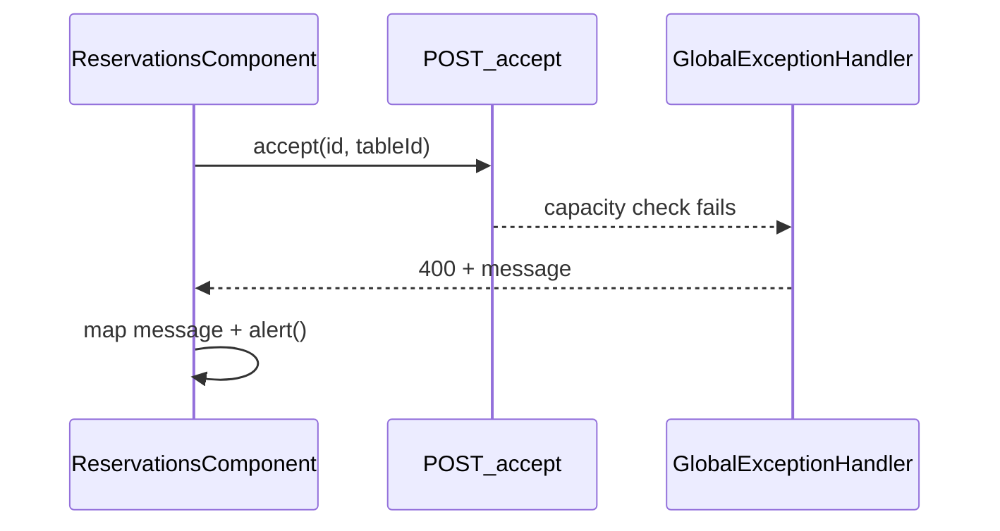

# Show popup on failed reservation accept

## Problem

[`onAccept`](coffeeshop-frontend/src/app/features/reservations/reservations.component.ts) and [`onAcceptRequest`](coffeeshop-frontend/src/app/features/shop-details/shop-details.component.ts) only subscribe to `next` — no `error` handler:

```typescript
this.requestService.accept(req.id, { tableId: sel.tableId }).subscribe(() => this.loadData());
```

When the backend rejects accept with **400** ([`IllegalArgumentException`](coffeeshop/src/main/java/com/coffeeshop/coffeeshop/service/impl/ReservationRequestServiceImpl.java) → [`GlobalExceptionHandler`](coffeeshop/src/main/java/com/coffeeshop/coffeeshop/exception/GlobalExceptionHandler.java)), the body is `{"message":"Table capacity is less than partySize"}` ([`ErrorResponse`](coffeeshop/src/main/java/com/coffeeshop/coffeeshop/exception/ErrorResponse.java)). The UI fails silently except for the network log.

The app already uses **`alert()`** for reservation UX (409 conflicts on create, “select a table first”) — no toast library exists; stay consistent.

## Approach



### 1. Small shared error helper

Add [`coffeeshop-frontend/src/app/utils/api-error.ts`](coffeeshop-frontend/src/app/utils/api-error.ts):

- `getApiErrorMessage(error: unknown, fallback: string): string` — read `HttpErrorResponse.error.message` when present.
- `getAcceptReservationErrorMessage(error: unknown, context?: { partySize: number; tableCapacity?: number }): string` — map known backend strings to clear copy:
  - `Table capacity is less than partySize` → e.g. *“This table seats {capacity} guests, but the request is for {partySize}. Choose a larger table.”* (use `context.tableCapacity` from selected table when available, else omit capacity number).
  - `Table must belong to the same shop as the reservation request` → short shop-mismatch message.
  - `Only pending reservation requests can be accepted` → already processed message.
  - **409** `No tables left for this event` / duplicate booking → reuse wording already used in [`isReservationConflict`](coffeeshop-frontend/src/app/features/reservations/reservations.component.ts) flows.
  - Default: API `message` or fallback *“Could not accept this reservation request.”*

### 2. Wire `error` on both accept call sites

**[`reservations.component.ts`](coffeeshop-frontend/src/app/features/reservations/reservations.component.ts)** — update `onAccept`:

- Resolve selected table from `this.tables()` + `sel.tableId` for capacity in context.
- `subscribe({ next: () => loadData(), error: (err) => alert(getAcceptReservationErrorMessage(err, { partySize: req.partySize, tableCapacity })) })`.

**[`shop-details.component.ts`](coffeeshop-frontend/src/app/features/shop-details/shop-details.component.ts)** — same pattern in `onAcceptRequest` (reload via `loadReservations()`).

Import `HttpErrorResponse` only inside the util if needed; components stay thin.

### 3. Preventive UX (recommended, same PR)

Reduce how often users hit the error:

| File | Change |
|------|--------|
| `reservations.component.ts` | Change `tableSelectOptionsForShop(shopId)` → `tableSelectOptionsForRequest(req)` filtering `t.shopId === req.shop.id && t.capacity >= req.partySize`. |
| `shop-details.component.ts` | Change `tableSelectOptions()` → `tableSelectOptionsForRequest(req)` with same capacity filter on `shop()?.tables`. |

Template: pass `req` into `[options]` (already per-row in reservations; update shop-details from `tableSelectOptions()` to `tableSelectOptionsForRequest(req)`).

If no table fits, dropdown is empty except placeholder — optional inline hint in template (*“No table large enough for party of X”*) is a one-line addition next to the select; only if empty list is common.

### 4. Out of scope (unless you want them later)

- Backend message with numeric capacity/party size (not required for frontend alerts).
- Toast/snackbar system.
- `onDeny` error handling.

## Verification

Manual:

1. Second shop: pending request with `partySize` larger than a small table’s `capacity`.
2. Select undersized table → Accept → alert explains capacity vs party size.
3. Select adequately sized table → Accept succeeds.
4. Repeat on shop-details pending tab for the same shop.

No new backend tests; optional tiny unit test for `getAcceptReservationErrorMessage` if the project already tests pure TS helpers (none found today — skip unless you want one).
