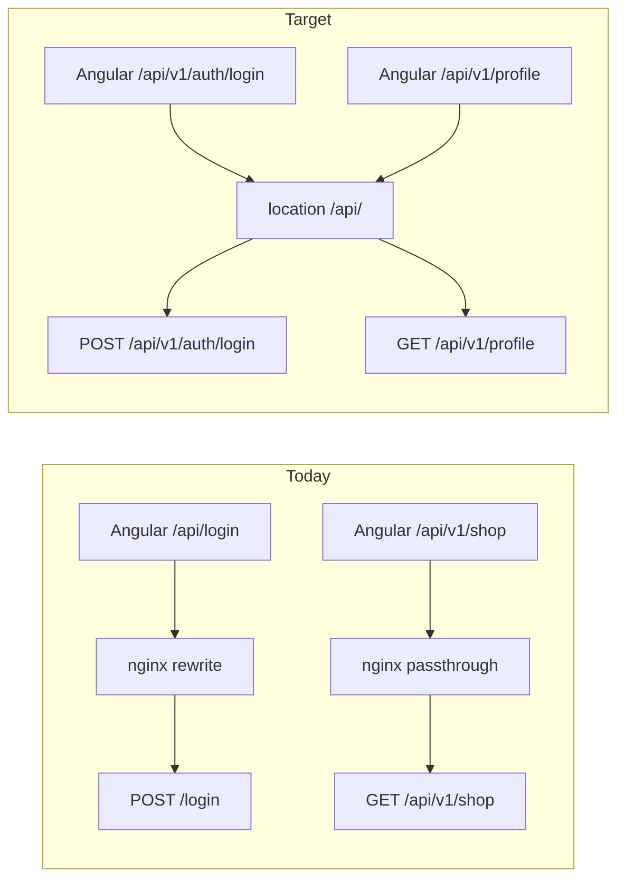

# Version all backend APIs under `/api/v1`

## Current state

| Area | Backend (Spring) | Frontend | Status |
|------|------------------|----------|--------|
| CRUD resources (`shop`, `event`, `user`, …) | `@RequestMapping("/api/v1/...")` on 14 controllers | `${environment.apiUrl}/api/v1/...` in all resource services | **Already done** |
| Auth | Root: `/login`, `/register`, `/auth/refresh`, `/auth/logout` (+ duplicate `/auth/login`) | [`auth.service.ts`](coffeeshop-frontend/src/app/services/auth.service.ts) via `authApiUrl` / `apiUrl` | **Needs change** |
| Profile | Root: `GET /profile` | [`profile.service.ts`](coffeeshop-frontend/src/app/services/profile.service.ts) + `profileUrl` in env | **Needs change** |
| Docker nginx | Generic `location /api/` + **4 special rewrites** for auth/profile | [`nginx.conf`](coffeeshop-frontend/nginx.conf) | Simplify after move |

There is **no secondary git worktree** (`git worktree list` shows only the main checkout). `/apply-worktree` is not applicable until work exists in another worktree; after implementation, run it only if you used a worktree branch.



## Target URL scheme

Consolidate auth under one controller prefix; drop legacy aliases.

| Method | New path | Replaces |
|--------|----------|----------|
| POST | `/api/v1/auth/login` | `/login`, `/auth/login` |
| POST | `/api/v1/auth/register` | `/register` |
| POST | `/api/v1/auth/refresh` | `/auth/refresh` |
| POST | `/api/v1/auth/logout` | `/auth/logout` |
| GET | `/api/v1/profile` | `/profile` |

Resource paths stay as-is (e.g. `/api/v1/shop`, not plural `shops`).

---

## 1. Backend (Spring Boot — [`coffeeshop/`](coffeeshop/))

### Controllers

- [`AuthController.java`](coffeeshop/src/main/java/com/coffeeshop/coffeeshop/auth/AuthController.java): add `@RequestMapping("/api/v1/auth")`, map methods to `/login`, `/register`, `/refresh`, `/logout`. **Remove** duplicate `@PostMapping("/auth/login")` and root-level mappings.
- [`ProfileController.java`](coffeeshop/src/main/java/com/coffeeshop/coffeeshop/auth/ProfileController.java): add `@RequestMapping("/api/v1")` + `@GetMapping("/profile")` (or class-level `/api/v1/profile`).

### Security (critical for profile)

[`SecurityConfiguration.java`](coffeeshop/src/main/java/com/coffeeshop/coffeeshop/config/SecurityConfiguration.java) currently has:

```39:39:coffeeshop/src/main/java/com/coffeeshop/coffeeshop/config/SecurityConfiguration.java
                        .requestMatchers(HttpMethod.GET, "/api/v1/**").permitAll()
```

Moving profile to `/api/v1/profile` would make it **anonymous** unless you add a **more specific rule first**:

```java
.requestMatchers(HttpMethod.GET, "/api/v1/profile").authenticated()
.requestMatchers(HttpMethod.POST,
        "/api/v1/auth/login", "/api/v1/auth/register",
        "/api/v1/auth/refresh", "/api/v1/auth/logout")
.permitAll()
.requestMatchers(HttpMethod.GET, "/api/v1/**").permitAll()
```

Remove old `/login`, `/register`, `/auth/*` matchers.

### Bearer token resolver

[`PublicEndpointBearerTokenResolver.java`](coffeeshop/src/main/java/com/coffeeshop/coffeeshop/config/PublicEndpointBearerTokenResolver.java):

- POST public paths → `/api/v1/auth/login`, `/register`, `/refresh`, `/logout`.
- GET `/api/v1/profile` must **not** skip JWT (treat like today’s `/profile`); extend the existing GET `/api/v1/` exclusion list (alongside `shop/mine`, `reservation-request`, etc.).

### Tests

Update paths in:

- [`AuthIntegrationTest.java`](coffeeshop/src/test/java/com/coffeeshop/coffeeshop/AuthIntegrationTest.java)
- [`ApiSecurityIntegrationTest.java`](coffeeshop/src/test/java/com/coffeeshop/coffeeshop/ApiSecurityIntegrationTest.java)
- [`ShopFavouriteIntegrationTest.java`](coffeeshop/src/test/java/com/coffeeshop/coffeeshop/ShopFavouriteIntegrationTest.java)

Run: `./mvnw -f coffeeshop test` (or project’s usual test command).

---

## 2. Frontend (Angular — delegate to **frontend-agent** after plan approval)

### Services

| File | Change |
|------|--------|
| [`auth.service.ts`](coffeeshop-frontend/src/app/services/auth.service.ts) | `authBase` → `${environment.apiUrl}/api/v1/auth`; paths `/login`, `/register`, `/refresh`, `/logout` (no `/auth/` segment in method paths) |
| [`profile.service.ts`](coffeeshop-frontend/src/app/services/profile.service.ts) | URL → `${environment.apiUrl}/api/v1/profile` |
| [`auth.interceptor.ts`](coffeeshop-frontend/src/app/services/auth.interceptor.ts) | Refresh guard: `includes('/api/v1/auth/refresh')` |

**No changes** to resource services (`shop.service.ts`, `event.service.ts`, etc.) — they already use `/api/v1/`.

### Environments

| File | Change |
|------|--------|
| [`environment.model.ts`](coffeeshop-frontend/src/environments/environment.model.ts) | Remove `authApiUrl` and dedicated `profileUrl` (optional: add `apiV1Url` helper — only if you want to DRY; not required) |
| [`environment.ts`](coffeeshop-frontend/src/environments/environment.ts) | Drop `profileUrl`; rely on `apiUrl` + `/api/v1/...` |
| [`environment.prod.ts`](coffeeshop-frontend/src/environments/environment.prod.ts) | Same |
| [`environment.docker.ts`](coffeeshop-frontend/src/environments/environment.docker.ts) | `apiUrl: ''` only; remove `authApiUrl` / `profileUrl` |

Angular **SPA routes** (`/login`, `/register`, `/profile` in [`app.routes.ts`](coffeeshop-frontend/src/app/app.routes.ts)) stay unchanged — only **HTTP API** paths move.

### Nginx

[`nginx.conf`](coffeeshop-frontend/nginx.conf): delete `location = /api/login`, `/api/register`, `/api/auth/`, `/api/profile`. The existing `location /api/` block forwards `/api/v1/**` to the backend unchanged, avoiding SPA/API path clashes.

### Docs / spec (light touch)

- Regenerate or replace [`api-docs.json`](coffeeshop-frontend/api-docs.json) from `GET /v3/api-docs` after backend change.
- Update auth/profile tables in [`frontend.md`](coffeeshop-frontend/frontend.md) if present.

---

## 3. Verification

1. **Backend tests** pass with new paths.
2. **Local dev** (`environment.ts`, backend on `:8080`):
   - `POST http://localhost:8080/api/v1/auth/login`
   - `GET http://localhost:8080/api/v1/profile` with Bearer → 200
   - `GET http://localhost:8080/api/v1/shop` without Bearer → 200 (unchanged)
3. **Docker compose** (`environment.docker.ts`):
   - Login/register from UI; confirm network tab shows `/api/v1/auth/login`, not `/api/login`
   - Profile load after login uses `/api/v1/profile`
4. **Staging** (if deployed): update any manual `curl` docs that still use `/api/login` or `/api/profile` (e.g. [`.cursor/plans/diagnose_silent_401_2c80e530.plan.md`](.cursor/plans/diagnose_silent_401_2c80e530.plan.md) — optional doc-only follow-up).

---

## 4. Out of scope / non-goals

- Renaming resources (`shop` → `shops`) or adding a shared `API_V1_PREFIX` constant (unless you want it later).
- Changing OpenAPI/Swagger UI paths (`/v3/api-docs`, `/swagger/**`).
- Changing Keycloak realm URLs or JWT issuer.
- `environment.prod.ts` not wired in `angular.json` (pre-existing; separate fix).

---

## 5. Apply-worktree

No extra worktree exists today. After coding in a worktree (if you create one), run the `/apply-worktree` Unix script from the command docs to copy changes into [`/Users/amastilovic/Desktop/dev/coffeeshop-monorepo`](file:///Users/amastilovic/Desktop/dev/coffeeshop-monorepo), then ask whether to delete the source worktree.
