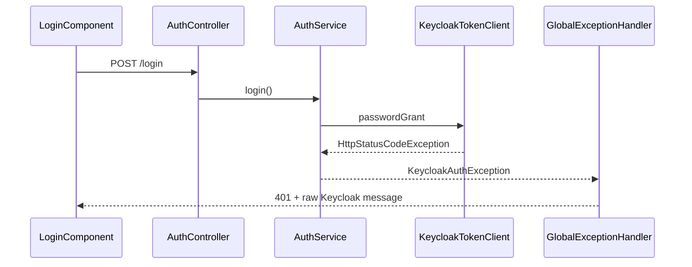
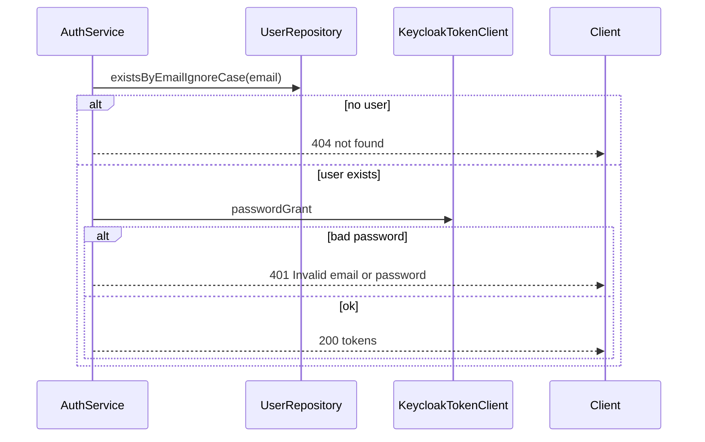

# Auth 404 and meaningful error messages

## Current behavior



- Login: [`AuthService.login`](coffeeshop/src/main/java/com/coffeeshop/coffeeshop/auth/AuthService.java) calls Keycloak directly; any token failure becomes [`KeycloakAuthException`](coffeeshop/src/main/java/com/coffeeshop/coffeeshop/auth/KeycloakAuthException.java) and [`GlobalExceptionHandler`](coffeeshop/src/main/java/com/coffeeshop/coffeeshop/exception/GlobalExceptionHandler.java) always responds with **401** and a technical message like `Keycloak token request failed: 401 UNAUTHORIZED`.
- Register: [`RegistrationService`](coffeeshop/src/main/java/com/coffeeshop/coffeeshop/auth/RegistrationService.java) throws **409 CONFLICT** for duplicate email (DB or Keycloak).
- Frontend already reads `err.error?.message` ([`login.component.ts`](coffeeshop-frontend/src/app/features/auth/login.component.ts), [`register.component.ts`](coffeeshop-frontend/src/app/features/auth/register.component.ts)) but login has no 404 branch; register only handles 409.

You confirmed **DB lookup** for “user not found” (aligned with registration’s `existsByEmailIgnoreCase`).

## Target behavior

| Case | Status | API `message` | UI message (suggested) |
|------|--------|---------------|------------------------|
| Login, email not in DB | 404 | `not found` | No account found with this email. |
| Login, email exists, wrong password | 401 | `Invalid email or password` | Same (from API) |
| Register, email already in DB | 404 | `An account with this email already exists` | Same (from API) |
| Register, Keycloak user already exists | 404 | Same as above | Same |

Wrong-password vs unknown-user is split by: **404 before** calling Keycloak when DB has no user; **401 after** Keycloak rejects credentials for an existing user.



## Backend changes

### 1. Login — [`AuthService.java`](coffeeshop/src/main/java/com/coffeeshop/coffeeshop/auth/AuthService.java)

Before `tokenClient.passwordGrant(...)`:

```java
if (!userRepository.existsByEmailIgnoreCase(request.email())) {
    throw new ResourceNotFoundException("not found");
}
```

Wrap Keycloak failure for existing users:

```java
try {
    final TokenResponse tokens = tokenClient.passwordGrant(...);
    ...
} catch (final KeycloakAuthException ex) {
    throw new ResponseStatusException(HttpStatus.UNAUTHORIZED, "Invalid email or password", ex);
}
```

`ResourceNotFoundException` is already mapped to **404** + [`ErrorResponse`](coffeeshop/src/main/java/com/coffeeshop/coffeeshop/exception/ErrorResponse.java) in `GlobalExceptionHandler`.

### 2. Register — [`RegistrationService.java`](coffeeshop/src/main/java/com/coffeeshop/coffeeshop/auth/RegistrationService.java)

Replace **409** paths with `ResourceNotFoundException` and a single user-facing message:

- Line 39–40: `existsByEmailIgnoreCase` → `new ResourceNotFoundException("An account with this email already exists")`
- Lines 54–56: Keycloak “already exists” → same message (not the raw Keycloak exception text)

Keep **403** / **422** / **502** behavior unchanged for admin role, invalid role, and IdP failures.

### 3. Consistent JSON for `ResponseStatusException` — [`GlobalExceptionHandler.java`](coffeeshop/src/main/java/com/coffeeshop/coffeeshop/exception/GlobalExceptionHandler.java)

Add handler so login 401 uses the same `{ "message": "..." }` shape as 404:

```java
@ExceptionHandler(ResponseStatusException.class)
public ResponseEntity<ErrorResponse> handleResponseStatus(final ResponseStatusException ex) {
    final String message = ex.getReason() != null ? ex.getReason() : ex.getStatusCode().toString();
    return ResponseEntity.status(ex.getStatusCode()).body(new ErrorResponse(message));
}
```

Optionally narrow [`KeycloakAuthException`](coffeeshop/src/main/java/com/coffeeshop/coffeeshop/exception/GlobalExceptionHandler.java) handler to a generic safe message for any remaining paths (refresh/logout), since login will no longer rely on it for credential errors.

## Frontend changes

### [`login.component.ts`](coffeeshop-frontend/src/app/features/auth/login.component.ts)

In the `error` callback, branch on status before the generic fallback:

- **404**: show a friendly line (e.g. “No account found with this email.”) — can use `err.error?.message` if you prefer showing literal `not found`
- **401**: `err.error?.message ?? 'Invalid email or password.'`
- default: existing fallback

No change to [`auth.interceptor.ts`](coffeeshop-frontend/src/app/services/auth.interceptor.ts): `/login` is not retried on 401.

### [`register.component.ts`](coffeeshop-frontend/src/app/features/auth/register.component.ts)

- Replace `status === 409` with `status === 404`
- Use `err.error?.message` for the duplicate-email case (backend will supply the full sentence)

## Tests

Add [`AuthIntegrationTest.java`](coffeeshop/src/test/java/com/coffeeshop/coffeeshop/AuthIntegrationTest.java) (same style as [`ApiSecurityIntegrationTest`](coffeeshop/src/test/java/com/coffeeshop/coffeeshop/ApiSecurityIntegrationTest.java)):

- `@MockitoBean KeycloakTokenClient` and `KeycloakAdminClient`
- **login_unknownEmail_returns404** — POST `/login`, assert status 404, body `message` = `not found`, verify `passwordGrant` never called
- **login_wrongPassword_returns401** — seed user in DB, mock `passwordGrant` to throw `KeycloakAuthException`, assert 401 + `Invalid email or password`
- **register_duplicateEmail_returns404** — register once, register again, assert 404 + duplicate message

Parse response body as `Map` or a small test DTO matching `ErrorResponse`.

## Files to touch

| File | Change |
|------|--------|
| [`AuthService.java`](coffeeshop/src/main/java/com/coffeeshop/coffeeshop/auth/AuthService.java) | DB pre-check + friendly 401 |
| [`RegistrationService.java`](coffeeshop/src/main/java/com/coffeeshop/coffeeshop/auth/RegistrationService.java) | 404 + shared duplicate message |
| [`GlobalExceptionHandler.java`](coffeeshop/src/main/java/com/coffeeshop/coffeeshop/exception/GlobalExceptionHandler.java) | `ResponseStatusException` → `ErrorResponse` |
| [`login.component.ts`](coffeeshop-frontend/src/app/features/auth/login.component.ts) | 404 / 401 UX |
| [`register.component.ts`](coffeeshop-frontend/src/app/features/auth/register.component.ts) | 404 instead of 409 |
| New `AuthIntegrationTest.java` | Cover the three flows |

No Docker/Keycloak config changes required.
