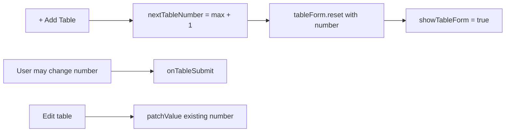

# Auto-increment default table number on create

## Current behavior

Table management lives in [`coffeeshop-frontend/src/app/features/shop-details/shop-details.component.ts`](coffeeshop-frontend/src/app/features/shop-details/shop-details.component.ts):

- Form defaults are fixed at init:

```751:754:coffeeshop-frontend/src/app/features/shop-details/shop-details.component.ts
  readonly tableForm = this.fb.nonNullable.group({
    number: [1, [Validators.required, Validators.min(1)]],
    capacity: [2, [Validators.required, Validators.min(1)]],
  });
```

- **+ Add Table** only toggles visibility — it does not recompute the number:

```333:333:coffeeshop-frontend/src/app/features/shop-details/shop-details.component.ts
            <button class="btn btn-primary mb-2" (click)="showTableForm.set(true)">+ Add Table</button>
```

- After a successful create, the form resets to `number: 1` again (line 1056).

There is no backend uniqueness constraint on table numbers; this is purely a UX default. No API or Java changes are required.

## Desired behavior

| Action | Table number field |
|--------|-------------------|
| Open **+ Add Table** | Pre-filled with `max(existing numbers) + 1` (or `1` if shop has no tables) |
| User edits the field | Any valid number ≥ 1 (unchanged) |
| **Edit** existing table | Existing `t.number` (unchanged) |

Rule confirmed: **highest existing number + 1** (e.g. tables 1, 3, 7 → default **8**).

Note: For reactive forms, the visible default is the **control value**, not an HTML `placeholder`. The number input will show the pre-filled value; users can still change it before submit.

## Implementation (single file)

**File:** [`shop-details.component.ts`](coffeeshop-frontend/src/app/features/shop-details/shop-details.component.ts)

### 1. Add helper

```typescript
private nextTableNumber(): number {
  const tables = this.shop()?.tables ?? [];
  if (tables.length === 0) return 1;
  return Math.max(...tables.map(t => t.number)) + 1;
}
```

### 2. Add `openAddTableForm()`

Called when starting a new table (not edit):

- `editingTableId.set(null)`
- `tableForm.reset({ number: this.nextTableNumber(), capacity: 2 })`
- `showTableForm.set(true)`

This fixes stale values if the user previously edited/cancelled, and always uses the latest `shop().tables` from the loaded shop.

### 3. Wire template

Replace inline click on **+ Add Table**:

```html
(click)="openAddTableForm()"
```

Leave `onEditTable` as-is (still `patchValue` with the table’s current number).

### 4. Align post-submit reset

In `onTableSubmit` success handler, replace hardcoded `number: 1` with `number: this.nextTableNumber()` so internal form state stays consistent if the form is reopened without clicking **+ Add Table** again (minor, but consistent).

## Flow



## Verification

1. Shop with no tables → open add form → number shows **1**.
2. Add tables 1, 2, 3 → open add form again → number shows **4**.
3. Shop with tables 1, 3, 7 → default **8**; change to 10 manually → create succeeds with 10.
4. Edit table 3 → number shows **3**, not auto-incremented.
5. Cancel add form, delete highest table, open add again → default reflects new max + 1.

No new tests unless you want a small unit test for `nextTableNumber` logic; the project does not currently test this component, so manual verification is sufficient for this scope.
