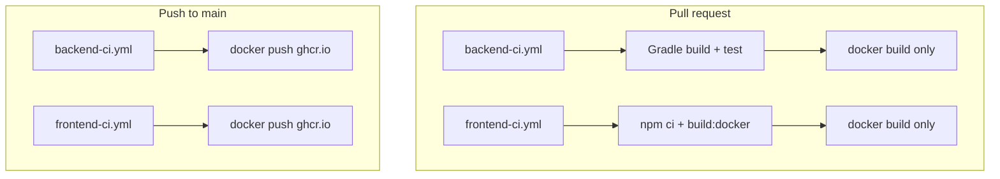

# CI pipelines for frontend and backend (GHCR)

## Current state

| Area | Status |
|------|--------|
| GitHub Actions | [`.github/workflows/`](.github/workflows/) exists but is **empty** — no workflows yet |
| Repo | [`mastilovic/coffeeshop-monorepo`](https://github.com/mastilovic/coffeeshop-monorepo) (monorepo root) |
| Backend | Spring Boot 4 + Java 25 in [`coffeeshop/`](coffeeshop/); multi-stage [`coffeeshop/Dockerfile`](coffeeshop/Dockerfile) (`gradle bootJar` → JRE 25) |
| Frontend | Angular 21 in [`coffeeshop-frontend/`](coffeeshop-frontend/); [`coffeeshop-frontend/Dockerfile`](coffeeshop-frontend/Dockerfile) (`npm run build:docker` → nginx) |
| Tests | Backend: 25+ JUnit tests, many integration tests via **Testcontainers** ([`TestcontainersConfiguration.java`](coffeeshop/src/test/java/com/coffeeshop/coffeeshop/TestcontainersConfiguration.java)). Frontend: `ng test` script exists but **no `*.spec.ts` files** — build-only in CI |

## Target architecture



**Your choices (locked in):**
- **Push to GHCR**: only on `push` to `main` (not on PRs)
- **PRs**: build + validate (backend includes tests); Docker image built but **not pushed**
- **Tests**: backend Gradle/Testcontainers; frontend compile/build only

## Image naming (GHCR)

Use lowercase names (GHCR requirement):

| Service | Image | Build context |
|---------|--------|----------------|
| Backend | `ghcr.io/mastilovic/coffeeshop-backend` | `coffeeshop/` |
| Frontend | `ghcr.io/mastilovic/coffeeshop-frontend` | `coffeeshop-frontend/` |

**Tags on `main` push:**
- `sha-<short_sha>` — immutable traceability (`github.sha` truncated to 7 chars)
- `latest` — rolling tag for local/prod compose pulls

Optional later: `v*` git tags → semver tags (not in initial scope unless you add release workflow).

## Files to add

### 1. [`.github/workflows/backend-ci.yml`](.github/workflows/backend-ci.yml)

**Triggers**
```yaml
on:
  pull_request:
    paths: ['coffeeshop/**', '.github/workflows/backend-ci.yml']
  push:
    branches: [main]
    paths: ['coffeeshop/**', '.github/workflows/backend-ci.yml']
```

**Job: `build-and-test`** (all events)
- `actions/checkout@v4`
- `actions/setup-java@v4` with **Temurin JDK 25** (matches [`build.gradle`](coffeeshop/build.gradle) toolchain)
- Gradle cache via `gradle/actions/setup-gradle@v4` (working directory: `coffeeshop`)
- Run: `./gradlew build --no-daemon` from `coffeeshop/` (compiles + runs unit/integration tests)

**Job: `docker`** (needs `build-and-test`, `if: success()`)
- `docker/setup-buildx-action@v3`
- **PRs**: `docker/build-push-action@v6` with `push: false`, `tags: ghcr.io/mastilovic/coffeeshop-backend:pr-${{ github.event.pull_request.number }}` (local validation only; tag is arbitrary since not pushed)
- **`main` push**:
  - `permissions`: `contents: read`, `packages: write`
  - Login: `docker/login-action@v3` → `registry: ghcr.io`, `username: ${{ github.actor }}`, `password: ${{ secrets.GITHUB_TOKEN }}`
  - `docker/build-push-action@v6` with `context: coffeeshop`, `push: true`, tags:
    - `ghcr.io/mastilovic/coffeeshop-backend:sha-${{ env.SHORT_SHA }}`
    - `ghcr.io/mastilovic/coffeeshop-backend:latest`
  - Enable BuildKit cache: `cache-from: type=gha`, `cache-to: type=gha,mode=max` (aligns with Dockerfile Gradle/npm cache mounts)

**Testcontainers on GHA:** Ubuntu runners include Docker; no extra service containers required for Postgres-only tests. Job does **not** need `services:` block unless you later add Keycloak-dependent E2E outside Testcontainers mocks.

### 2. [`.github/workflows/frontend-ci.yml`](.github/workflows/frontend-ci.yml)

**Triggers** (mirror backend with frontend paths):
```yaml
paths: ['coffeeshop-frontend/**', '.github/workflows/frontend-ci.yml']
```

**Job: `build`**
- `actions/setup-node@v4` with **Node 22** (matches [`Dockerfile`](coffeeshop-frontend/Dockerfile))
- `npm ci` + `npm run build:docker` in `coffeeshop-frontend/` (same as Docker build stage)

**Job: `docker`**
- Same push/no-push split as backend
- `context: coffeeshop-frontend`
- Image: `ghcr.io/mastilovic/coffeeshop-frontend`

### 3. Optional: [`.github/dependabot.yml`](.github/dependabot.yml)

Low priority follow-up: Dependabot for `github-actions` and Docker base images. Not required for first CI cut.

## Repository / org setup (manual, one-time)

1. **GHCR package visibility**  
   After first successful `main` push, open **GitHub → Packages** for `coffeeshop-backend` / `coffeeshop-frontend`. Set visibility (private recommended for a personal app). Link packages to the repo if prompted.

2. **Workflow permissions** (if org enforces restricted `GITHUB_TOKEN`)  
   Repo **Settings → Actions → General → Workflow permissions**: allow read access; ensure **Packages: Read and write** for workflows that push (or use fine-grained rules allowing `packages: write`).

3. **No extra secrets for GHCR** if using default `GITHUB_TOKEN` with `packages: write` on the push job. Use a PAT only if you need cross-repo pushes later.

4. **Pull images locally** (after first main build):
   ```bash
   docker login ghcr.io -u <github-username>
   docker pull ghcr.io/mastilovic/coffeeshop-backend:latest
   ```

## Optional compose alignment (post-CI)

Today [`coffeeshop/docker-compose.yaml`](coffeeshop/docker-compose.yaml) uses `build:` for `backend` and `frontend`. For deployed environments you may later add a second compose override that swaps to published images:

```yaml
backend:
  image: ghcr.io/mastilovic/coffeeshop-backend:latest
frontend:
  image: ghcr.io/mastilovic/coffeeshop-frontend:latest
```

Keep local dev on `docker compose up --build` unchanged; this is a separate follow-up.

## Workflow skeleton (reference)

Backend push job essentials:

```yaml
permissions:
  contents: read
  packages: write

steps:
  - uses: docker/login-action@v3
    with:
      registry: ghcr.io
      username: ${{ github.actor }}
      password: ${{ secrets.GITHUB_TOKEN }}
  - uses: docker/build-push-action@v6
    with:
      context: coffeeshop
      push: ${{ github.ref == 'refs/heads/main' && github.event_name == 'push' }}
      tags: |
        ghcr.io/mastilovic/coffeeshop-backend:sha-${{ steps.meta.outputs.short_sha }}
        ghcr.io/mastilovic/coffeeshop-backend:latest
```

Use a single `push` boolean (or `if: github.ref == 'refs/heads/main'`) instead of duplicating workflows for PR vs main.

## Verification checklist

After implementation:

1. Open a PR touching only `coffeeshop/` → backend workflow runs, tests pass, Docker build succeeds, **no** new GHCR tags.
2. Open a PR touching only `coffeeshop-frontend/` → frontend workflow runs, `build:docker` succeeds, no push.
3. Merge to `main` → both images appear under `ghcr.io/mastilovic/` with `latest` and `sha-*` tags.
4. Confirm backend job duration is acceptable (Testcontainers + Gradle); tune Gradle GHA cache if runs exceed ~10–15 min.

## Out of scope (initial delivery)

- Frontend `ng test` / Playwright E2E
- Deploy to cloud (ECS/K8s), environment promotion, or signing
- Semantic-release / tag-based versioning
- Monolithic single workflow (you explicitly want **two** pipelines)

## Implementation order

1. Add `backend-ci.yml` and validate on a backend-only PR.
2. Add `frontend-ci.yml` and validate on a frontend-only PR.
3. Merge to `main` and confirm GHCR packages + permissions.
4. Document image names in root README or devops notes (optional).
