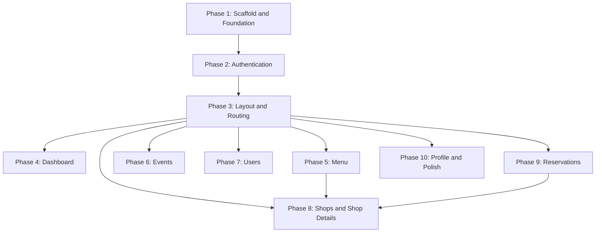

# CoffeeShop Frontend -- Full Implementation Plan

The frontend is a **greenfield Angular 21 SPA** (standalone components, signals, OnPush, inline templates, no CSS framework). The `coffeeshop-frontend/` directory currently only contains `frontend.md` and `api-docs.json`.

The plan is split into **10 phases**. Each phase produces a working increment that can be served and tested against the Spring Boot backend at `http://localhost:8080`.

---

## Phase 1: Project Scaffold and Foundation

Scaffold the Angular project and establish the shared foundation that every subsequent phase depends on.

**Steps:**
- Run `ng new coffeeshop-frontend --standalone --routing --style=css --skip-tests` inside the monorepo (or scaffold manually)
- Remove SSR/server entries from `angular.json` if generated
- Set up `src/environments/environment.ts` (`apiUrl: 'http://localhost:8080'`) and `environment.prod.ts`
- Write `src/styles.css` with the full design-system tokens: color palette (`#121212` bg, `#1a1a2e` surface, `#d4a574` accent, etc.), typography stack, and all recurring CSS classes (`.page`, `.form-card`, `.btn`, `.data-table`, `.card-grid`, `.loading`, `.empty-state`, `.badge`, etc.)
- Create all TypeScript model interfaces in `src/app/models/`:
  - `user.model.ts` -- `UserResponseDto`, `UserSummaryDto`, `UserCreateRequest`, `UserUpdateRequest`, `RegisterRequest`, `LoginRequest`, `TokenResponse`
  - `shop.model.ts` -- `ShopResponseDto`, `ShopSummaryDto`, `ShopCreateRequest`
  - `event.model.ts` -- `EventResponseDto`, `EventCreateRequest`, `EventUpdateRequest`
  - `reservation.model.ts` -- `ReservationResponseDto`, `ReservationCreateRequest`, `ReservationRequestResponseDto`, `ReservationRequestCreateRequest`, `ReservationAcceptRequest`
  - `menu.model.ts` -- `MenuResponseDto`, `MenuItemResponseDto`, `MenuItemCreateRequest`
  - `table.model.ts` -- `TableResponseDto`, `TableCreateRequest`
  - `review.model.ts` -- `ReviewResponseDto`, `ReviewCreateRequest`
  - `role.model.ts` -- `RoleResponseDto`
  - `loyalty-plan.model.ts` -- `LoyaltyPlanResponseDto`
  - `contact.model.ts` -- `ContactResponseDto`
- Configure `app.config.ts` with `provideRouter`, `provideHttpClient(withFetch(), withInterceptors([authInterceptor]))`, and `provideBrowserGlobalErrorListeners()`
- Set up minimal `app.ts` root component: `template: '<router-outlet />'`

**Files created:** ~20 files (scaffold + models + environments + global CSS)

---

## Phase 2: Authentication System

Build the complete auth flow: service, interceptor, guard, and the two full-screen pages.

**Steps:**
- Create `src/app/services/auth.service.ts`:
  - Inject `HttpClient`, use `environment.apiUrl`
  - Methods: `login(email, password)`, `register(name, email, password, role)`, `refreshToken()`, `logout()`
  - Signal-based state: `accessToken`, `refreshToken`, `isAuthenticated` (computed), `currentUserEmail`, `realmRoles`, `isAdmin` (computed)
  - JWT decode helper (parse base64 payload for `sub`, `email`/`preferred_username`, `realm_access.roles`, `exp`)
  - Persist tokens to `localStorage` keys `coffeeshop_access_token` / `coffeeshop_refresh_token`
  - Restore tokens from `localStorage` on service init
- Create `src/app/services/auth.interceptor.ts` -- functional `HttpInterceptorFn`, attaches `Authorization: Bearer` header when token exists
- Create `src/app/services/auth.guard.ts` -- `canActivateFn`, redirects to `/login` if not authenticated
- Create `src/app/features/auth/login.component.ts`:
  - Reactive form: email + password
  - `POST /login`, store tokens, navigate to `/dashboard`
  - Error display from `{ message }` body
  - Link to `/register`
- Create `src/app/features/auth/register.component.ts`:
  - Reactive form: name, email, password, role select (`customer` | `shop_owner`)
  - `POST /register`, show success message, link to login
  - Handle 409/403 errors
- Wire `/login` and `/register` routes in `app.routes.ts` (lazy, no layout)

**Files created:** ~5 files

---

## Phase 3: Layout Shell and Routing

Build the authenticated layout wrapper and complete the route table.

**Steps:**
- Create `src/app/shared/layout/layout.component.ts`:
  - Sidebar (collapsible) with nav links: Dashboard, Menu, Events, My Reservations, Users, Shops
  - Header with app title + profile dropdown (user email from auth signals, links to `/profile`, logout action)
  - Nested `<router-outlet />` for child content
  - Dark theme styling per design system
  - `ChangeDetectionStrategy.OnPush`
- Create `src/app/services/profile.service.ts`:
  - `getProfile(): Observable<UserResponseDto>` calling `GET /profile`
  - Signal `currentUser` populated after login
- Complete `app.routes.ts` with the full route table:
  - `/login`, `/register` (no layout, lazy)
  - Layout parent route with `canActivate: [authGuard]` and children:
    - `/dashboard`, `/menu`, `/events`, `/reservations`, `/users`, `/shops`, `/shops/:id`, `/profile`
  - Default redirect `/` to `/dashboard`
  - Wildcard `**` to `/dashboard`
  - All child routes use `loadComponent` for lazy loading
- Create placeholder components for all features (empty shell with page title) so routing works end-to-end

**Files created:** ~10 files (layout + placeholders)

---

## Phase 4: Dashboard

**Steps:**
- Create `src/app/features/dashboard/dashboard.component.ts`:
  - Stat cards showing: total shops, total menu items, total events, pending reservation requests (optional)
  - Load data from `GET /api/v1/shop`, `GET /api/v1/event`, `GET /api/v1/menu-item` on init
  - Use signals for reactive card values
  - `.card-grid` layout with styled stat cards

**Files created:** 1 file (replaces placeholder)

---

## Phase 5: Menu Management

**Steps:**
- Create `src/app/services/menu.service.ts` -- CRUD for `/api/v1/menu` (create sends empty `{}`)
- Create `src/app/services/menu-item.service.ts` -- CRUD for `/api/v1/menu-item`
- Create `src/app/features/menu/menu.component.ts`:
  - Data table listing all menu items (`name`, `description`, `price`, `priceCurrency`, `imageUrl`)
  - Add/edit form toggle (signal `showForm`): fields for `name`, `description`, `price`, `priceCurrency`, `imageUrl`, `menuId` (select from available menus)
  - Delete with `confirm()`
  - Button to create a new menu (empty POST)

**Files created:** 3 files

---

## Phase 6: Events

**Steps:**
- Create `src/app/services/event.service.ts` -- CRUD for `/api/v1/event` (note: path uses `eventId` not `id`)
- Create `src/app/features/events/events.component.ts`:
  - Data table: `eventName`, shop name (resolve via shops list), `eventDate`, `description`
  - Add/edit form: `eventName`, `eventDate` (datetime-local), `description`, shop select (`shopId`)
  - CRUD operations
  - Load shops list for the shop selector

**Files created:** 2 files

---

## Phase 7: Users

**Steps:**
- Create `src/app/services/user.service.ts` -- CRUD for `/api/v1/user`
- Create `src/app/features/users/users.component.ts`:
  - Data table: `name`, `email`, `userType`, roles list
  - Edit button visible when row user `id` matches current profile user `id` or user is admin
  - Delete button restricted to admin realm role
  - Edit form: `name`, `email`, `userType`, `roleIds`

**Files created:** 2 files

---

## Phase 8: Shops and Shop Details

The largest feature -- shop listing plus the tabbed detail view.

**Steps:**
- Create `src/app/services/shop.service.ts` -- CRUD for `/api/v1/shop`
- Create `src/app/services/table.service.ts` -- CRUD for `/api/v1/table`
- Create `src/app/services/review.service.ts` -- CRUD for `/api/v1/review`
- Create `src/app/features/shops/shops.component.ts`:
  - Card grid of all shops (`name`, `address`, `phoneNumber`, `email`)
  - Click card to navigate to `/shops/:id`
  - Create shop form: `name`, `address`, `phoneNumber`, `email`, `createdByUserId` (auto-filled from profile)
  - Edit/delete gated by `createdBy.id` match or `SHOP_OWNER`/`ADMIN` role
- Create `src/app/features/shop-details/shop-details.component.ts`:
  - Load `GET /api/v1/shop/{id}` once; extract nested data
  - Tab navigation (signal-driven active tab):
    - **Users tab** -- list `shop.users` (read-only)
    - **Menu tab** -- list `shop.menu.items`, CRUD menu items with `menuId` pre-filled
    - **Tables tab** -- list `shop.tables`, CRUD via TableService (`number`, `capacity`, `shopId`)
    - **Reservations tab** -- filter reservations by shop, show reservation requests with accept/deny buttons
    - **Events tab** -- filter events by `shopId`
    - **Reviews tab** -- list `shop.reviews`, optional CRUD

**Files created:** ~5 files

---

## Phase 9: Reservations

**Steps:**
- Create `src/app/services/reservation.service.ts` -- CRUD for `/api/v1/reservation`
- Create `src/app/services/reservation-request.service.ts` -- create request, accept (`POST .../accept` with `{ tableId }`), deny (`POST .../deny`)
- Create `src/app/features/reservations/reservations.component.ts`:
  - **Customer view**: create reservation request form (`shopId` select, `minPartySize`, `maxPartySize`), list own requests filtered by profile user id, show status badges (`PENDING`/`ACCEPTED`/`DENIED`)
  - **Shop owner view**: list requests for their shops, accept (select table) / deny buttons
  - **Confirmed reservations**: list filtered by current user, show table assignment

**Files created:** 3 files

---

## Phase 10: Profile and Remaining Services

**Steps:**
- Create `src/app/features/profile/profile.component.ts`:
  - Load `GET /profile`
  - Display: `name`, `email`, `userType`, roles, favourite shops list
  - Edit form: `PUT /api/v1/user/{id}` with `name`, `email`, `favouriteShopIds` (multi-select from shops)
- Create remaining services (if not already created):
  - `src/app/services/contact.service.ts` -- CRUD for `/api/v1/contact`
  - `src/app/services/role.service.ts` -- CRUD for `/api/v1/role`
  - `src/app/services/loyalty-plan.service.ts` -- CRUD for `/api/v1/loyalty-plan`
- Polish:
  - Token refresh before expiry (timer or interceptor 401 retry)
  - Consistent error handling across all services (toast or inline `{ message }`)
  - Loading spinners on all data-fetching components
  - Empty-state messages when lists are empty

**Files created:** ~5 files

---

## Dependency Graph

Phases 4-10 can be implemented in any order after Phase 3 is complete, except:
- Phase 8 (Shop Details) reuses MenuService/MenuItemService from Phase 5 and ReservationRequestService from Phase 9
- Implementing Phase 5 and 9 before Phase 8 is recommended

---

## Estimated File Count

- **Models:** ~10 files
- **Services:** ~13 files (auth, profile, user, shop, event, reservation, reservation-request, menu, menu-item, table, review, contact, role, loyalty-plan)
- **Features:** ~10 component files
- **Shared:** 1 layout component
- **Config/bootstrap:** ~5 files (app.ts, app.config.ts, app.routes.ts, environments x2)
- **Styles:** 1 global CSS file
- **Total:** ~40 hand-written files + Angular scaffold
