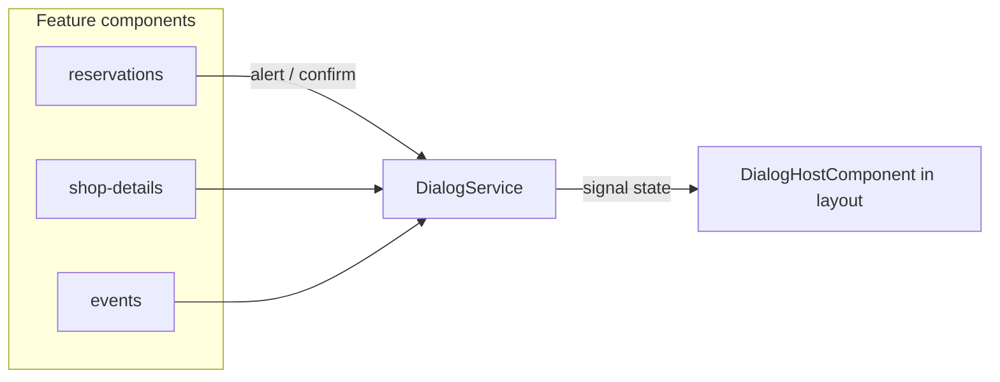

# Replace browser alert/confirm with custom dialogs

## Inventory (19 call sites, 0 `prompt()`)

| File | `alert` | `confirm` | Messages |
|------|---------|-----------|----------|
| [`reservations.component.ts`](coffeeshop-frontend/src/app/features/reservations/reservations.component.ts) | 5 | 1 | Table selection, accept errors, event full, 409 conflicts, deny request |
| [`shop-details.component.ts`](coffeeshop-frontend/src/app/features/shop-details/shop-details.component.ts) | 6 | 4 | Table selection, accept errors, menu/items, delete post/item/table, deny request, comment/review errors |
| [`events.component.ts`](coffeeshop-frontend/src/app/features/events/events.component.ts) | 0 | 1 | Delete event |
| [`shops.component.ts`](coffeeshop-frontend/src/app/features/shops/shops.component.ts) | 0 | 1 | Delete shop |
| [`users.component.ts`](coffeeshop-frontend/src/app/features/users/users.component.ts) | 0 | 1 | Delete user |

Auth routes (`login`, `register`) have **no** browser dialogs.

## Existing assets to reuse

Global styles already define the overlay pattern in [`styles.css`](coffeeshop-frontend/src/styles.css):

```670:703:coffeeshop-frontend/src/styles.css
.confirm-overlay { ... }
.confirm-dialog { ... }
.confirm-dialog-actions { ... }
```

[`shop-details.component.ts`](coffeeshop-frontend/src/app/features/shop-details/shop-details.component.ts) has one **inline** custom confirm (`newMenuConfirmOpen` signal + template block lines 643–658). Migrate this to the shared service so there is a single dialog pattern.

## Architecture



### 1. DialogService

New [`coffeeshop-frontend/src/app/services/dialog.service.ts`](coffeeshop-frontend/src/app/services/dialog.service.ts):

- `providedIn: 'root'`
- Promise-based API (drop-in mental model for `alert` / `confirm`):
  - `alert(message: string): Promise<void>`
  - `confirm(message: string, options?: DialogConfirmOptions): Promise<boolean>`
- `DialogConfirmOptions`: optional `confirmLabel` (default `"OK"`), `cancelLabel` (default `"Cancel"`), `confirmVariant: 'primary' | 'danger'` (use `danger` for delete flows)
- Internal `signal<ActiveDialog | null>`; only one dialog at a time
- `closeAlert()` / `closeConfirm(confirmed: boolean)` called by host

### 2. DialogHostComponent

New [`coffeeshop-frontend/src/app/shared/dialog-host/dialog-host.component.ts`](coffeeshop-frontend/src/app/shared/dialog-host/dialog-host.component.ts):

- Standalone, OnPush, reads `dialogService.state()`
- Renders overlay when active:
  - **alert**: message + single primary OK button
  - **confirm**: message + Cancel (secondary) + confirm button (primary or danger)
- Backdrop click + Escape key → alert closes; confirm cancels (same as Cancel)
- `role="dialog"`, `aria-modal="true"`, `aria-labelledby` on message
- Uses existing `.confirm-overlay` / `.confirm-dialog` classes (no new design system)

### 3. Mount once in layout

Update [`layout.component.ts`](coffeeshop-frontend/src/app/shared/layout/layout.component.ts):

- Import `DialogHostComponent`
- Add `<app-dialog-host />` at end of template (covers all auth-guarded routes via [`app.routes.ts`](coffeeshop-frontend/src/app/app.routes.ts))

### 4. Replace all call sites

Inject `DialogService` and swap:

**Alert (sync guard):**
```typescript
// before
alert('Please select a table first.');
return;
// after
void this.dialog.alert('Please select a table first.');
return;
```

**Alert (subscribe error):**
```typescript
error: () => void this.dialog.alert('Could not submit review...')
```

**Confirm (delete / deny):**
```typescript
// before
if (!confirm(`Delete "${shop.name}"?`)) return;
this.shopService.delete(shop.id).subscribe(...);

// after
void this.dialog.confirm(`Delete "${shop.name}"?`, { confirmLabel: 'Delete', confirmVariant: 'danger' })
  .then(ok => {
    if (!ok) return;
    this.shopService.delete(shop.id).subscribe(...);
  });
```

**Deny reservation** (both components): `confirmLabel: 'Deny'`, `confirmVariant: 'danger'`.

**Accept errors**: keep using [`getAcceptReservationErrorMessage`](coffeeshop-frontend/src/app/utils/api-error.ts) but show via `dialog.alert(...)`.

### 5. Remove shop-details inline confirm

Delete `newMenuConfirmOpen` signal, template block (lines 643–658), `onNewMenuConfirmYes` / `onNewMenuConfirmNo`. Replace trigger with:

```typescript
void this.dialog.confirm(
  'Create a new menu? The current menu will become read-only history.',
  { confirmLabel: 'Yes', cancelLabel: 'No' },
).then(ok => { if (ok) this.executeCreateMenu(); });
```

## Files touched

| Action | File |
|--------|------|
| Create | `services/dialog.service.ts` |
| Create | `shared/dialog-host/dialog-host.component.ts` |
| Edit | `shared/layout/layout.component.ts` |
| Edit | `features/reservations/reservations.component.ts` (6 sites) |
| Edit | `features/shop-details/shop-details.component.ts` (10 sites + remove inline dialog) |
| Edit | `features/events/events.component.ts` (1 site) |
| Edit | `features/shops/shops.component.ts` (1 site) |
| Edit | `features/users/users.component.ts` (1 site) |

No new npm dependencies. Optional minor CSS tweak in `styles.css` only if single-button alert layout needs centering (likely fine with existing flex-end actions).

## Verification

1. Reservations → Accept without table → custom dialog (not browser popup).
2. Accept with undersized table → custom error dialog with capacity message.
3. Deny request → custom confirm with Deny/Cancel.
4. Delete shop/event/user/menu item/table/post → custom confirm with red Delete button.
5. Menu create error, review/comment errors → custom alert.
6. Shop details → "Create new menu" → same custom confirm (no inline duplicate).
7. Escape and backdrop click dismiss correctly.
