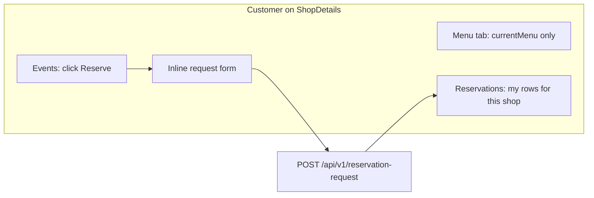

# Customer shop details experience

## Current behavior (gaps)

All changes live in [`coffeeshop-frontend/src/app/features/shop-details/shop-details.component.ts`](coffeeshop-frontend/src/app/features/shop-details/shop-details.component.ts).

| Area | Today | Problem for CUSTOMER |
|------|--------|----------------------|
| **Menu** | Shows `currentMenu` plus **Menu history** (`shop.menuHistory`) for everyone | Customers see old menus |
| **Tables** | Tab always visible | Customers should not manage or view table inventory |
| **Reservations** | `loadReservations()` calls `requestService.getAll(shopId)` and lists all shop pending/approved/denied rows for non-owners | Backend **forbids** shop-scoped request listing for customers (`403` in [`ReservationRequestServiceImpl.findForCurrentUser`](coffeeshop/src/main/java/com/coffeeshop/coffeeshop/service/impl/ReservationRequestServiceImpl.java)); UI would also leak other guests’ bookings |
| **Events** | Read-only table | No way to start a reservation from the shop context |

Existing patterns to reuse (do not duplicate blindly):

- Customer filtering on global **Reservations** page: [`myReservations`](coffeeshop-frontend/src/app/features/reservations/reservations.component.ts) filters `r.user?.id === profile.id`
- Event eligibility: [`canReserveForEvent`](coffeeshop-frontend/src/app/features/events/events.component.ts) (not full, future date)
- Blocking duplicate bookings: `eventIdsBlockedForUser` + `BLOCKING_REQUEST_STATUSES` in [`reservations.component.ts`](coffeeshop-frontend/src/app/features/reservations/reservations.component.ts)
- Global Events page already navigates to `/reservations?shopId=&eventId=` — shop Events tab should keep the user **in shop details** per your request



## Implementation plan

### 1. Add role-aware computed flags

In `ShopDetailsComponent`:

```typescript
readonly isCustomer = computed(() => {
  const profile = this.profileService.currentUser();
  return !!profile && profile.userType === 'CUSTOMER' && !this.canManageShop();
});

readonly visibleTabs = computed(() =>
  this.isCustomer() ? this.tabs.filter(t => t.key !== 'tables') : this.tabs,
);
```

- Template: iterate `visibleTabs()` instead of `tabs` (line ~78).
- If the active tab is `tables` and the user is a customer (edge case), reset to `menu` in `onTabChange` or when shop loads.

### 2. Menu tab — current menu only for customers

Wrap the **Menu history** block (lines 276–309) with `@if (!isCustomer())` so owners/admins still see history.

No change needed for the **Current menu** section — it already reads `shop.currentMenu`; owner CRUD stays behind `canManageShop()`.

### 3. Reservations tab — only the logged-in customer’s bookings for this shop

**Data loading** — split `loadReservations()`:

| Role | Requests API | Client filter |
|------|----------------|---------------|
| Owner / admin (`canManageShop()`) | `getAll(shopId)` (unchanged) | none |
| Customer | `getAll()` **without** `shopId` | `req.shop.id === shopId && req.user.id === profile.id` |
| Customer | `reservationService.getAll()` | `r.shop.id === shopId && r.user.id === profile.id` |

Store full customer request list in a signal (e.g. `allUserRequests`) for event-blocking logic (step 4).

**Computed lists** — derive tab counts from filtered data:

- `pendingRequests` / `deniedRequests` from shop-scoped customer requests
- `reservations()` (approved) from shop-scoped customer reservations

**Template** — for `isCustomer()`:

- Remove **Guest** column from all reservation tables
- Keep Pending / Approved / Denied sub-tabs but only with the customer’s rows (same structure as [`reservations.component.ts`](coffeeshop-frontend/src/app/features/reservations/reservations.component.ts) customer view)

Owners keep the existing manage UI (accept/deny, table picker).

### 4. Events tab — click event and request reservation

**Eligibility helpers** (mirror reservations/events components):

- `isEventFull(event)` — `isFull` or `freeTables <= 0`
- `canReserveForEvent(event)` — not full + event date in the future (copy from events component)
- `isEventBlockedForCurrentUser(eventId)` — user already has PENDING/ACCEPTED request or confirmed reservation for that event (use `allUserRequests` + filtered reservations)

**UI** (customer only):

- Add an **Actions** column (or make the row clickable) on the events table
- **Reserve** button when `canReserveForEvent(e) && !isEventBlockedForCurrentUser(e.eventId)`
- Disabled states with short hint: Full / Past / Already requested
- On click: set `selectedEventForRequest` signal and show an inline `form-card` under the table:
  - Event name (read-only)
  - Party size (number, min 1)
  - Submit → `requestService.create({ userId: profile.id, shopId, eventId, partySize })`
  - On success: clear form, `loadReservations()`, optional success dialog
  - On `409`: same conflict message as reservations page

Non-customers keep the read-only events table (owners manage events elsewhere).

### 5. Optional small refactor (recommended, low risk)

Extract shared pure helpers to e.g. [`coffeeshop-frontend/src/app/utils/reservation-event.utils.ts`](coffeeshop-frontend/src/app/utils/reservation-event.utils.ts):

- `BLOCKING_REQUEST_STATUSES`
- `eventIdsBlockedForUser(requests, reservations, userId)`
- `isEventFull`, `canReserveForEvent`

Import from `shop-details`, `reservations`, and `events` to avoid three copies of the same rules.

## Files to touch

| File | Change |
|------|--------|
| [`shop-details.component.ts`](coffeeshop-frontend/src/app/features/shop-details/shop-details.component.ts) | Main: tabs, menu history, reservations load/filter/template, events reserve flow |
| [`reservation-event.utils.ts`](coffeeshop-frontend/src/app/utils/reservation-event.utils.ts) | New shared helpers (optional) |
| [`reservations.component.ts`](coffeeshop-frontend/src/app/features/reservations/reservations.component.ts) | Import shared utils (optional) |
| [`events.component.ts`](coffeeshop-frontend/src/app/features/events/events.component.ts) | Import shared utils (optional) |

**No backend changes** required for this scope; customer request listing already works via `GET /api/v1/reservation-request` without `shopId`.

## Manual test plan

1. Log in as **CUSTOMER**, open a shop you do not own.
2. **Menu**: only current items; no “Menu history” section; no “+ New Menu”.
3. **Tabs**: no **Tables** tab.
4. **Reservations**: only your pending/approved/denied rows for that shop; no other guests’ names.
5. **Events**: Reserve on an available future event → submit → row appears under Pending; Reserve disabled after submit or when full/past.
6. Log in as **shop owner** on the same shop: Tables tab, menu history, full reservation management unchanged.
