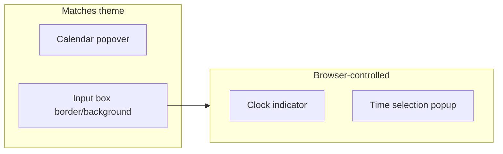

# Dark-mode time picker styling

## Problem

The event date field uses a custom dark calendar ([`date-time-picker.component.ts`](coffeeshop-frontend/src/app/shared/date-time-picker/date-time-picker.component.ts)), but the time field is a native `<input type="time" class="form-input date-time-picker-time">`. Browsers render the clock icon and time UI with **light system chrome** by default, so it clashes with `.form-input` (`#16213e` background, `#e0e0e0` text) defined in [`styles.css`](coffeeshop-frontend/src/styles.css).



## Approach: CSS-only (recommended)

Extend [`styles.css`](coffeeshop-frontend/src/styles.css) after the existing `.date-time-picker-time` block (~line 700). No TypeScript changes required.

### 1. Tell the browser to use dark UI

```css
.date-time-picker-time,
input[type="time"].form-input {
  color-scheme: dark;
}
```

This affects Chromium/Safari/Firefox native time popups and spinners where supported.

### 2. Match text segments inside the input (WebKit/Blink)

```css
.date-time-picker-time::-webkit-datetime-edit,
.date-time-picker-time::-webkit-datetime-edit-fields-wrapper {
  color: #e0e0e0;
}

.date-time-picker-time::-webkit-datetime-edit-hour-field,
.date-time-picker-time::-webkit-datetime-edit-minute-field,
.date-time-picker-time::-webkit-datetime-edit-ampm-field {
  color: #e0e0e0;
}
```

### 3. Style the clock icon to match accent

```css
.date-time-picker-time::-webkit-calendar-picker-indicator {
  cursor: pointer;
  opacity: 0.85;
  filter: invert(0.85) sepia(0.2) saturate(2) hue-rotate(5deg);
}
```

Tune filter so the icon reads as warm gold (`#d4a574`) on dark background—same accent as focus borders and calendar selection.

### 4. Focus and disabled states

Align with existing `.form-input:focus` and disabled calendar behavior:

- `:focus` — keep `border-color: #d4a574` (inherits from `.form-input:focus`)
- `:disabled` — `opacity: 0.5`, `cursor: not-allowed`, background `#16213e` (already disabled when no date selected)

### 5. Optional app-wide baseline

Add `color-scheme: dark` on `html` in the same file so any future `type="date"` / `type="datetime-local"` inputs stay consistent. Low risk since the app is already dark-themed (`#121212` body).

## Files to change

| File | Change |
|------|--------|
| [`styles.css`](coffeeshop-frontend/src/styles.css) | New rules under "Date-time picker" section + optional `html { color-scheme: dark; }` |
| [`date-time-picker.component.ts`](coffeeshop-frontend/src/app/shared/date-time-picker/date-time-picker.component.ts) | **No change** unless CSS is insufficient |

## Fallback (only if QA fails)

If the native popup still looks light on a target browser (older Safari, etc.), replace the native input with a minimal **custom time control**: two styled `<select>` elements (hour 00–23, minute 00–59) using `.form-input` styling, same width as `.date-time-picker-time`. That is ~40 lines in the component template and avoids browser-native UI entirely. Defer unless needed.

## Verification

1. Events → Add Event → pick a date → confirm time input background, text, and clock icon match other form fields
2. Open the time popup — should use dark chrome (where `color-scheme` applies)
3. Disabled state before date is selected — muted but still on-theme
4. `npm run build` in `coffeeshop-frontend`
