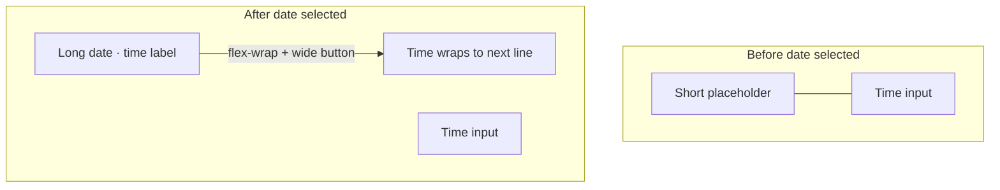

# Fix date + time picker side-by-side layout

## Cause

In [`styles.css`](coffeeshop-frontend/src/styles.css), `.date-time-picker` uses `flex-wrap: wrap`, so when the row runs out of width the time input wraps below the calendar.

After a date is selected, the trigger text grows from `"Select date"` to something like `"18 May 2026 · 12:00"` ([`triggerLabel`](coffeeshop-frontend/src/app/shared/date-time-picker/date-time-picker.component.ts)). That duplicates the time already shown in the adjacent `<input type="time">`, widens the button, and triggers the wrap.



The event form sits in a `.form-row` grid column (~50% width), so there is limited horizontal space ([`styles.css`](coffeeshop-frontend/src/styles.css) `.form-row`).

## Fix (CSS + small label change)

### 1. Lock row layout — [`styles.css`](coffeeshop-frontend/src/styles.css)

Update the `.date-time-picker` block (~line 687):

- Set `flex-wrap: nowrap` (replace `wrap`)
- Keep `align-items: stretch` (or `center` if heights look off)

Update `.date-time-picker-calendar`:

- Use `flex: 1 1 0` and `min-width: 0` so the calendar column **shrinks** inside the row instead of growing with label content
- Add `overflow: hidden` on the wrapper

Update `.date-time-picker-calendar .date-range-trigger`:

- Add `overflow: hidden`, `text-overflow: ellipsis`
- Keep `white-space: nowrap` (already on `.date-range-trigger` globally)
- Keep `width: 100%` so the button fills the flex column and ellipsizes

Time input stays `flex: 0 0 7.5rem` — fixed width, never wraps.

### 2. Shorten trigger label — [`date-time-picker.component.ts`](coffeeshop-frontend/src/app/shared/date-time-picker/date-time-picker.component.ts)

Change `triggerLabel` to show **date only** when selected:

```typescript
return formatDisplay(date);
```

Remove the ` · ${time}` suffix. The time field already displays and edits time; showing it on the date button was redundant and drove the width growth.

### 3. No changes to [`events.component.ts`](coffeeshop-frontend/src/app/features/events/events.component.ts)

The toolbar range picker uses `.date-range-picker` with `flex: 0 0 auto` and is unaffected.

## Verification

1. Events → Add Event → confirm date trigger and time input stay on one row with empty date
2. Pick a date → row stays horizontal; long dates truncate with ellipsis if needed
3. Change time → trigger shows date only; time updates in the time input
4. Narrow browser / small form column → still one row (ellipsis on date button)
5. `npm run build` in `coffeeshop-frontend`
