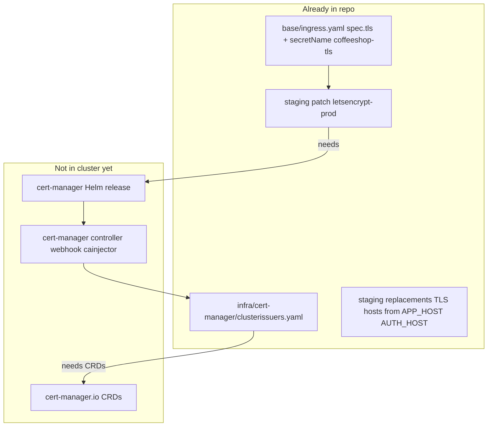

# Deploy cert-manager to DOKS

## Investigation summary

Your repo **already configures TLS for cert-manager**, but only the **application** layer. The **cert-manager controller is not installed** in the cluster, so nothing can satisfy the Ingress annotation or create `Certificate` resources.



| Asset | Path | Status |
|-------|------|--------|
| Ingress TLS + ingress-shim | [`deploy/k8s/base/ingress.yaml`](deploy/k8s/base/ingress.yaml) | Present (`spec.tls`, `coffeeshop-tls`) |
| Issuer annotation | [`deploy/k8s/overlays/staging/patches/ingress-cert-manager-issuer.yaml`](deploy/k8s/overlays/staging/patches/ingress-cert-manager-issuer.yaml) | `letsencrypt-prod` |
| TLS host injection | [`deploy/k8s/overlays/staging/kustomization.yaml`](deploy/k8s/overlays/staging/kustomization.yaml) | `spec.tls.0.hosts[0/1]` from ConfigMap |
| ClusterIssuers | [`deploy/k8s/infra/cert-manager/clusterissuers.yaml`](deploy/k8s/infra/cert-manager/clusterissuers.yaml) | Present (HTTP-01, `ingress.class: nginx`) |
| cert-manager install | — | **Missing** |
| CI apply of infra | [`.github/workflows/deploy-staging-reusable.yml`](.github/workflows/deploy-staging-reusable.yml) | Only `kubectl apply -k overlays/staging` |

[`deploy/README.md`](deploy/README.md) line 69 mentions cert-manager briefly but has no install steps. Follow-ups still list it as future work.

**Prerequisite:** NGINX Ingress with `ingressClassName: nginx` (you already have this).

---

## Rollout order (critical)

Apply in this sequence or issuance will fail:

1. **Helm:** install cert-manager into namespace `cert-manager`
2. **Wait:** controller + webhook pods Ready
3. **Kustomize:** `kubectl apply -k deploy/k8s/infra/cert-manager` (ClusterIssuers)
4. **App deploy:** `kubectl apply -k deploy/k8s/overlays/staging` (or GitHub **CI/CD Staging** / **Deploy Staging**)
5. **Watch:** `Certificate` `coffeeshop-tls` in `coffeeshop-staging` becomes Ready
6. **GitHub Variable:** set `STAGING_PUBLIC_SCHEME=https`, redeploy so `KEYCLOAK_JWT_ISSUER_URI` and CORS use `https://`

Do **not** set `STAGING_PUBLIC_SCHEME=https` until the public cert is issued (or login/JWT issuer checks will fail).

---

## 1. Add install script (manual path)

Create [`deploy/k8s/infra/cert-manager/install.sh`](deploy/k8s/infra/cert-manager/install.sh) (executable):

- Pin chart version (e.g. **cert-manager v1.16.x** from [jetstack/cert-manager](https://github.com/cert-manager/cert-manager) Helm chart — verify latest stable at implementation time)
- Commands:
  ```bash
  helm repo add jetstack https://charts.jetstack.io
  helm repo update
  helm upgrade --install cert-manager jetstack/cert-manager \
    --namespace cert-manager --create-namespace \
    --version <pinned> \
    --set crds.enabled=true \
    --set startupapicheck.enabled=true
  kubectl wait --for=condition=Available deployment/cert-manager -n cert-manager --timeout=300s
  kubectl wait --for=condition=Available deployment/cert-manager-webhook -n cert-manager --timeout=300s
  kubectl apply -k "$(dirname "$0")"   # ClusterIssuers
  ```
- **Small-node note:** optional `--set` values to cap requests (e.g. controller/webhook ~64–128Mi each) so cert-manager fits alongside your staging stack on 2GB nodes; document tradeoff if OOM occurs.

Idempotent: `helm upgrade --install` safe to re-run.

---

## 2. Expand infra documentation

Add [`deploy/k8s/infra/cert-manager/README.md`](deploy/k8s/infra/cert-manager/README.md) covering:

- Purpose (ClusterIssuers + relationship to Ingress-shim)
- Prerequisites (DNS A records → ingress LB IP, port 80 reachable for HTTP-01)
- `./install.sh` usage
- Verification commands:
  ```bash
  kubectl get pods -n cert-manager
  kubectl get clusterissuer
  kubectl get certificate,order,challenge -n coffeeshop-staging
  kubectl describe certificate coffeeshop-tls -n coffeeshop-staging
  openssl s_client -connect auth.<domain>:443 -servername auth.<domain> </dev/null 2>/dev/null | openssl x509 -noout -issuer -dates
  ```
- Troubleshooting: Challenge stuck → check Ingress host, firewall, wrong LB IP
- **Issuer choice:** staging overlay uses **`letsencrypt-prod`** (browser-trusted; required for Go/JVM OIDC discovery). Keep `letsencrypt-staging` in [`clusterissuers.yaml`](deploy/k8s/infra/cert-manager/clusterissuers.yaml) for manual testing only.
- Link to [`deploy/GITHUB_SETUP.md`](deploy/GITHUB_SETUP.md) for `STAGING_PUBLIC_SCHEME=https` after cert Ready

Update [`deploy/README.md`](deploy/README.md) **One-time cluster setup** — replace the one-line TLS note with:

- Step 5: Install cert-manager (`deploy/k8s/infra/cert-manager/install.sh`)
- Step 6: Deploy staging overlay / enable HTTPS variable

---

## 3. Optional GitHub Actions workflow

Create [`.github/workflows/install-cert-manager.yml`](.github/workflows/install-cert-manager.yml):

- **Trigger:** `workflow_dispatch` only (cluster bootstrap, not every app deploy)
- **Uses:** same `KUBE_CONFIG` secret as deploy
- **Steps:**
  1. Checkout
  2. Install Helm (curl official install script or `azure/setup-helm` if allowed by your Actions policy — prefer curl to match existing kubectl/kustomize pattern in [`deploy-staging-reusable.yml`](.github/workflows/deploy-staging-reusable.yml))
  3. Run `deploy/k8s/infra/cert-manager/install.sh` (or inline equivalent)
  4. Print `kubectl get pods -n cert-manager` and `kubectl get clusterissuer`

**Do not** add cert-manager install to [`deploy-staging-reusable.yml`](.github/workflows/deploy-staging-reusable.yml) by default — avoids Helm on every push and permission churn; app deploy can assume cert-manager already exists.

Optional follow-up (document only): a lightweight pre-deploy check in reusable workflow that fails fast if `kubectl get crd certificates.cert-manager.io` is missing, with a link to the install workflow.

Document in [`deploy/GITHUB_SETUP.md`](deploy/GITHUB_SETUP.md) under a new **TLS / cert-manager** section.

---

## 4. Post-install: enable HTTPS in app config

After `Certificate` `coffeeshop-tls` is **Ready**:

1. GitHub → Variables → `STAGING_PUBLIC_SCHEME` = `https`
2. Redeploy (push to `main` or **Deploy Staging (DOKS)**)
3. Confirm backend env:
   ```bash
   kubectl exec -n coffeeshop-staging deploy/backend -- env | grep KEYCLOAK_JWT_ISSUER_URI
   ```
4. Browser smoke test: `https://<APP_HOST>/`, `https://<AUTH_HOST>/health/ready`
5. Keycloak client: ensure realm redirect URIs include `https://<APP_HOST>/*` (see GITHUB_SETUP Keycloak realm section)

Ingress-shim creates the `Certificate` automatically; no separate `Certificate` manifest needed in repo.

---

## 5. Memory / scheduling on small DOKS nodes

cert-manager adds **3 deployments** in `cert-manager` namespace (~150–350Mi requests depending on chart defaults). On a **2GB** node already at ~99% memory requests, install cert-manager **after** applying [`resources-small-node.yaml`](deploy/k8s/overlays/staging/patches/resources-small-node.yaml) and consider **4GB nodes** for a stable single-node stack.

If install script sets reduced resources, verify webhook still passes after upgrades.

---

## 6. Security / ops notes

- ACME email in [`clusterissuers.yaml`](deploy/k8s/infra/cert-manager/clusterissuers.yaml) is committed (`trialprodigy45@gmail.com`) — acceptable for Let’s Encrypt expiry notices; optional later: move to Kustomize secretGenerator + `$(ACME_EMAIL)` from GitHub Secret.
- Rate limits: use `letsencrypt-staging` issuer only for experiments; production traffic should use `letsencrypt-prod` (already patched on staging Ingress).
- cert-manager is **cluster-scoped** — install once per DOKS cluster, not per namespace.

---

## Verification checklist

| Check | Expected |
|-------|----------|
| `kubectl get pods -n cert-manager` | All Running |
| `kubectl get clusterissuer` | `letsencrypt-prod` Ready=True |
| `kubectl get certificate -n coffeeshop-staging` | `coffeeshop-tls` Ready=True |
| `kubectl get secret coffeeshop-tls -n coffeeshop-staging` | Type `kubernetes.io/tls` |
| `curl -I https://<AUTH_HOST>/health/ready` | 200, valid cert |
| Backend logs | No TLS/PKIX errors on OIDC discovery |

---

## Files to add/change

| File | Action |
|------|--------|
| `deploy/k8s/infra/cert-manager/install.sh` | **Create** — Helm install + apply issuers |
| `deploy/k8s/infra/cert-manager/README.md` | **Create** — install, verify, troubleshoot |
| `.github/workflows/install-cert-manager.yml` | **Create** — workflow_dispatch bootstrap |
| `deploy/README.md` | **Update** — cert-manager setup step |
| `deploy/GITHUB_SETUP.md` | **Update** — TLS workflow + `STAGING_PUBLIC_SCHEME` timing |

No changes required to existing Ingress/ClusterIssuer YAML unless install testing reveals solver misconfiguration (nginx class already matches `ingressClassName: nginx`).
