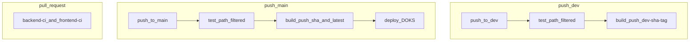

# Branch-based CI/CD: dev build vs main staging deploy

## Target flow



| Event | Tests | Docker push | DOKS deploy |
|-------|-------|-------------|-------------|
| PR → `dev` or `main` | [backend-ci.yml](.github/workflows/backend-ci.yml), [frontend-ci.yml](.github/workflows/frontend-ci.yml) | `push: false` (unchanged) |
| Push → **`dev`** | [ci-cd-staging.yml](.github/workflows/ci-cd-staging.yml) | `dev-sha-<7>` only | **No** |
| Push → **`main`** (staging) | Same workflow | `sha-<7>` + `latest` | **Yes** |
| Manual | [deploy-staging.yml](.github/workflows/deploy-staging.yml) | Uses chosen `image_tag` | **Yes** |

Recommended git flow: feature branches → PR into **`dev`** → PR **`dev` → `main`** when ready for staging; only merges to **`main`** hit the cluster.

---

## 1. Update [ci-cd-staging.yml](.github/workflows/ci-cd-staging.yml)

### Triggers

```yaml
on:
  push:
    branches: [dev, main]
    paths:
      - 'coffeeshop/**'
      - 'coffeeshop-frontend/**'
      - 'deploy/**'
      - '.github/workflows/**'
```

### Concurrency

Avoid cancelling `dev` when `main` runs:

```yaml
concurrency:
  group: ci-cd-${{ github.ref }}
  cancel-in-progress: true
```

### `meta` job — branch-aware image tag

```yaml
- id: tag
  run: |
    short=$(echo "${GITHUB_SHA}" | cut -c1-7)
    if [ "${{ github.ref }}" = "refs/heads/main" ]; then
      echo "image_tag=sha-${short}" >> "$GITHUB_OUTPUT"
    else
      echo "image_tag=dev-sha-${short}" >> "$GITHUB_OUTPUT"
    fi
```

### `build-backend` / `build-frontend` — conditional tags

Keep `push: true` on both branches; tag sets differ:

| Branch | Backend / frontend tags |
|--------|-------------------------|
| `main` | `:sha-<7>`, `:latest` |
| `dev` | `:dev-sha-<7>` only (no `latest`) |

Implementation: set tag list in a step output or use two `docker/build-push-action` conditionals. Example pattern:

```yaml
tags: |
  ghcr.io/mastilovic/coffeeshop-backend:${{ needs.meta.outputs.image_tag }}
  ${{ github.ref == 'refs/heads/main' && format('ghcr.io/mastilovic/coffeeshop-backend:latest') || '' }}
```

(Trim empty lines or use explicit `if` on a second tag line per GitHub Actions expression rules.)

### `deploy` job — main only

```yaml
deploy:
  needs: [meta, build-backend, build-frontend]
  if: |
    github.ref == 'refs/heads/main' &&
    needs.build-backend.result == 'success' &&
    needs.build-frontend.result == 'success'
  # ... existing reusable workflow call with image_tag from meta (sha-<7>)
```

No changes required to [deploy-staging-reusable.yml](.github/workflows/deploy-staging-reusable.yml) or Kustomize manifests.

---

## 2. Keep PR workflows as-is (minor path tweak)

[backend-ci.yml](.github/workflows/backend-ci.yml) and [frontend-ci.yml](.github/workflows/frontend-ci.yml) remain **pull_request** only with `push: false` Docker builds.

Optional: ensure PRs target `dev` by default in GitHub branch settings (repo config, not code).

No need to run separate push CI on `dev` if unified workflow covers it.

---

## 3. Documentation updates

Update [deploy/README.md](deploy/README.md) and [deploy/GITHUB_SETUP.md](deploy/GITHUB_SETUP.md):

- **`dev`**: CI/CD runs tests + publishes `dev-sha-*` images; no cluster deploy.
- **`main`**: staging environment; publishes `sha-*` / `latest` and deploys to DOKS.
- Manual deploy still uses `sha-<7>` from a **main** build (not `dev-sha-*` unless you explicitly dispatch with that tag).

---

## 4. Verification checklist

1. Push to **`dev`** (change under `coffeeshop/`): workflow runs; **deploy** job skipped; GHCR shows `dev-sha-*` tags.
2. Push to **`main`**: workflow runs; images `sha-*` + `latest`; **deploy** runs against DOKS.
3. PR to `dev`: **Backend CI** / **Frontend CI** only; no deploy.
4. Merge `dev` → `main`: triggers full staging pipeline + deploy.

---

## Files to change

| File | Change |
|------|--------|
| [.github/workflows/ci-cd-staging.yml](.github/workflows/ci-cd-staging.yml) | `dev` + `main` triggers; branch tags; deploy gated to `main`; per-ref concurrency |
| [deploy/README.md](deploy/README.md) | Branch workflow section |
| [deploy/GITHUB_SETUP.md](deploy/GITHUB_SETUP.md) | Note deploy only on `main` |

No changes to K8s manifests, reusable deploy workflow, or application code.
