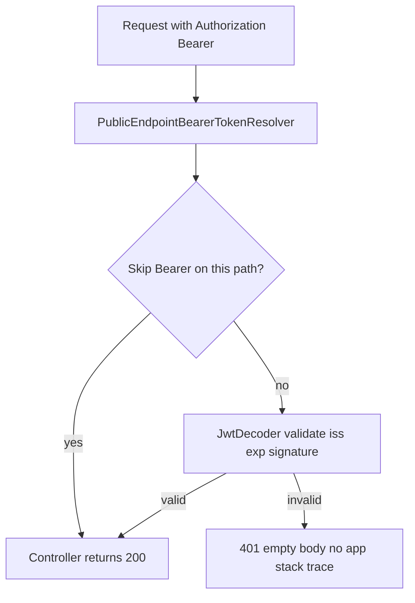

# Diagnose and fix silent 401 after TLS

## What changed (why no errors in logs)

PKIX/`JwtDecoderInitializationException` is fixed. Remaining **401 responses are normal** for Spring OAuth2 resource server: invalid/missing Bearer JWT is rejected in the filter **without** an application stack trace or `GlobalExceptionHandler` JSON body.



Your symptom set matches this model:

| Request | Your result | Why |
|---------|-------------|-----|
| `GET /api/profile` | **401** | Always requires valid JWT ([`SecurityConfiguration`](coffeeshop/src/main/java/com/coffeeshop/coffeeshop/config/SecurityConfiguration.java) `anyRequest().authenticated()`) |
| `GET /api/v1/shop` | **401** | **Special case**: this exact path **does** validate Bearer ([`PublicEndpointBearerTokenResolver`](coffeeshop/src/main/java/com/coffeeshop/coffeeshop/config/PublicEndpointBearerTokenResolver.java) excludes only `shop/mine`, not `shop`) |
| `GET /api/v1/shop/{id}` | Often **200** | Other shop paths skip Bearer validation on GET |
| `POST /api/v1/**` after fresh login | **200** | New access token with correct `iss` |

So you can have **working mutations** while **shop list + profile still show 401** from earlier requests (stale token) or from the `GET /api/v1/shop` quirk.

---

## Step 1 — Prove it in 5 minutes (no code)

Run these and compare **three issuer strings** (must match exactly):

```bash
NS=coffeeshop-staging
AUTH=auth.kafenerija.online
APP=app.kafenerija.online

# Backend expectation
kubectl -n $NS exec deploy/backend -- printenv KEYCLOAK_JWT_ISSUER_URI

# Keycloak discovery (public)
curl -sS "https://${AUTH}/realms/coffeeshop/.well-known/openid-configuration" | jq -r .issuer

# Fresh login token iss
curl -sS -X POST "https://${APP}/api/login" \
  -H 'Content-Type: application/json' \
  -d '{"email":"YOUR_EMAIL","password":"YOUR_PASSWORD"}' \
  | jq -r .access_token | awk -F. '{print $2}' | base64 -d 2>/dev/null | jq -r .iss
```

**Interpretation**

| Result | Meaning |
|--------|---------|
| All three equal `https://auth.kafenerija.online/realms/coffeeshop` | Issuer alignment OK; focus on **stale browser token** + **GET /api/v1/shop** quirk |
| Token `iss` is `http://...` but backend expects `https://...` | Keycloak still minting HTTP issuer; fix Keycloak hostname URL (Step 3) |
| Backend env still `http://...` | ConfigMap not applied or pod not restarted (Step 2) |

**Browser Network tab**

1. Filter by time **after** your latest login only.
2. On failing `GET /api/profile` and `GET /api/v1/shop`, confirm `Authorization: Bearer ...` is present.
3. Compare `iss` in that token vs backend env.
4. Clear **Local Storage** keys `coffeeshop_access_token` / `coffeeshop_refresh_token`, hard refresh, login again on **`https://app.kafenerija.online`**.

---

## Step 2 — Infra/config fixes (no Java changes)

### A. Ensure backend picked up `STAGING_PUBLIC_SCHEME=https`

```bash
kubectl -n coffeeshop-staging get configmap coffeeshop-config -o jsonpath='{.data.KEYCLOAK_JWT_ISSUER_URI}{"\n"}'
kubectl -n coffeeshop-staging rollout restart deployment/backend
kubectl -n coffeeshop-staging rollout status deployment/backend --timeout=300s
```

### B. Confirm TLS is trusted (already done in prior fix)

```bash
kubectl -n coffeeshop-staging get certificate coffeeshop-tls
echo | openssl s_client -servername auth.kafenerija.online -connect auth.kafenerija.online:443 2>/dev/null \
  | openssl x509 -noout -issuer
```

Expect Let's Encrypt production issuer (not fake ingress cert, not staging CA).

### C. Fresh tokens only

- Always use **`https://`** for app and auth hosts.
- After any scheme/TLS change, clear localStorage and log in again.

---

## Step 3 — Fix Keycloak `iss` if discovery ≠ token `iss`

Today Keycloak uses hostname only ([`deploy/k8s/base/keycloak/deployment.yaml`](deploy/k8s/base/keycloak/deployment.yaml)):

- `KC_HOSTNAME` = `AUTH_HOST` (no scheme)
- `KC_PROXY=edge`, `KC_HOSTNAME_STRICT_HTTPS=false`

Tokens are obtained via internal `http://keycloak:8080` ([`KEYCLOAK_BASE_URL`](deploy/k8s/base/backend/deployment.yaml)), which can produce **`iss: http://auth...`** while the backend expects **`https://auth...`**.

**Recommended fix:** add `KC_HOSTNAME_URL` to Keycloak deployment, sourced from the same scheme as the public issuer:

- Add to generated `config.env` in [deploy-staging-reusable.yml](.github/workflows/deploy-staging-reusable.yml), e.g.  
  `KEYCLOAK_PUBLIC_URL=${SCHEME}://${STAGING_AUTH_HOST}`
- Wire Keycloak env: `KC_HOSTNAME_URL` from that key (Keycloak 24 supports full URL)

Redeploy Keycloak + backend; verify token `iss` matches `KEYCLOAK_JWT_ISSUER_URI`.

---

## Step 4 — Code fixes (small, high impact)

### A. Backend: treat `GET /api/v1/shop` like other public GETs

In [`PublicEndpointBearerTokenResolver.java`](coffeeshop/src/main/java/com/coffeeshop/coffeeshop/config/PublicEndpointBearerTokenResolver.java), remove the `!path.equals("/api/v1/shop")` exclusion so list-shops behaves like `GET /api/v1/user` (Bearer ignored when invalid; still works when valid).

This matches documented behavior in [`coffeeshop/docs/keycloak.md`](coffeeshop/docs/keycloak.md) and stops **shop list 401 with a stale token in the header**.

### B. Frontend: refetch profile after token refresh

[`layout.component.ts`](coffeeshop-frontend/src/app/shared/layout/layout.component.ts) loads profile once in `ngOnInit` if `localStorage` has a token. [`login.component.ts`](coffeeshop-frontend/src/app/features/auth/login.component.ts) already calls `getProfile()` after login.

Optional hardening:

- After successful `authInterceptor` refresh, call `profileService.getProfile()` again.
- On 401 from `getProfile()`, clear profile signal (avoid showing “logged in” UI with failed profile).

### C. Temporary debug (optional, remove after fix)

```yaml
# application-docker or staging profile
logging.level.org.springframework.security.oauth2=DEBUG
```

Shows `invalid_token` / issuer errors at WARN without full stack traces.

---

## Step 5 — Verification checklist

| Check | Expected |
|-------|----------|
| `POST /api/login` | 200 + `access_token` |
| Decode `iss` | Matches `KEYCLOAK_JWT_ISSUER_URI` |
| `GET /api/profile` with fresh token | **200** (or **404** if user not linked in DB—not 401) |
| `GET /api/v1/shop` with fresh token | **200** |
| `GET /api/v1/shop` with **no** Authorization | **200** (after resolver fix) |
| Backend logs | No `JwtDecoderInitializationException` / PKIX |

---

## Most likely root cause for your case

Given **post-login POSTs return 200** but **`GET /api/profile` and `GET /api/v1/shop` return 401**:

1. **Primary:** Stale pre-HTTPS token still in `localStorage` used on initial layout/shop requests; Network tab may show old 401s mixed with new 200s.
2. **Secondary (code):** `GET /api/v1/shop` uniquely validates Bearer—list fails even when `GET /api/v1/shop/{id}` would succeed.
3. **If fresh-login `iss` ≠ backend issuer:** Add `KC_HOSTNAME_URL` and redeploy Keycloak.

No further cert-manager changes needed if prod LE cert is already serving.
