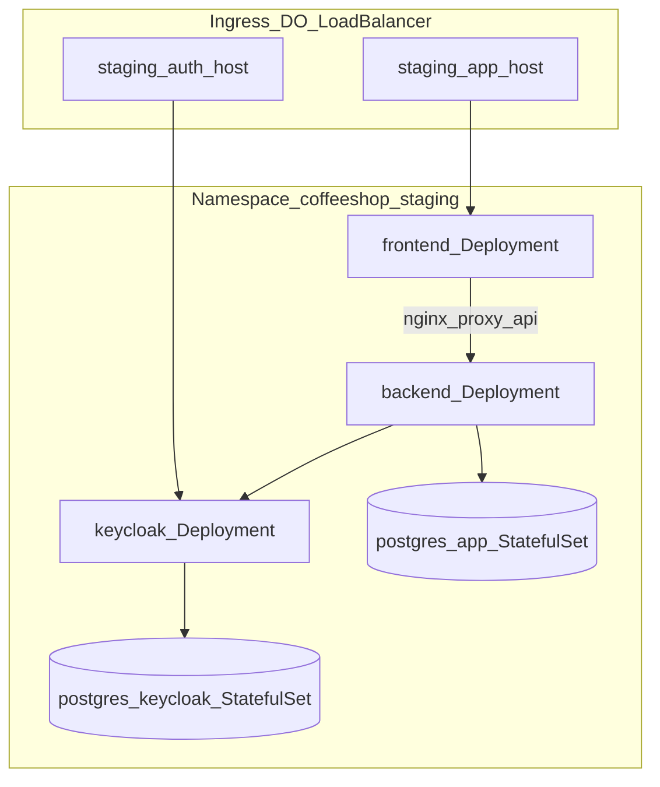

# DOKS staging deployment and CD plan

## Goals and constraints

- **Target**: One staging namespace on your existing DOKS cluster.
- **Data**: In-cluster PostgreSQL for app + Keycloak (aligned with [coffeeshop/docker-compose.yaml](coffeeshop/docker-compose.yaml)).
- **Images**: Reuse existing CI output — `ghcr.io/mastilovic/coffeeshop-backend` and `ghcr.io/mastilovic/coffeeshop-frontend` from [.github/workflows/backend-ci.yml](.github/workflows/backend-ci.yml) and [frontend-ci.yml](.github/workflows/frontend-ci.yml).
- **Traffic pattern**: Keep the **same-origin** model from [environment.docker.ts](coffeeshop-frontend/src/environments/environment.docker.ts) and [nginx.conf](coffeeshop-frontend/nginx.conf) — browser → frontend nginx → `http://backend:8080` for `/api/*`.
- **Out of scope (v1)**: Valkey/Redis (Compose references it but there is no Redis usage in `coffeeshop/src`); production hardening (HPA, multi-env, managed DB); sealed-secrets operator.



---

## Phase 0 — Cluster prerequisites (manual, documented)

Add [deploy/README.md](deploy/README.md) with steps you run once on the cluster (not committed secrets):

1. **Kubeconfig for CI**: `doctl kubernetes cluster kubeconfig save <cluster-name>` → store full file as GitHub secret `KUBE_CONFIG`.
2. **Ingress controller**: Install NGINX Ingress (DO marketplace or Helm). Staging Ingress will use `ingressClassName: nginx`.
3. **GHCR pull access** (if packages are private): create `ghcr-pull` secret in namespace and reference in Deployments.
4. **DNS**: Point two records at the Ingress LB IP after first deploy:
   - `APP_HOST` (e.g. `staging.app.yourdomain.com`) → frontend
   - `AUTH_HOST` (e.g. `staging.auth.yourdomain.com`) → Keycloak  
   Placeholders go in Kustomize overlay; you substitute real hosts before first apply.
5. **TLS (optional v1)**: Start with HTTP for smoke tests, or add cert-manager + ClusterIssuer in a follow-up patch (documented, not blocking first deploy).

---

## Phase 1 — Repository layout (Kustomize)

Create:

```text
deploy/
  README.md
  k8s/
    base/
      kustomization.yaml
      namespace.yaml              # coffeeshop-staging
      postgres-app/               # StatefulSet, Service, PVC, Secret template
      postgres-keycloak/
      keycloak/                   # Deployment, Service, ConfigMap(realm), Secret
      backend/                    # Deployment, Service
      frontend/                   # Deployment, Service
      ingress.yaml
    overlays/
      staging/
        kustomization.yaml
        patches/
          ingress-hosts.yaml
          keycloak-hostname.yaml
        config.env.example        # non-secret defaults; copy to config.env (gitignored)
```

**Why Kustomize**: Single overlay now; later add `overlays/production` without duplicating base manifests.

---

## Phase 2 — Workloads (mirror Compose)

### PostgreSQL (app + Keycloak)

| Resource | Mirrors Compose service | Notes |
|----------|-------------------------|--------|
| `postgres-app` | `postgres` | `StatefulSet` + `volumeClaimTemplate` (DO block storage default SC); Service name **`postgres`** |
| `postgres-keycloak` | `postgres-keycloak` | Same pattern; Service name **`postgres-keycloak`** |

- Env from [coffeeshop/.env.example](coffeeshop/.env.example): `POSTGRES_DB`, `POSTGRES_USER`, passwords in **Secret** (generated via overlay `secretGenerator` from local `deploy/k8s/overlays/staging/secrets.env`, gitignored).
- Readiness: `pg_isready` (same as Compose healthcheck).

### Keycloak

| Setting | Staging approach |
|---------|------------------|
| Image | `quay.io/keycloak/keycloak:24.0` (same as Compose) |
| Command | `start` (not `start-dev`) with `KC_PROXY=edge`, `KC_HTTP_ENABLED=true`, `KC_HOSTNAME=<AUTH_HOST>` |
| DB | `KC_DB_URL` → `jdbc:postgresql://postgres-keycloak:5432/keycloak` |
| Realm import | ConfigMap mount of [coffeeshop/docker/keycloak/realm-coffeeshop.json](coffeeshop/docker/keycloak/realm-coffeeshop.json) + `--import-realm` |

**Realm patch for staging**: Kustomize `configMapGenerator` or JSON patch to add staging `redirectUris` / `webOrigins` for `APP_HOST` (Compose only lists localhost today). Without this, login redirects may fail once exposed publicly.

**Issuer alignment** (critical — see Compose comments lines 43–45):

- Internal (backend → Keycloak): `KEYCLOAK_BASE_URL=http://keycloak:8080`
- JWT validation (resource server): `KEYCLOAK_JWT_ISSUER_URI=https://<AUTH_HOST>/realms/coffeeshop`  
  Backend Deployment env must use **public HTTPS issuer**, not `keycloak:8080`.

### Backend

- Image: `ghcr.io/mastilovic/coffeeshop-backend:sha-<tag>` (set by CD via `kustomize edit set image`).
- `SPRING_PROFILES_ACTIVE=docker` (matches [Dockerfile](coffeeshop/Dockerfile)).
- Env from Compose lines 69–84: datasource → `postgres`, Keycloak vars above, `CORS_ALLOWED_ORIGINS=https://<APP_HOST>`.
- **Omit** `SPRING_DATA_REDIS_*` until Redis is implemented (Compose references Valkey but service definition is incomplete).
- Service name **`backend`** (port 8080) so existing [nginx.conf](coffeeshop-frontend/nginx.conf) works unchanged.
- Probes: `/actuator/health/readiness` (same as Compose).

### Frontend

- Image: `ghcr.io/mastilovic/coffeeshop-frontend:sha-<tag>`.
- No nginx change required if backend Service is named `backend`.
- Service port 80 → Ingress host `APP_HOST`.

---

## Phase 3 — Ingress (DigitalOcean)

Single Ingress resource (or two rules, one host each):

| Host | Backend Service | Path |
|------|-----------------|------|
| `APP_HOST` | `frontend:80` | `/` |
| `AUTH_HOST` | `keycloak:8080` | `/` |

Use NGINX annotations compatible with DO load balancers (document in README). After apply: `kubectl get ingress -n coffeeshop-staging` → configure DNS → optional cert-manager.

---

## Phase 4 — CD workflow (GitHub Actions)

Add [.github/workflows/deploy-staging.yml](.github/workflows/deploy-staging.yml):

```yaml
# Triggers: workflow_dispatch (always) + workflow_run after backend/frontend docker jobs on main (optional)
# Needs: secret KUBE_CONFIG
# Steps:
#   - checkout
#   - setup kubectl + kustomize
#   - write kubeconfig from KUBE_CONFIG
#   - kustomize edit set image ...=ghcr.io/...:sha-${{ github.sha }}
#   - kubectl apply -k deploy/k8s/overlays/staging
#   - kubectl rollout status deployment/backend deployment/frontend deployment/keycloak -n coffeeshop-staging
```

**Image tagging**: Prefer immutable `sha-<7>` tags already produced by CI over `:latest`. Deploy job should either:

- Reuse the **same SHA** from the triggering `workflow_run`, or  
- Run only via `workflow_dispatch` with an input `image_tag` for manual promote.

**Permissions**: `contents: read` only; no cluster changes from fork PRs (deploy job gated to `main` + `workflow_dispatch`).

---

## Phase 5 — Secrets and config contract

Document in [deploy/README.md](deploy/README.md):

| Secret / config | Where set | Used by |
|-----------------|-----------|---------|
| `KUBE_CONFIG` | GitHub Actions | deploy job |
| `secrets.env` (local, gitignored) | `kustomize secretGenerator` in staging overlay | Postgres, Keycloak admin, `KEYCLOAK_BACKEND_CLIENT_SECRET` |
| `config.env` | overlay `configMapGenerator` | `APP_HOST`, `AUTH_HOST`, realm name, CORS |

Provide [deploy/k8s/overlays/staging/secrets.env.example](deploy/k8s/overlays/staging/secrets.env.example) mirroring [.env.example](coffeeshop/.env.example) with **non-dev** password placeholders.

**Do not commit** real passwords or kubeconfig.

---

## Phase 6 — Verification checklist

After first deploy:

1. `kubectl get pods -n coffeeshop-staging` — all Running.
2. `curl https://<APP_HOST>/` — SPA loads.
3. `curl https://<APP_HOST>/api/...` or actuator via ingress — backend reachable through nginx.
4. `curl https://<AUTH_HOST>/health/ready` — Keycloak up.
5. Register/login from UI — confirms issuer + CORS + realm redirect URIs.
6. Check backend logs for JWT issuer mismatch (common misconfig if `KEYCLOAK_JWT_ISSUER_URI` still points at internal hostname).

---

## Optional follow-ups (not in v1 PR)

| Item | When |
|------|------|
| cert-manager + Let's Encrypt | Once DNS is stable |
| Fix/remove Valkey from [docker-compose.yaml](coffeeshop/docker-compose.yaml) | Separate PR; align local dev with K8s |
| Managed Postgres + external Keycloak | Production overlay |
| Sealed Secrets / External Secrets | Before prod |
| Keycloak `start` + hostname hardening review | Before exposing staging publicly |
| Second namespace + manual prod deploy | After staging is stable |

---

## Files to create or modify

| Action | Path |
|--------|------|
| Create | `deploy/README.md`, `deploy/k8s/base/**`, `deploy/k8s/overlays/staging/**` |
| Create | `.github/workflows/deploy-staging.yml` |
| Create | `.gitignore` entries for `secrets.env`, `config.env` under overlay |
| Optional patch | `coffeeshop/docker/keycloak/realm-coffeeshop.json` or staging-specific realm fragment for redirect URIs |
| No change required | Dockerfiles, existing CI build jobs (deploy consumes their tags) |

---

## What you must provide before first deploy

1. **Cluster name** (for README examples only).
2. **`KUBE_CONFIG`** in GitHub Actions secrets.
3. **`APP_HOST` / `AUTH_HOST`** values in overlay `config.env`.
4. **Strong passwords** in local `secrets.env`.
5. **DNS** records after Ingress gets an external IP.

No additional `doctl` export is required beyond kubeconfig and standard cluster setup.
