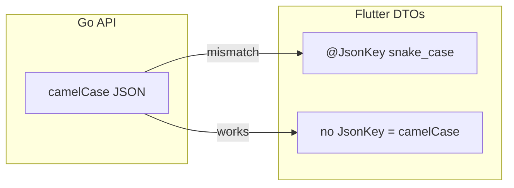

# Flutter DTO camelCase audit and remediation plan

## Pattern (same root cause as Events tab)

The Go API ([`coffeeshop-go/internal/handler/`](coffeeshop-go/internal/handler/)) serializes **camelCase** JSON (`eventId`, `shopId`, `userType`, `totalPages`). Flutter DTOs were generated for a legacy snake_case API via `@JsonKey(name: 'snake_case')`.



**Failure modes:**
1. **TypeError** — required field reads `json['user_type']` → `null` → red ErrorView
2. **Silent empty/wrong** — optional fields miss; `@Default(0)` / `[]` mask the bug (ratings show 0, lists empty)
3. **Broken writes** — request `toJson()` sends snake_case; Go expects camelCase → 400 or ignored fields

**Exception — keep snake_case:** [`token_response.dart`](coffeeshop-mobile/lib/data/models/token_response.dart) (`access_token`, `refresh_token`) matches Keycloak OAuth; auth request bodies already use `refreshToken` in [`auth_api_service.dart`](coffeeshop-mobile/lib/data/services/auth_api_service.dart).

---

## Already fixed

| File | Status |
|------|--------|
| [`event_response_dto.dart`](coffeeshop-mobile/lib/data/models/event_response_dto.dart) | Fixed |
| [`user_profile_response_dto.dart`](coffeeshop-mobile/lib/data/models/user_profile_response_dto.dart) | Fixed |

---

## Tier 1 — Likely TypeError today (user-visible crash)

| DTO | Wrong keys | Used by | Screen |
|-----|------------|---------|--------|
| [`user_list_item_dto.dart`](coffeeshop-mobile/lib/data/models/user_list_item_dto.dart) | `user_type` → `userType` (**required**) | [`user_providers.dart`](coffeeshop-mobile/lib/features/users/user_providers.dart) | Users tab |

---

## Tier 2 — Loads but wrong/empty data (high-traffic screens)

| DTO / file | Wrong keys (examples) | Impact |
|------------|----------------------|--------|
| [`shop_response_dto.dart`](coffeeshop-mobile/lib/data/models/shop_response_dto.dart) | `phone_number`, `average_rating`, `review_count`, `member_count`, `favourite_by_current_user`, `owner_user_id`, … | Shop cards show 0 reviews, no rating, favourite always false |
| [`shop_providers.dart`](coffeeshop-mobile/lib/features/shops/shop_providers.dart) | Manual `data['total_pages']` / `data['total_elements']` | Pagination stuck at 0 pages (Go sends `totalPages`, `totalElements`) |
| [`dashboard_activity_response.dart`](coffeeshop-mobile/lib/data/models/dashboard_activity_response.dart) | **Entire file** — `top_shops`, `upcoming_events`, `shop_count`, `event_id`, `favourite_shops`, … | Dashboard stats 0, top shops empty, upcoming events hidden; fixing parent keys alone would then crash nested `UpcomingEventItem` (`event_id` required) |
| [`review_response_dto.dart`](coffeeshop-mobile/lib/data/models/review_response_dto.dart) | `review_date`, `comments_enabled`, `user_id`, `shop_id` | Shop detail Reviews tab loads but dates/flags missing |
| [`community_post_response_dto.dart`](coffeeshop-mobile/lib/data/models/community_post_response_dto.dart) | `created_at`, `shop_id`, `author_id` | Community tab missing timestamps/author |

**Active parse sites:**

```60:74:coffeeshop-mobile/lib/features/shops/shop_providers.dart
  final content = (data['content'] as List<dynamic>?)
          ?.map((e) => ShopResponseDto.fromJson(e as Map<String, dynamic>))
          ...
  return ShopListResult(
    shops: content,
    totalPages: (data['total_pages'] as int?) ?? 0,  // should be totalPages
    totalElements: (data['total_elements'] as int?) ?? 0,
  );
```

```7:11:coffeeshop-mobile/lib/features/dashboard/dashboard_provider.dart
  final data = await apiService.getActivity();
  return DashboardActivityResponse.fromJson(data);
```

---

## Tier 3 — DTOs correct before features ship (not wired to UI yet)

These have the same snake_case bug but screens are "coming soon" or use raw `Map<String, dynamic>`:

| DTO file | Notes |
|----------|-------|
| [`reservation_response_dto.dart`](coffeeshop-mobile/lib/data/models/reservation_response_dto.dart) | `party_size`, `reservation_request_id`, … |
| [`reservation_request_response_dto.dart`](coffeeshop-mobile/lib/data/models/reservation_request_response_dto.dart) | Used by [`reservation_request_api_service.dart`](coffeeshop-mobile/lib/data/services/reservation_request_api_service.dart) |
| [`menu_response_dto.dart`](coffeeshop-mobile/lib/data/models/menu_response_dto.dart) | `created_at`, `price_currency`, `image_url`, `item_type`, `menu_id` |
| [`table_response_dto.dart`](coffeeshop-mobile/lib/data/models/table_response_dto.dart) | `shop_id` |
| [`contact_response_dto.dart`](coffeeshop-mobile/lib/data/models/contact_response_dto.dart) | `shop_id` |
| [`shop_employee_dto.dart`](coffeeshop-mobile/lib/data/models/shop_employee_dto.dart) | `user_id`, `shop_id`, `is_owner` |
| [`review_comment_response_dto.dart`](coffeeshop-mobile/lib/data/models/review_comment_response_dto.dart) | `created_at`, `user_id`, `review_id` |
| [`page_response.dart`](coffeeshop-mobile/lib/data/models/page_response.dart) | `total_elements`, `total_pages` — not used via `fromJson` yet; fix for consistency |

---

## Tier 4 — Outbound request bodies (mutations will fail when used)

All create/update request types in the same files above, plus:

| File | Wrong outbound keys |
|------|---------------------|
| [`user_create_request.dart`](coffeeshop-mobile/lib/data/models/user_create_request.dart) | `user_type` |
| [`user_update_request.dart`](coffeeshop-mobile/lib/data/models/user_update_request.dart) | `user_type` |

Go expects e.g. `userType`, `partySize`, `shopId`, `phoneNumber`, `commentsEnabled` per handler structs.

---

## Already correct (no change)

- [`register_request.dart`](coffeeshop-mobile/lib/data/models/register_request.dart), [`login_request.dart`](coffeeshop-mobile/lib/data/models/login_request.dart)
- [`loyalty_plan_response_dto.dart`](coffeeshop-mobile/lib/data/models/loyalty_plan_response_dto.dart), [`role_response_dto.dart`](coffeeshop-mobile/lib/data/models/role_response_dto.dart)
- [`user_summary_dto.dart`](coffeeshop-mobile/lib/data/models/user_summary_dto.dart)
- [`token_response.dart`](coffeeshop-mobile/lib/data/models/token_response.dart)

---

## Legacy / cleanup

[`user_response_dto.dart`](coffeeshop-mobile/lib/data/models/user_response_dto.dart) — old profile shape (`user_type`, `is_active`, `created_at`); auth now uses `UserProfileResponseDto`. Only referenced in [`user_response_dto_test.dart`](coffeeshop-mobile/test/data/models/user_response_dto_test.dart). Either delete or align to Go `userResponseDTO` if admin user-detail is added later.

---

## Recommended fix approach

### Phase 1 — Crash + highest-traffic (1 PR)

1. Fix [`user_list_item_dto.dart`](coffeeshop-mobile/lib/data/models/user_list_item_dto.dart)
2. Fix [`shop_response_dto.dart`](coffeeshop-mobile/lib/data/models/shop_response_dto.dart) + [`shop_providers.dart`](coffeeshop-mobile/lib/features/shops/shop_providers.dart) pagination keys
3. Fix entire [`dashboard_activity_response.dart`](coffeeshop-mobile/lib/data/models/dashboard_activity_response.dart)
4. Fix [`review_response_dto.dart`](coffeeshop-mobile/lib/data/models/review_response_dto.dart) + [`community_post_response_dto.dart`](coffeeshop-mobile/lib/data/models/community_post_response_dto.dart)
5. `dart run build_runner build --delete-conflicting-outputs`
6. Update tests: [`shop_response_dto_test.dart`](coffeeshop-mobile/test/data/models/shop_response_dto_test.dart) (still uses snake_case fixtures); add `dashboard_activity_response_dto_test.dart` with Go-shaped JSON
7. Verify: Shops list (ratings + pagination), Dashboard, Users, Shop detail Reviews/Community

### Phase 2 — Remaining DTOs + requests (1 PR)

Fix Tier 3 + Tier 4 files in one batch (same pattern: remove `@JsonKey` snake overrides), regenerate, add parse tests per DTO.

### Phase 3 — Guardrails (optional)

- Add a short comment in [`lib/data/models/`](coffeeshop-mobile/lib/data/models/) README or team rule: **Go API = camelCase; only `TokenResponse` uses snake_case**
- Consider a CI grep/check: `@JsonKey(name: '[a-z]+_[a-z]'` in `lib/data/models/` fails unless file is `token_response.dart`

---

## Per-file fix pattern (repeat for each DTO)

Same as events fix — remove snake_case `@JsonKey` so property names match Go:

```dart
// Before
@JsonKey(name: 'average_rating') double? averageRating,

// After
double? averageRating,
```

Then regenerate `.g.dart` / `.freezed.dart` and update unit tests to use camelCase fixtures copied from Go handler structs.

---

## Test coverage gap

Only 4 model tests exist today; most broken DTOs have **zero** parse tests:

- [`event_response_dto_test.dart`](coffeeshop-mobile/test/data/models/event_response_dto_test.dart) — updated
- [`user_profile_response_dto_test.dart`](coffeeshop-mobile/test/data/models/user_profile_response_dto_test.dart) — OK
- [`shop_response_dto_test.dart`](coffeeshop-mobile/test/data/models/shop_response_dto_test.dart) — **still snake_case, would pass while production fails**
- [`user_response_dto_test.dart`](coffeeshop-mobile/test/data/models/user_response_dto_test.dart) — legacy

Priority tests to add with Phase 1: `dashboard_activity_response`, `user_list_item_dto`, `review_response_dto`.
