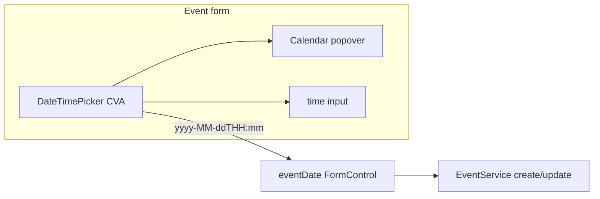

# Event date calendar (create/edit form)

## Goal

When creating or editing an event on the Events page, pick the **date** with the same calendar popover used for **Filter by date**, and pick **time** with a separate `<input type="time">`. The `eventDate` form control continues to store `yyyy-MM-ddTHH:mm` (unchanged backend contract and [`futureDateValidator`](coffeeshop-frontend/src/app/features/events/events.component.ts)).



## Reference UI

Reuse the existing markup and CSS from [`date-range-picker.component.ts`](coffeeshop-frontend/src/app/shared/date-range-picker/date-range-picker.component.ts) and [`.date-range-*` styles](coffeeshop-frontend/src/styles.css) — same trigger button, month header, weekday row, day grid, footer Clear, click-outside and Escape to close.

**Single-date behavior (differs from range picker):**

| Action | Result |
|--------|--------|
| Click a day | Set date, close popover, update form value (keep or set time) |
| Clear | Clear date (and optionally time); emit `''` |
| Past days | **Disabled** when `minDate` is set (create mode: today) |
| Edit mode | No `minDate` — all days selectable (matches current edit: no `min` on `datetime-local`) |

## New shared pieces

### 1. Calendar utilities (dedupe)

**New file:** [`coffeeshop-frontend/src/app/shared/calendar/calendar-date.utils.ts`](coffeeshop-frontend/src/app/shared/calendar/calendar-date.utils.ts)

Move shared helpers from the range picker: `toIsoDate`, `todayIso`, `parseIsoDate`, `startOfMonth`, `buildCalendarDays`, `formatDisplay`. Update [`date-range-picker.component.ts`](coffeeshop-frontend/src/app/shared/date-range-picker/date-range-picker.component.ts) to import from utils (no behavior change).

### 2. Date-time picker component

**New file:** [`coffeeshop-frontend/src/app/shared/date-time-picker/date-time-picker.component.ts`](coffeeshop-frontend/src/app/shared/date-time-picker/date-time-picker.component.ts)

- **Selector:** `app-date-time-picker`
- **`ControlValueAccessor`** + `NG_VALUE_ACCESSOR` so it works with `formControlName="eventDate"`
- **Inputs:**
  - `minDate: string | null` — ISO `yyyy-MM-dd`; when set, disable grid cells with `iso < minDate`
  - `placeholder` — default e.g. `Select date`
- **Template layout:**
  - Row: calendar trigger (`.date-range-trigger` / popover) + `<input type="time" class="form-input">`
  - Popover: copy range picker structure; remove range-only UI (`in-range`, “Select end date” hint)
- **Value model:**
  - Parse `writeValue`: split on `T` → internal `dateIso` + `timeHHmm` (default time `12:00` if missing)
  - Emit `onChange`: `${dateIso}T${timeHHmm}` when date set; `''` when cleared
  - On day click: set date; if no time yet, default `12:00`; if `minDate === today` and date is today, default time to **next whole hour** (or `now+1min` padded) so `futureDateValidator` is less likely to fail immediately
  - On time change: re-emit combined string if date is set
- **Trigger label:** `formatDisplay(dateIso) · HH:mm` when complete, else placeholder
- **Accessibility:** `role="dialog"`, `aria-label="Select event date"`, same keyboard/outside-click behavior as range picker

## Events page integration

**File:** [`events.component.ts`](coffeeshop-frontend/src/app/features/events/events.component.ts)

Replace:

```html
<input type="datetime-local" formControlName="eventDate" [attr.min]="..." />
```

With:

```html
<app-date-time-picker
  formControlName="eventDate"
  [minDate]="editingId() ? null : todayIso()"
/>
```

- Import `DateTimePickerComponent`
- Add `todayIso()` signal/computed (or inline util) for create-only `minDate`
- Remove `minDateTime` computed and `formatDateTimeLocal` usage in template (keep `normalizeDateTimeLocal` for edit `patchValue`)
- Keep existing `futureDateValidator` on create and error message for `pastDate`
- Optional UX: when date is today, set `[attr.min]` on the time input to current `HH:mm` (validator still authoritative)

## Styles

**File:** [`styles.css`](coffeeshop-frontend/src/styles.css)

Add a small layout rule only, e.g. `.event-date-time-row` / `.date-time-picker` — flex row, gap, time input fixed width — so the picker fits the form row beside “Event Name”. Reuse existing `.date-range-*` for the popover (no duplicate theme work).

Add `.date-range-day:disabled` if not already present (disabled past days when `minDate` is set).

## Out of scope

- Backend / [`EventDateParser`](coffeeshop/src/main/java/com/coffeeshop/coffeeshop/util/EventDateParser.java) — unchanged
- Toolbar range filter — unchanged except utils import refactor
- Merging range + single into one mega-component (utils + parallel templates is enough)

## Verification

1. **Create:** open Add Event → calendar shows; past days disabled; pick today + future time → submit succeeds
2. **Create validation:** pick today + past time or past day → `Event date must be in the future` on touch/submit
3. **Edit:** open existing event → all dates enabled; value shows correct date/time from API; update works
4. **Filter:** range picker still works after utils extraction
5. `npm run build` in `coffeeshop-frontend`
