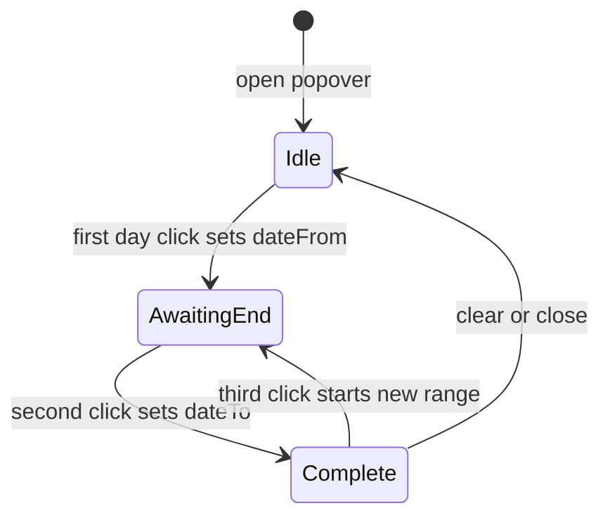

# Single calendar for event date range filter

## Goal

Replace the two `<input type="date">` fields in [`events.component.ts`](coffeeshop-frontend/src/app/features/events/events.component.ts) with **one range calendar** where the user:

1. Opens a popover from a single control (e.g. “Dates” / displayed range)
2. Clicks a **start** day (`dateFrom`)
3. Clicks an **end** day (`dateTo`) — days in between are highlighted
4. List reloads **automatically when the second day is clicked** (your choice)

No backend changes: keep sending `dateFrom` and `dateTo` as `yyyy-MM-dd` to existing [`EventService.search`](coffeeshop-frontend/src/app/services/event.service.ts).

## Why custom (not Angular Material)

[`package.json`](coffeeshop-frontend/package.json) has no `@angular/material`. Adding Material for one picker is heavy. A small standalone component matches patterns like [`city-search-select`](coffeeshop-frontend/src/app/shared/city-search-select/city-search-select.component.ts) (popover + signals + existing `.form-input` / dark theme).

## Component design

**New file:** [`coffeeshop-frontend/src/app/shared/date-range-picker/date-range-picker.component.ts`](coffeeshop-frontend/src/app/shared/date-range-picker/date-range-picker.component.ts)



### API (inputs/outputs)

| Binding | Type | Purpose |
|---------|------|---------|
| `dateFrom` | `input` string `''` or `yyyy-MM-dd` | Current filter start |
| `dateTo` | `input` string | Current filter end |
| `rangeChange` | `output` `{ dateFrom: string; dateTo: string }` | Emitted when range completes or cleared |
| `placeholder` | optional | Default `"Filter by date"` |

### Interaction

- **Trigger:** button styled like `.btn.btn-secondary` showing:
  - Placeholder when empty
  - `18 May 2026 – 25 May 2026` when both set (locale-friendly short format)
  - Partial: `From 18 May 2026` if only start (optional; can clear on second click)
- **Popover:** month grid (Sun–Sat header), prev/next month arrows
- **Selection:**
  - 1st click → set `dateFrom`, clear `dateTo`, highlight start
  - 2nd click → set `dateTo` (if before start, swap so `from <= to`), highlight range, **emit `rangeChange`**, close popover (optional: keep open; recommend close for cleaner UX)
  - 3rd click → reset selection (new range starting at that day)
- **Clear** link inside popover → emit `{ dateFrom: '', dateTo: '' }`
- **Click outside** → close popover (`focusout` / `document:click` pattern like city-search-select)
- **Keyboard:** `Escape` closes; basic `aria-expanded` on trigger

### Visual states (CSS in component or `styles.css`)

- `.day` — default
- `.day.selected` — start/end endpoints (`#d4a574` accent, consistent with app)
- `.day.in-range` — between dates (muted highlight `#2a2a3e` / border)
- `.day.today` — subtle outline
- `.day.outside-month` — dimmed adjacent-month cells

## Integration in Events page

In [`events.component.ts`](coffeeshop-frontend/src/app/features/events/events.component.ts):

**Remove:**

```html
<input type="date" ... dateFrom />
<input type="date" ... dateTo />
<button Clear dates />
```

**Add:**

```html
<app-date-range-picker
  [dateFrom]="dateFrom()"
  [dateTo]="dateTo()"
  (rangeChange)="onDateRangeChange($event)"
/>
```

```ts
onDateRangeChange(range: { dateFrom: string; dateTo: string }): void {
  this.dateFrom.set(range.dateFrom);
  this.dateTo.set(range.dateTo);
  this.currentPage.set(0);
  this.loadEvents();
}
```

Remove `onDateFromChange`, `onDateToChange`, `clearDateFilters` (handled by picker).

## Styles

- Update [`.events-toolbar`](coffeeshop-frontend/src/styles.css): remove `.events-date-filter` rules; allow picker trigger to sit beside search
- Add `.date-range-picker`, `.date-range-popover`, `.date-range-grid` rules (dark card `#1a1a2e`, border `#2a2a3e`)

## Files to change

| File | Action |
|------|--------|
| `shared/date-range-picker/date-range-picker.component.ts` | **Create** — calendar UI + range logic |
| `features/events/events.component.ts` | Replace dual inputs with picker |
| `styles.css` | Popover/cell styles; toolbar tweak |

**No changes** to Java API, `event.model.ts` params, or `event.service.ts` (already supports `dateFrom`/`dateTo`).

## Verification

1. Open Events → click date filter → calendar opens.
2. Click two days → in-between days highlighted; table reloads with correct API query.
3. Clear in popover → filters removed; full list returns.
4. Text search + date range work together.
5. `npm run build` succeeds.
