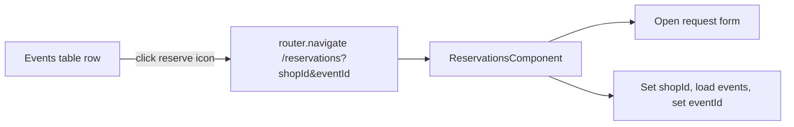

# Event row reservation shortcut

## Current state

- [`events.component.ts`](coffeeshop-frontend/src/app/features/events/events.component.ts): paginated table; the rightmost **Actions** column only shows Edit/Delete for users who `canManageEvent()` — no reservation affordance.
- [`reservations.component.ts`](coffeeshop-frontend/src/app/features/reservations/reservations.component.ts): create/request flows are **inline on `/reservations`** (no child routes, no `queryParams` usage today). Shop/event are chosen via cascading dropdowns (`onShopChange` → `eventService.getByShopId` → set `eventId`).

## UX design



**Per-row control (right side):**

- Show on **every** event row for all authenticated users (not limited to event managers).
- Place it as the **rightmost** control in the Actions cell: `[Edit] [Delete]` (when allowed) then **reserve icon**.
- Use a compact icon-only button (new shared style) with:
  - Inline SVG: simple chair/table motif (matches sidebar “My Reservations” theme)
  - `aria-label="Reserve for {eventName}"` and `title` tooltip with the same text
  - Accent on hover using existing `#d4a574` token

**Click behavior:**

| Role | Destination form |
|------|------------------|
| Regular user | Request form (`showRequestForm`) |
| Shop owner / admin (`isShopOwner()` on reservations page) | Guest request form (`ownerFormMode === 'request'`) — same as “+ Request for guest”; guest still chosen on reservations page |

Direct “Create reservation” (table required) stays on the reservations page only; the shortcut optimizes the common “I found an event, now book it” path.

**Past events:** disable the icon when `event.eventDate` is in the past (reuse the same `new Date(value)` parsing approach as `futureDateValidator` in events). Tooltip: “This event has already passed.”

## Implementation

### 1. Events page — shortcut + navigation

**File:** [`coffeeshop-frontend/src/app/features/events/events.component.ts`](coffeeshop-frontend/src/app/features/events/events.component.ts)

- Import `Router`.
- Add `canReserveForEvent(event: EventResponseDto): boolean` (not in the past).
- Add `onReserve(event: EventResponseDto)`:

```typescript
this.router.navigate(['/reservations'], {
  queryParams: { shopId: event.shopId, eventId: event.eventId },
});
```

- Update Actions `<td>` template:

```html
<td class="event-row-actions">
  <motion class="event-row-actions__inner">
    @if (canManageEvent(event)) { ... Edit/Delete ... }
    <button
      type="button"
      class="btn btn-icon btn-reserve"
      [disabled]="!canReserveForEvent(event)"
      [attr.aria-label]="'Reserve for ' + event.eventName"
      [title]="canReserveForEvent(event) ? 'Reserve for ' + event.eventName : 'This event has already passed'"
      (click)="onReserve(event)"
    >
      <!-- inline SVG -->
    </button>
  </motion>
</td>
```

- Widen/rename column header only if needed (optional: keep “Actions” — it now covers reserve + manage).

### 2. Global styles — icon button

**File:** [`coffeeshop-frontend/src/styles.css`](coffeeshop-frontend/src/styles.css)

Add minimal utilities (scoped names, no new component file):

- `.event-row-actions__inner` — `display: flex; align-items: center; justify-content: flex-end; gap: 0.5rem;`
- `.btn-icon` — square padding (`0.5rem`), no extra min-width; centers SVG
- `.btn-reserve` — default muted icon color; hover: accent `#d4a574`; disabled: existing `.btn:disabled` opacity

### 3. Reservations page — read query params and pre-fill

**File:** [`coffeeshop-frontend/src/app/features/reservations/reservations.component.ts`](coffeeshop-frontend/src/app/features/reservations/reservations.component.ts)

- Inject `ActivatedRoute` and `Router`.
- After existing `ngOnInit` setup (shops/users loaded, `valueChanges` wired), read **once** from `route.snapshot.queryParamMap`:
  - `shopId`, `eventId` — both required to prefill; ignore partial params.
- Add private `openRequestFormWithEvent(shopId: string, eventId: string)`:
  1. If `isShopOwner()`: `ownerFormMode.set('request')`, set `guestUserId` validators (mirror `toggleOwnerForm('request')`); else `showRequestForm.set(true)`.
  2. `requestForm.patchValue({ shopId, eventId: '', partySize: 1 })` — clear `eventId` first so cascade stays consistent.
  3. Call existing `onShopChange(shopId)` logic, then in the **same** `getByShopId` subscription callback set `eventId` if that event exists in the loaded list (handles race if events API is slow).
  4. `router.navigate([], { relativeTo: route, queryParams: {}, replaceUrl: true })` to strip params after apply (clean URL, avoids re-open on refresh).

Extract a small helper if needed so `onShopChange` and prefill share one “load events for shop” path — avoid duplicating the `eventService.getByShopId` subscribe.

**Edge cases (handled on reservations page, no extra events-page API):**

- User already has blocking request/reservation for that event → event may be filtered from dropdown; form opens with shop set; user sees existing “blocked events” hint — acceptable for v1.
- Invalid/missing `eventId` in shop’s event list → shop pre-selected, event left empty.

### 4. No routing changes

[`app.routes.ts`](coffeeshop-frontend/src/app/app.routes.ts) stays as-is; query params on `/reservations` are sufficient.

## Files touched

| File | Change |
|------|--------|
| [`events.component.ts`](coffeeshop-frontend/src/app/features/events/events.component.ts) | Reserve icon, navigation, past-event guard |
| [`reservations.component.ts`](coffeeshop-frontend/src/app/features/reservations/reservations.component.ts) | Query-param prefill + URL cleanup |
| [`styles.css`](coffeeshop-frontend/src/styles.css) | `.btn-icon`, `.event-row-actions__inner`, `.btn-reserve` |

## Manual test plan

1. **Regular user:** Events → click reserve on a future event → lands on `/reservations` with request form open, shop + event selected, party size default 1.
2. **Shop owner:** same shortcut → “Request for guest” form open with shop + event filled; guest dropdown empty (expected).
3. **Past event:** icon disabled, no navigation.
4. **Manager row:** Edit/Delete still visible; reserve icon remains rightmost.
5. **Browser back:** after landing, URL has no query params (replaceUrl cleanup).
