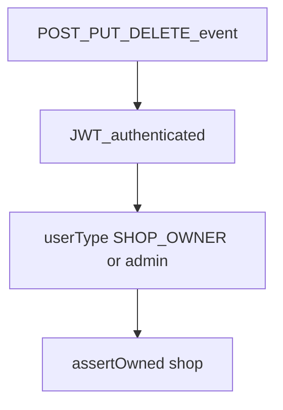

# Event mutations restricted to shop owners

## Current state

| Layer | Behavior |
|-------|----------|
| Frontend [`events.component.ts`](coffeeshop-frontend/src/app/features/events/events.component.ts) | **"+ Add Event"** and create form always visible (lines 17–22). Edit/Delete gated by `canManageEvent()` → `ownedShopIds` from `ShopService.getMine()` only (no `userType` check). |
| Backend [`EventServiceImpl`](coffeeshop/src/main/java/com/coffeeshop/coffeeshop/service/impl/EventServiceImpl.java) | `create` / `update` / `delete` call `shopOwnershipService.assertOwned(...)` only. Any authenticated user who owns the shop can mutate. |
| Reference pattern | [`ShopServiceImpl.create`](coffeeshop/src/main/java/com/coffeeshop/coffeeshop/service/impl/ShopServiceImpl.java) rejects non–`SHOP_OWNER` before other checks. Frontend [`shops.component.ts`](coffeeshop-frontend/src/app/features/shops/shops.component.ts) uses `canCreateShop()` with `profile.userType === 'SHOP_OWNER' \|\| isAdmin()`. |



Per your choice: **all mutations** (POST, PUT, DELETE) require **SHOP_OWNER or admin**, then existing shop ownership still applies for non-admins.

---

## Frontend ([`events.component.ts`](coffeeshop-frontend/src/app/features/events/events.component.ts))

**Inject** `AuthService` and `ProfileService` (same as [`shops.component.ts`](coffeeshop-frontend/src/app/features/shops/shops.component.ts)).

**Add helpers:**

```ts
canCreateEvent(): boolean {
  const profile = this.profileService.currentUser();
  if (!profile) return false;
  return this.authService.isAdmin() || profile.userType === 'SHOP_OWNER';
}

canManageEvent(event: EventResponseDto): boolean {
  if (!this.canCreateEvent()) return false;
  if (this.authService.isAdmin()) return true;
  return this.ownedShopIds().has(event.shopId);
}

canShowForm(): boolean {
  const id = this.editingId();
  if (id) {
    const event = this.events().find(e => e.eventId === id);
    return event ? this.canManageEvent(event) : false;
  }
  return this.canCreateEvent();
}
```

**Template changes:**

- Wrap header button: `@if (canCreateEvent()) { ... + Add Event ... }`
- Replace `@if (showForm())` with `@if (showForm() && canShowForm())` so customers cannot open the form via URL/state hacks
- Row actions already use `@if (canManageEvent(event))` — logic update above hides Edit/Delete for `CUSTOMER` users

No new API calls; profile is already loaded from [`layout.component.ts`](coffeeshop-frontend/src/app/shared/layout/layout.component.ts).

---

## Backend

### 1. Shared role gate on [`ShopOwnershipService`](coffeeshop/src/main/java/com/coffeeshop/coffeeshop/auth/ShopOwnershipService.java)

Add a reusable method (keeps message and rules in one place):

```java
public void assertShopOwnerOrAdmin(final User user) {
    if (isAdmin(user)) {
        return;
    }
    if (user.getUserType() != UserType.SHOP_OWNER) {
        throw new ResponseStatusException(HttpStatus.FORBIDDEN, "Only shop owners can manage events");
    }
}
```

Import `UserType` from [`UserType.java`](coffeeshop/src/main/java/com/coffeeshop/coffeeshop/model/enums/UserType.java).

### 2. [`EventServiceImpl`](coffeeshop/src/main/java/com/coffeeshop/coffeeshop/service/impl/EventServiceImpl.java)

At the start of **`create`**, **`update`**, and **`deleteById`**:

```java
final User currentUser = currentUserService.requireCurrentUser();
shopOwnershipService.assertShopOwnerOrAdmin(currentUser);
```

Then keep existing `assertOwned(...)` calls unchanged.

- **Admin:** passes role gate; `assertOwned` still bypassed for admins (existing behavior).
- **SHOP_OWNER:** must pass role gate and own the shop.
- **CUSTOMER:** 403 before ownership check.

Controller [`EventController`](coffeeshop/src/main/java/com/coffeeshop/coffeeshop/controller/EventController.java) stays `@PreAuthorize("isAuthenticated()")` — no `hasRole` change (consistent with tables/menu items).

---

## Tests ([`EventOwnershipIntegrationTest`](coffeeshop/src/test/java/com/coffeeshop/coffeeshop/EventOwnershipIntegrationTest.java))

Add cases (reuse `createUser`, `linkKeycloakSubject`, `createShopWithOwner`, `ownerHeaders`):

| Test | Expect |
|------|--------|
| `createEvent_asCustomer_returnsForbidden` | CUSTOMER + valid `shopId` → **403** |
| `updateEvent_asCustomer_returnsForbidden` | CUSTOMER + `PUT` on existing event → **403** |
| `deleteEvent_asCustomer_returnsForbidden` | CUSTOMER + `DELETE` → **403** |

Existing tests (`createEvent_onOwnShop`, `createEvent_onOtherOwnersShop`, `createEvent_asAdmin_onOtherOwnersShop`) should remain green.

---

## Verification

1. **Customer** on `/events` → no "+ Add Event", no Edit/Delete on any row.
2. **SHOP_OWNER** with owned shop(s) → "+ Add Event" visible; Edit/Delete only on events for owned shops.
3. **SHOP_OWNER** on another owner's event → no row actions; API `POST`/`PUT`/`DELETE` → **403** (ownership).
4. **Admin** → "+ Add Event" visible; can mutate events on any shop (API + UI for all rows if desired via `isAdmin()` branch).
5. Run `EventOwnershipIntegrationTest` (and full test suite if convenient).
