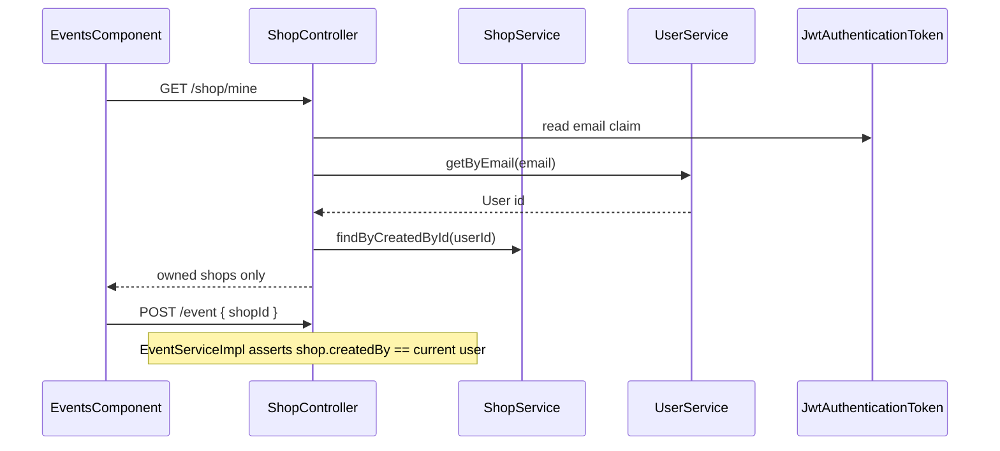

# Event creation: shop ownership validation

## Problem

Today, any authenticated user can `POST /api/v1/event` with any existing `shopId`. [`EventServiceImpl`](coffeeshop/src/main/java/com/coffeeshop/coffeeshop/service/impl/EventServiceImpl.java) only verifies the shop exists — it never checks `shop.createdBy`.

The Events UI loads **all** shops via `GET /api/v1/shop` with no ownership filter.

## Approach overview

1. **New API** — `GET /api/v1/shop/mine` returns shops owned by the caller (resolved via JWT email → user → `createdBy`).
2. **Event mutations** — keep server-side ownership assert on create/update/delete (defense in depth; UI alone is not enough).
3. **Frontend** — Events form calls `getMine()` instead of `getAll()` + client filter.



---

## Backend: `GET /api/v1/shop/mine` (java-agent)

### Endpoint

**[`ShopController`](coffeeshop/src/main/java/com/coffeeshop/coffeeshop/controller/ShopController.java)**

```java
@PreAuthorize("isAuthenticated()")
@SecurityRequirement(name = "bearer-jwt")
@GetMapping("/mine")
public ResponseEntity<List<ShopResponseDto>> getMine() { ... }
```

- Place **`/mine` before `/{id}`** so Spring does not treat `mine` as a UUID path variable.
- No email query param — email comes only from the access token (caller cannot impersonate another user).

### Service flow

**[`ShopService`](coffeeshop/src/main/java/com/coffeeshop/coffeeshop/service/ShopService.java)** — add:

```java
List<Shop> findByCurrentUser();
```

**[`ShopServiceImpl`](coffeeshop/src/main/java/com/coffeeshop/coffeeshop/service/impl/ShopServiceImpl.java)**:

1. Read authenticated JWT via `SecurityContextHolder` → `JwtAuthenticationToken` → `jwt.getClaimAsString("email")`, falling back to `preferred_username` if needed (same order as [`JwtAccessTokenClaims.email`](coffeeshop/src/main/java/com/coffeeshop/coffeeshop/auth/JwtAccessTokenClaims.java)).
2. If email missing → `401` or `403` with clear message.
3. `User user = userService.getByEmail(email)` (new method below).
4. `return shopRepository.findByCreatedById(user.getId())`.

Alternatively inject `JwtAccessTokenClaims` + token value from `jwtAuth.getToken().getTokenValue()` — either approach is fine; prefer reading claims from the already-validated `Jwt` in the security context.

### UserService

**[`UserService`](coffeeshop/src/main/java/com/coffeeshop/coffeeshop/service/UserService.java)** — add:

```java
User getByEmail(String email);
```

**[`UserServiceImpl`](coffeeshop/src/main/java/com/coffeeshop/coffeeshop/service/impl/UserServiceImpl.java)** — use existing `userRepository.findByEmailIgnoreCase(email)`; throw `ResourceNotFoundException` if absent.

### ShopRepository

**[`ShopRepository`](coffeeshop/src/main/java/com/coffeeshop/coffeeshop/repository/ShopRepository.java)** — add:

```java
List<Shop> findByCreatedById(UUID createdById);
```

(`existsByCreatedById` already exists.)

### Tests for `/shop/mine`

New cases in integration test (dedicated class or extend shop tests):

| Case | Expected |
|------|----------|
| Shop owner with linked JWT email | `200`, only shops where `createdBy.id` = user id |
| Unauthenticated | `401` |
| Authenticated but email not in local DB | `404` |

**Test JWT email claim:** [`TestcontainersConfiguration`](coffeeshop/src/test/java/com/coffeeshop/coffeeshop/TestcontainersConfiguration.java) currently sets a **fixed** `email` claim (`jwt-test-subject@example.com`) for all tokens. When bearer = `ownerId.toString()`, subject matches the user but email does not. **Update test `JwtDecoder`** to set `email` from the linked `User` record when the bearer token is a user UUID (lookup by `keycloakSubject` or id), so `/shop/mine` works in existing owner integration tests.

---

## Backend: event ownership assert (java-agent)

**[`EventServiceImpl`](coffeeshop/src/main/java/com/coffeeshop/coffeeshop/service/impl/EventServiceImpl.java)**

1. Inject [`CurrentUserService`](coffeeshop/src/main/java/com/coffeeshop/coffeeshop/auth/CurrentUserService.java).
2. Private helpers (same pattern as [`ReservationRequestServiceImpl`](coffeeshop/src/main/java/com/coffeeshop/coffeeshop/service/impl/ReservationRequestServiceImpl.java)):
   - `assertShopOwnedBy(Shop shop, User currentUser)` → `403` / `"You do not own this shop"`
   - `isAdmin(User user)` → `UserType.ADMIN` or `ROLE_ADMIN`
3. **create** — after `resolveShop()`, assert ownership (skip if admin).
4. **update** — assert on target shop (new `shopId` or existing).
5. **delete** — assert on `event.getShop()`.

**Tests:** `EventOwnershipIntegrationTest` — owner `201` on own shop, `403` on other's shop, admin bypass `201`.

**Fix existing tests** in [`ReservationRequestIntegrationTest`](coffeeshop/src/test/java/com/coffeeshop/coffeeshop/ReservationRequestIntegrationTest.java) that create events on another owner's shop with the wrong bearer (L259, L358, L384) — create those events as `otherOwnerId` bearer instead.

---

## Frontend (frontend-agent)

**[`shop.service.ts`](coffeeshop-frontend/src/app/services/shop.service.ts)**

```typescript
getMine(): Observable<ShopResponseDto[]> {
  return this.http.get<ShopResponseDto[]>(`${this.base}/mine`);
}
```

(Auth interceptor already attaches bearer token.)

**[`events.component.ts`](coffeeshop-frontend/src/app/features/events/events.component.ts)**

- Replace `shopService.getAll()` with `shopService.getMine()` for the create/edit form dropdown.
- Keep `shopMap` population from the mine list for name display.
- **No** client-side `createdBy` filter needed on Events page (reservations can adopt `getMine()` later as a follow-up; out of scope unless requested).

**Optional:** filter events table to owned shops only (hide edit/delete for others); backend still enforces.

---

## Out of scope

- Shop update/delete ownership (separate gap)
- Changing `GET /api/v1/shop` (public list stays as-is)
- Email as a request parameter (security: token only)

---

## Verification

- `./mvnw -f coffeeshop test` — new shop-mine + event ownership tests; existing reservation tests pass
- Manual: shop owner → Events → dropdown shows only owned shops; tampered `shopId` on POST → `403`
