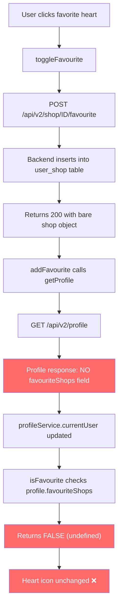

## Root Cause Analysis

The `user_shop_favourite` table does NOT exist — but this is by design. The codebase uses a single `user_shop` table with a `relationship_type` column (`FAVOURITE`, `OWNER`, `EMPLOYEE`). The backend `AddFavourite` handler works correctly (inserts into `user_shop`, returns 200).

**The real bug**: The frontend `isFavourite()` method at `shop-details.component.ts:943-948` checks `profile.favouriteShops`, but the backend `GET /api/v2/profile` endpoint returns only `{id, name, username, email, userType}` — it does NOT include `favouriteShops`. So `profile.favouriteShops` is always `undefined` and `isFavourite()` always returns `false`.

### Data Flow of the Bug

## Fix Plan

### 1. Backend: Add favouriteShops to profile response

**File**: `coffeeshop-go/internal/handler/profile.go`

Query the `user_shop` table for shops favorited by the current user and include them in the profile response. The frontend `UserProfileResponseDto` already expects a `favouriteShops: ShopSummaryDto[]` field.

New response shape: `{id, name, username, email, userType, favouriteShops: [{id, name, ...}]}`

Also query `user_shop` for owned shops and include `roles` and other expected fields.

### 2. Backend: Add reviews and reservations to profile response

**File**: `coffeeshop-go/internal/handler/profile.go`

The frontend `UserProfileResponseDto` also expects `reviews` and `reservations`. Add these to make the profile endpoint complete.

### 3. Frontend: Use shop.favouriteByCurrentUser as primary check

**File**: `coffeeshop-frontend/src/app/features/shop-details/shop-details.component.ts`

Change `isFavourite()` to check `shop.favouriteByCurrentUser` first (which is already available from the shop detail endpoint), falling back to `profile.favouriteShops`. Also update `toggleFavourite()` to optimistically toggle `favouriteByCurrentUser` locally.

### 4. Backend: Return fullShopResponse from AddFavourite/RemoveFavourite

**File**: `coffeeshop-go/internal/handler/shop.go`

Instead of returning a bare `model.Shop`, return the full shop response (with `favouriteByCurrentUser`) so the frontend gets the correct state immediately.

## Files Changed
- `coffeeshop-go/internal/handler/profile.go` — Add favouriteShops, reviews, reservations to response
- `coffeeshop-go/internal/handler/shop.go` — Return full shop response from AddFavourite/RemoveFavourite
- `coffeeshop-frontend/src/app/features/shop-details/shop-details.component.ts` — Use shop.favouriteByCurrentUser, optimistic UI update