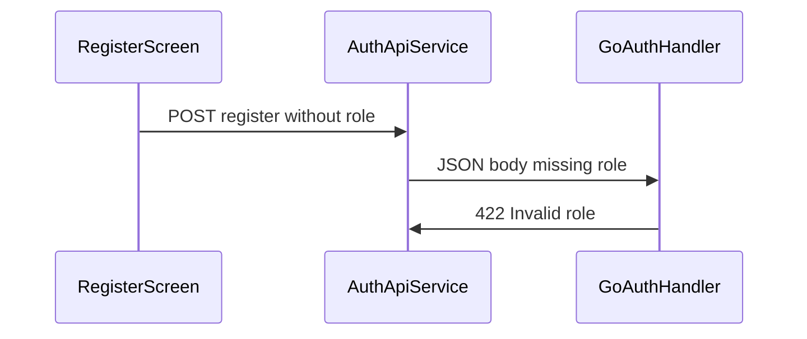

# Fix Register 422 "Invalid role"

## Root Cause

The Go backend requires `role` to be exactly `customer` or `shop_owner`:

```120:122:coffeeshop-go/internal/handler/auth.go
	if req.Role != "customer" && req.Role != "shop_owner" {
		apperror.WriteError(w, apperror.Validation("Invalid role"))
		return
```

Flutter's [`RegisterRequest`](coffeeshop-mobile/lib/data/models/register_request.dart) only serializes `name`, `username`, `email`, `password` — no `role`. The backend decodes `role` as `""`, which fails validation with **422 Invalid role**.

The Angular app already sends `role` via an Account Type dropdown ([`register.component.ts`](coffeeshop-frontend/src/app/features/auth/register.component.ts) lines 9-12, 121).



## Changes

### 1. Add `role` to the register model

**File:** [`coffeeshop-mobile/lib/data/models/register_request.dart`](coffeeshop-mobile/lib/data/models/register_request.dart)

Add a required `role` field to the Freezed model:

```dart
required String role,
```

Regenerate codegen:

```bash
cd coffeeshop-mobile && dart run build_runner build --delete-conflicting-outputs
```

### 2. Thread `role` through the auth stack

Update these files to accept and forward `role`:

| File | Change |
|------|--------|
| [`auth_api_service.dart`](coffeeshop-mobile/lib/data/services/auth_api_service.dart) | Add `required String role` param; pass to `RegisterRequest` |
| [`auth_service.dart`](coffeeshop-mobile/lib/core/auth/auth_service.dart) | Add `role` to `register()` signature |
| [`auth_notifier.dart`](coffeeshop-mobile/lib/core/auth/auth_notifier.dart) | Add `role` to `register()` signature |

### 3. Add Account Type selector to register screen

**File:** [`register_screen.dart`](coffeeshop-mobile/lib/features/auth/register_screen.dart)

- Add state: `String _selectedRole = 'customer'` (default matches Angular)
- Add a `FormSelect<String>` using the existing [`form_select.dart`](coffeeshop-mobile/lib/shared/widgets/form_select.dart) widget
- Options: `customer` → "Customer", `shop_owner` → "Shop Owner"
- Pass `_selectedRole` into `authService.register(...)`

Placement: after the password field, before the Register button (same order as Angular).

### 4. Verify

```bash
cd coffeeshop-mobile && dart analyze
```

Manual test: register on Chrome with role "Customer" → expect 201, auto-login, redirect to dashboard.

## Files NOT Changed

- Go backend — validation is correct; Flutter must match the API contract
- `token_storage.dart`, `auth_interceptor.dart` — unrelated to registration payload

## Skills Used

- **flutter-implement-json-serialization** — `RegisterRequest` + `build_runner`
- **dart-run-static-analysis** — post-change verification
