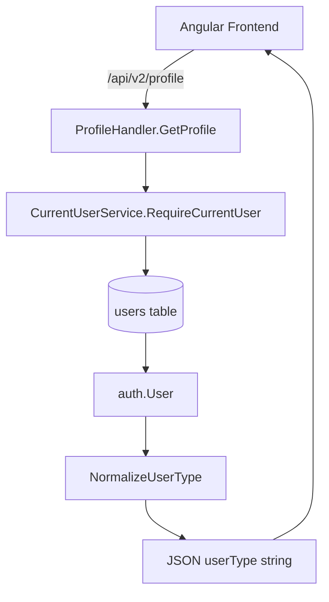

## Goal

Ensure the Go service always returns **string user types** (e.g. `CUSTOMER` / `SHOP_OWNER` / `ADMIN`) in JSON responses, never numeric `0` / `1`, so the Angular frontend can render meaningful labels everywhere `userType` is shown.

## Current state

- **Go auth/user model**: `auth.User` in `[coffeeshop-go/internal/auth/current_user.go](coffeeshop-go/internal/auth/current_user.go)` maps `user_type` column to `UserType string` with JSON `userType`.
- **Profile endpoint**: `ProfileHandler.GetProfile` in `[coffeeshop-go/internal/handler/profile.go](coffeeshop-go/internal/handler/profile.go)` returns `user.UserType` directly in its JSON.
- **User endpoints**: `UserHandler` in `[coffeeshop-go/internal/handler/user.go](coffeeshop-go/internal/handler/user.go)` exposes `userType` via `userResponseDTO` for list, detail, create, and update.
- **Registration**: `AuthHandler.Register` in `[coffeeshop-go/internal/handler/auth.go](coffeeshop-go/internal/handler/auth.go)` already sets `userType` to uppercase strings (`CUSTOMER` / `SHOP_OWNER`) and persists these.
- **Frontend**:
  - The Angular models in `[coffeeshop-frontend/src/app/models/user.model.ts](coffeeshop-frontend/src/app/models/user.model.ts)` already expect `userType: 'CUSTOMER' | 'SHOP_OWNER' | 'ADMIN'` in `UserListItemDto`, `UserResponseDto`, and `UserProfileResponseDto`.
  - `UsersComponent` in `[coffeeshop-frontend/src/app/features/users/users.component.ts](coffeeshop-frontend/src/app/features/users/users.component.ts)` displays `{{ user.userType }}` directly and uses select options bound to `CUSTOMER` / `SHOP_OWNER` / `ADMIN`.
- **Likely root cause**: legacy or migrated records in the `users` table still have numeric `user_type` values (`0` / `1`). GORM reads them into `UserType string`, giving JSON values "0" / "1" which the frontend then renders as-is.

A simple, low-risk fix is to normalize these legacy numeric values at the Go service layer while preserving the existing string-based contract for all new writes.

## High-level approach

- **Keep DB flexible**: Do not require immediate DB schema changes; treat existing numeric values as legacy and map them to canonical strings at read time.
- **Centralize mapping**: Implement a single **normalization helper** in the Go `auth` package that converts any `UserType` value (`"0"`, `"1"`, lowercase, etc.) into the canonical uppercase string values used by the API.
- **Apply normalization at all user-returning endpoints**: Ensure `userType` is normalized before it is encoded to JSON in **profile**, **user list/detail**, and any other user-related responses.
- **Optionally backfill DB later**: Optionally provide a follow-up SQL migration to permanently convert numeric codes in `users.user_type` to the canonical string values, simplifying future maintenance.

## Detailed steps

### 1. Add a normalization helper in the Go auth package

- In `[coffeeshop-go/internal/auth/current_user.go](coffeeshop-go/internal/auth/current_user.go)` (or a small new file in the same package), introduce a helper such as `NormalizeUserType(raw string) string`.
- Behavior:
  - Map known numeric codes to canonical strings, e.g.:
    - `"0"` → `"CUSTOMER"`
    - `"1"` → `"SHOP_OWNER"`
  - Also handle common legacy string variants defensively (case-insensitive):
    - `"customer"` → `"CUSTOMER"`
    - `"shop_owner"` → `"SHOP_OWNER"`
    - `"admin"` → `"ADMIN"`
  - For values already in canonical form (`CUSTOMER`, `SHOP_OWNER`, `ADMIN`), return them unchanged.
  - For unknown values, return the original string to avoid breaking unexpected data, but consider logging in the future.

### 2. Normalize user type in profile responses

- Update `ProfileHandler.GetProfile` in `[coffeeshop-go/internal/handler/profile.go](coffeeshop-go/internal/handler/profile.go)` to call the normalization helper when building the JSON response.
- Concretely, change the `"userType"` field to use `auth.NormalizeUserType(user.UserType)` instead of `user.UserType`.
- This ensures the current user profile endpoint always returns descriptive string values, even for legacy numeric records.

### 3. Normalize user type in user list/detail responses

- Update the `toUserResponse` function in `[coffeeshop-go/internal/handler/user.go](coffeeshop-go/internal/handler/user.go)` to normalize `UserType` via the same helper.
- Because all entry points (`listAll`, `paginatedSearch`, `GetByID`, `Create`, `Update`) go through `toUserResponse`, this ensures **all user-related admin/listing endpoints** return canonical string values.

### 4. Keep writes using canonical string values

- Confirm that **all places writing `UserType`** already use the canonical strings:
  - `AuthHandler.Register` in `[coffeeshop-go/internal/handler/auth.go](coffeeshop-go/internal/handler/auth.go)` already sets `userType` to `"CUSTOMER"` or `"SHOP_OWNER"`.
  - `UserHandler.Create` / `Update` in `[coffeeshop-go/internal/handler/user.go](coffeeshop-go/internal/handler/user.go)` set `UserType` directly from request JSON, which the Angular admin UI already constrains to `CUSTOMER` / `SHOP_OWNER` / `ADMIN`.
- No change should be required here, but we can add a **defensive normalization before save** as a small extra safeguard:
  - Before saving `auth.User`, apply `NormalizeUserType` on the incoming `UserType`.

### 5. Verify frontend compatibility

- No TypeScript changes should be required because the frontend already expects uppercase string literals for `userType`.
- Optionally, add a **display-friendly pipe or mapping** (in Angular) to render nicer labels (e.g. `Shop Owner` instead of `SHOP_OWNER`) without altering the contract, but this is not required to fix the 0/1 issue.

### 6. Optional: future DB backfill/migration (not required for initial fix)

- Once the normalization is in place and verified, consider a separate migration step (manual or through your migration tool) to **update existing DB rows** so the `users.user_type` column only contains canonical strings:
  - `UPDATE users SET user_type = 'CUSTOMER' WHERE user_type = '0';`
  - `UPDATE users SET user_type = 'SHOP_OWNER' WHERE user_type = '1';`
- This cleanup is optional for correctness but will simplify reasoning about data long-term.

## Simple flow diagram

This ensures that regardless of how `user_type` is stored in the DB today, the **JSON contract is always a descriptive string**, fixing the 0/1 display issue across the app.
