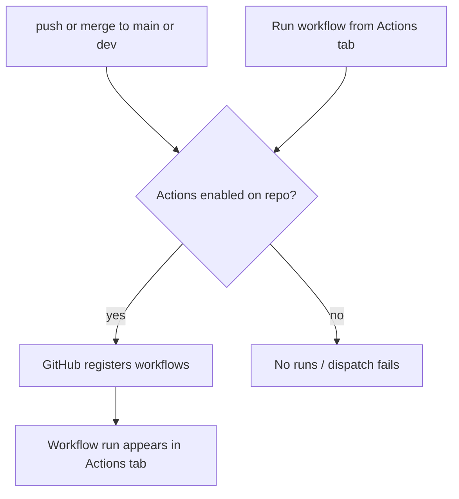

# Fix GitHub Actions — GitHub UI only

**Scope:** Diagnose and fix zero pipeline runs and **Failed to queue workflow run** using **only** [github.com](https://github.com/mastilovic/coffeeshop-monorepo). No local `gh` CLI, no terminal API calls, no repo YAML changes unless settings are confirmed correct and runs still fail.

**Related docs:** [deploy/GITHUB_SETUP.md](deploy/GITHUB_SETUP.md) — section *"No runs appear in Actions at all?"*

---

## Current state (already verified)

Workflow YAML on GitHub is **correct** and does not need changes for this issue:

| Branch | Commit (approx.) | File |
|--------|------------------|------|
| `main` | `1143617` | [`.github/workflows/ci-cd-staging.yml`](.github/workflows/ci-cd-staging.yml) |
| `dev` | `9d63955` | Same workflow content |

Triggers:

```yaml
on:
  push:
    branches: [dev, main]
  workflow_dispatch:
    inputs:
      skip_tests: ...
```

- No top-level `paths` on `push` — every push/merge to `main` or `dev` should schedule a run when Actions is enabled.
- `workflow_dispatch` is present for manual **Run workflow** from the Actions tab.

**Symptoms you reported:**

1. No run after push to `dev` or merge to `main`
2. **Actions → CI/CD Staging → Run workflow** on `main` → *Failed to queue workflow run* (404 in response)

Both symptoms together strongly indicate **repository-level Actions disabled, restricted, or billing blocked** — not a YAML trigger bug.



---

## Phase 1: Repository settings (github.com as `mastilovic`)

Open **https://github.com/mastilovic/coffeeshop-monorepo** while logged in as the repo owner.

### 1a. Enable Actions

**Settings → Actions → General → Actions permissions**

- Select **Allow all actions and reusable workflows**
- If set to **Disable actions**, that explains both missing push runs and failed manual dispatch — change and save.

### 1b. Workflow permissions

**Settings → Actions → General → Workflow permissions**

- Select **Read and write permissions** (needed for GHCR image push in build jobs)
- Save

### 1c. Default branch and workflow file on `main`

**Settings → General → Default branch**

- Must be **`main`** (required for **Run workflow** UI to register workflows)

**Code → branch `main` → `.github/workflows/ci-cd-staging.yml`**

- Confirm the file exists and shows `workflow_dispatch` under `on:`

### 1d. Billing

**Settings → Billing and plans**

- Confirm GitHub Actions minutes are not exhausted for the current period (private repos on free plan: 2,000 min/month).

### 1e. Fork (only if applicable)

If the repo is a fork: **Actions** tab → accept running workflows if GitHub prompts.

---

## Phase 2: Verify manual dispatch (Actions tab only)

After Phase 1, without any local tools:

### Step 2a — Control workflow

1. **Actions** (left sidebar)
2. Select **Deploy Staging (DOKS)** ([`deploy-staging.yml`](.github/workflows/deploy-staging.yml))
3. **Run workflow** → branch **`main`** → Run

| Result | Meaning |
|--------|---------|
| Run appears in list | Actions is working repo-wide |
| Same queue failure / 404 | Repo-wide block (settings, billing, org policy) — not specific to CI/CD Staging |

### Step 2b — CI/CD Staging

1. **Actions → CI/CD Staging**
2. **Run workflow** → branch **`main`**, **`skip_tests`**: `false` → Run
3. Within ~30 seconds, a new run should appear at the top of the workflow run list

### Step 2c — If dispatch still fails (browser only)

1. Open browser **Developer Tools → Network**
2. Click **Run workflow** again
3. Find the failed request (often contains `dispatches` in the path)
4. Note:
   - Full request URL (should include `repos/mastilovic/coffeeshop-monorepo/actions/workflows/...`)
   - HTTP status and JSON `message` field

Use that for GitHub Support if Phase 1 settings were already correct.

---

## Phase 3: Verify push triggers (GitHub UI + normal git push)

Use your usual git workflow (IDE, SourceTree, or `git push` — no `gh` required).

### 3a. Trigger on `main`

- Merge a small PR to `main` **or** push an empty commit to `main`
- **Actions → CI/CD Staging** — confirm a new run for that commit within ~30 seconds
- On success: **build-backend**, **build-frontend**, then **deploy** should run (deploy is `main`-only)

### 3b. Trigger on `dev` (path filtering)

- Push a **docs-only** change to `dev` (e.g. edit root `README.md` only)
- Confirm a run appears
- Confirm **build-backend** and **build-frontend** are **skipped** (path gating from recent YAML fix)
- Confirm **deploy** does **not** run on `dev`

### 3c. What you should see in the Actions tab

| Event | Workflow | Deploy job |
|-------|----------|------------|
| Push/merge to `main` | CI/CD Staging | Runs after green builds |
| Push to `dev` (relevant paths) | CI/CD Staging | Skipped |
| PR only | Backend CI / Frontend CI | N/A (not CI/CD Staging) |

---

## Phase 4: Escalation (still no runs after Phase 1–3)

If Actions permissions and billing look correct but push and manual dispatch still fail:

1. **Organization policies** (if repo is under an org): org **Settings → Actions** — ensure org does not disable Actions for this repo
2. **GitHub Support** — include:
   - Repo: `mastilovic/coffeeshop-monorepo`
   - Default branch: `main`
   - Example commit on `main`: `1143617`
   - Screenshot of **Settings → Actions → General**
   - Network tab URL + JSON from failed `dispatches` request (Phase 2c)
3. **No further YAML edits** until Support or org policy identifies a platform issue — triggers and file placement are already correct

---

## Out of scope for this plan

| Item | Reason |
|------|--------|
| Local `gh` CLI | Per your request — all verification via github.com |
| Changes to [`.github/workflows/ci-cd-staging.yml`](.github/workflows/ci-cd-staging.yml) | YAML already correct; changing it will not fix disabled Actions |
| [backend-ci.yml](.github/workflows/backend-ci.yml) / [frontend-ci.yml](.github/workflows/frontend-ci.yml) | PR-only by design; they never run on direct push to `main` |

---

## Success checklist

- [ ] **Settings → Actions** allows all actions; workflow permissions are read/write
- [ ] Default branch is `main`; `ci-cd-staging.yml` visible on `main` in Code tab
- [ ] **Deploy Staging (DOKS)** manual run queues successfully
- [ ] **CI/CD Staging** manual run queues successfully
- [ ] Push/merge to `main` creates a CI/CD Staging run automatically
- [ ] Docs-only push to `dev` creates a run with build jobs skipped
