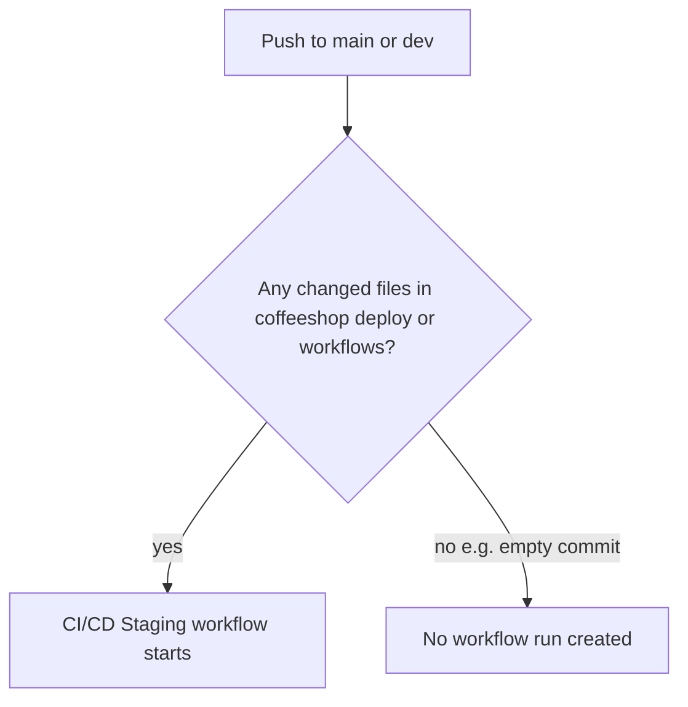

# Fix GitHub Actions not running after `b4432c6`

## What we know

| Fact | Implication |
|------|-------------|
| Last run tied to **`b4432c6`** (“add step to validate cluster connection”) | Everything after that on `main` should also qualify, but you see nothing new |
| You **see** “CI/CD Staging” and “Deploy Staging (DOKS)” in Actions | Workflows are **registered**; repo Actions is not fully off |
| Local `origin/main` is at **`b1b65b0`** with `deploy/README.md` changed | That commit **must** match the `deploy/**` path filter — it is not an empty commit |
| Only **[`ci-cd-staging.yml`](.github/workflows/ci-cd-staging.yml)** runs on `push` to `dev`/`main` | “Backend CI” / “Frontend CI” are **PR-only** — you will never see them on a direct push to `main` |



Commits since `b4432c6` that **should** have started **CI/CD Staging** (all touch watched paths):

- `e8b2f34` — `deploy/**`, `.github/workflows/deploy-staging-reusable.yml`
- `e142918` — `coffeeshop/**`
- `9697109` — merge PR (workflow + deploy docs)
- `b1b65b0` — `deploy/README.md`
- `b665254` — **empty** (correctly produces **no** run)

So if **none** of these appear in the Actions run list, the problem is **not** “deploy only runs on main” — it is **no push workflow run at all** (or you are not seeing runs that exist).

---

## Phase 1 — Diagnose on GitHub (no code changes)

Do these in order on **https://github.com/mastilovic/coffeeshop-monorepo**:

### 1. Confirm the push reached GitHub

- **Code → main → Commits**: verify `b1b65b0` (“chore: trigger staging CI/CD on main”) is on **`main`**, not only local.
- Open that commit: check for a status/check area (yellow dot / green check / “No checks”). **No checks** = no workflow was scheduled for that SHA.

### 2. Search Actions without branch filter

- **Actions → CI/CD Staging → Run workflow** (if we add dispatch in Phase 2, use that; until then use step 3).
- Clear filters: set branch to **All branches** (not only `main`).
- Search runs around **May 26** and for commit SHAs: `b1b65b0`, `9697109`, `e142918`.

Also check branch **`dev`** — `55e9fe0` may have runs there even when `main` looks empty.

### 3. Manual deploy (bypasses push + path filters)

- **Actions → Deploy Staging (DOKS) → Run workflow**
- Branch: **`main`**
- `image_tag`: **`latest`** (or `sha-b4432c6` short SHA from the last green build)

If this **starts a run** → push triggering is the problem; deploy pipeline itself may still be fine.

If this **does not start** → check **Settings → Actions → General** (“Allow all actions”), billing, or org policy blocking workflows.

### 4. Clarify “no actions” vs “no deploy”

A run can exist with **deploy skipped** (grey) when:

- Branch is **`dev`** (deploy gated to `main` only):

```177:182:.github/workflows/ci-cd-staging.yml
  deploy:
    needs: [meta, build-backend, build-frontend]
    if: |
      github.ref == 'refs/heads/main' &&
      needs.build-backend.result == 'success' &&
      needs.build-frontend.result == 'success'
```

- Or **build-backend** / **build-frontend** failed (deploy never starts).

Expand a run and check whether **meta / changes / tests / builds** ran even if **deploy** did not.

---

## Phase 2 — Workflow changes (recommended)

Goal: **always** be able to start CI/CD from the UI, and make **`main`** pushes harder to “silently skip.”

### 1. Add `workflow_dispatch` to CI/CD Staging

In [`.github/workflows/ci-cd-staging.yml`](.github/workflows/ci-cd-staging.yml):

```yaml
on:
  push:
    branches: [dev, main]
    paths: [...]
  workflow_dispatch:
    inputs:
      skip_tests:
        description: 'Skip unit tests (emergency deploy only)'
        type: boolean
        default: false
```

- Wire optional `skip_tests` into `backend-test` / `frontend-test` `if:` (default: run tests).
- Document in [`deploy/GITHUB_SETUP.md`](deploy/GITHUB_SETUP.md): **Actions → CI/CD Staging → Run workflow** on `main` to force a full build + deploy.

### 2. (Recommended) Remove top-level `paths` on `push`

Keep path intelligence **inside** the workflow via existing [`dorny/paths-filter`](.github/workflows/ci-cd-staging.yml) `changes` job so:

- Every push to `main` / `dev` **creates a run** (visible in Actions).
- Tests/builds still skip when irrelevant paths did not change (current behavior).
- Empty commits still produce a run where **meta** + **changes** run; builds may skip — acceptable tradeoff for visibility.

This directly fixes “I pushed but nothing shows up” when path matching or merge-commit edge cases are confusing.

### 3. Document trigger rules

Update [`deploy/GITHUB_SETUP.md`](deploy/GITHUB_SETUP.md) and a short section in [`deploy/README.md`](deploy/README.md):

- Empty commits do **not** match `on.push.paths` → no workflow.
- PR workflows ≠ push workflows.
- `dev` builds images; only `main` deploys to DOKS.
- How to trigger: push with a change under `deploy/**`, merge to `main`, or **Run workflow**.

### 4. Optional: commit status on `main`

Add a trivial job that always runs on `main` push (e.g. `workflow-dispatch` / `notify`) so commit pages show a check even when builds are skipped — only if you want visible GitHub commit status without full CI cost.

---

## Phase 3 — Unblock staging now (before merge)

**Fastest path today** (no code wait):

1. **Deploy Staging (DOKS)** → Run workflow on `main` with `image_tag: latest` (or last known good `sha-*` from run at `b4432c6`).
2. If that succeeds, cluster is updated; then implement Phase 2 so the next `main` push is observable.

If manual deploy fails, capture the failing step (often `KUBE_CONFIG`, missing `STAGING_APP_HOST` variable, or `envsubst` / realm template) — that is a **pipeline config** issue, not a trigger issue.

---

## Verification after Phase 2

1. Push a one-line change to [`deploy/GITHUB_SETUP.md`](deploy/GITHUB_SETUP.md) on `main` → **CI/CD Staging** run appears within ~30s.
2. **Run workflow** manually on `main` → same workflow runs without a commit.
3. On `main`, green **build-backend** + **build-frontend** → **deploy** job runs (not skipped).
4. On `dev`, same push → run appears, **deploy** skipped.

---

## Summary

- Your repo **has valid workflows** (you see them in the sidebar).
- Commits after `b4432c6` **should** have triggered runs; `b1b65b0` definitely should. If the commit page shows **no checks**, treat it as a **missing push event / repo Actions policy** issue first (Phase 1).
- **Do not use empty commits** to trigger CI.
- **Immediate unblock**: manual **Deploy Staging (DOKS)** with `latest`.
- **Durable fix**: `workflow_dispatch` + remove top-level `paths` on push + docs (Phase 2).
