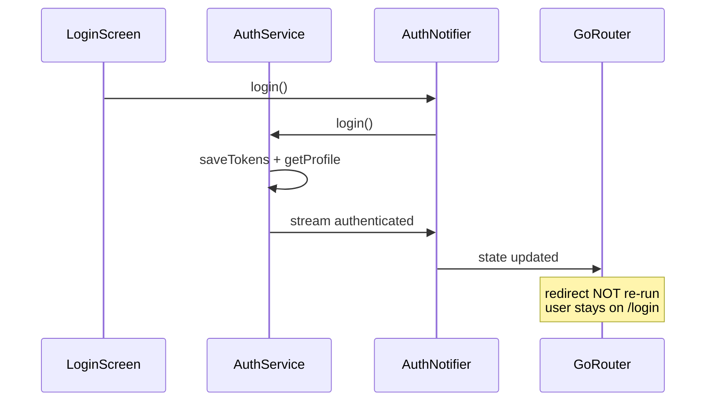

# Fix login/register redirect after auth

## Root cause

Auth state **does** update on success — [`auth_service.dart`](coffeeshop-mobile/lib/core/auth/auth_service.dart) saves tokens and emits `AuthStatus.authenticated` via `_authStateController`, and [`auth_notifier.dart`](coffeeshop-mobile/lib/core/auth/auth_notifier.dart) mirrors that into `authNotifierProvider`.

The router redirect in [`app_router.dart`](coffeeshop-mobile/lib/core/routing/app_router.dart) is correct in logic:

```dart
if (isAuthenticated && isAuthRoute) {
  return '/dashboard';
}
```

But **redirect only runs on initial navigation or explicit navigation** — not when auth state flips while already sitting on `/login`. The current setup recreates `GoRouter` via `ref.watch(authNotifierProvider)` but does **not** use `refreshListenable`, which is the go_router mechanism to re-evaluate redirects in place.



This also explains why **logout** from profile would not redirect to `/login` — same missing refresh.

## Secondary issues (Chrome/web)

Your terminal shows `RethrownDartError: OperationError` while running on **Chrome**. [`token_storage.dart`](coffeeshop-mobile/lib/core/auth/token_storage.dart) uses default `FlutterSecureStorage()` with no `WebOptions`. On web, secure storage relies on Web Crypto; misconfiguration or storage failures can break `saveTokens` / `readAccessToken`, causing `getProfile` to fail and auth to remain `unauthenticated` even when the login API returns 200.

We will harden web storage as a follow-up within the same fix if login still fails after the router change.

## Implementation plan

### 1. Add a router refresh notifier (primary fix)

In [`app_router.dart`](coffeeshop-mobile/lib/core/routing/app_router.dart):

- Add a small `ChangeNotifier` (e.g. `RouterRefreshNotifier`) that go_router can listen to.
- **Stop** `ref.watch(authNotifierProvider)` at the provider top level (that recreates the router each auth change).
- Create **one stable** `GoRouter` instance inside `appRouterProvider`.
- Use `ref.listen(authNotifierProvider, ...)` to call `notifier.notifyListeners()` on every auth change.
- Pass `refreshListenable: notifier` to `GoRouter`.
- Inside `redirect`, use `ref.read(authNotifierProvider)` so redirect always reads the latest auth state.
- Call `ref.onDispose` to dispose the notifier.

Pattern:

```dart
final appRouterProvider = Provider<GoRouter>((ref) {
  final refresh = RouterRefreshNotifier();
  ref.onDispose(refresh.dispose);

  ref.listen(authNotifierProvider, (_, __) => refresh.notify());

  return GoRouter(
    refreshListenable: refresh,
    initialLocation: '/dashboard',
    redirect: (context, state) {
      final authState = ref.read(authNotifierProvider);
      // existing redirect logic
    },
    routes: [...],
  );
});
```

This matches [`flutter-setup-declarative-routing`](.agents/skills/flutter-setup-declarative-routing/SKILL.md) guidance: auth-based redirects belong in `redirect`, and the router must be told when auth changes.

### 2. Handle `AuthStatus.unknown` during startup (small UX fix)

While `tryAutoLogin()` runs, status is `unknown`. Today that is treated as unauthenticated and can flash `/login` before auto-login completes.

Add an early return in `redirect`:

```dart
if (authState.status == AuthStatus.unknown) return null;
```

This keeps the current route until auth resolves, then redirect fires once via `refreshListenable`.

### 3. Clean up auth notifier login side-effect

In [`auth_notifier.dart`](coffeeshop-mobile/lib/core/auth/auth_notifier.dart), remove the pre-login reset:

```dart
state = state.copyWith(status: AuthStatus.unauthenticated, clearUser: true);
```

It is unnecessary (auth service already manages state via stream) and can cause a brief erroneous unauthenticated signal that triggers extra redirect churn.

### 4. Align register screen with auth notifier

In [`register_screen.dart`](coffeeshop-mobile/lib/features/auth/register_screen.dart), call `ref.read(authNotifierProvider.notifier).register(...)` instead of `authServiceProvider` directly. Behavior is the same today (stream listener still fires), but this keeps a single entry point and matches login.

No manual `context.go('/dashboard')` needed in login/register screens — redirect should handle it once refresh is wired.

### 5. Harden web token storage (if auth still fails on Chrome)

If after step 1 redirect still does not fire because auth never reaches `authenticated`:

- Configure `FlutterSecureStorage` with explicit `WebOptions` in [`token_storage.dart`](coffeeshop-mobile/lib/core/auth/token_storage.dart).
- Optionally use `kIsWeb` + `shared_preferences` fallback for web-only token persistence (only if secure storage continues to throw `OperationError`).

Verify by watching network tab: after login, `GET /api/v2/profile` should return 200 with `Authorization: Bearer ...`.

## Files to change

| File | Change |
|------|--------|
| [`coffeeshop-mobile/lib/core/routing/app_router.dart`](coffeeshop-mobile/lib/core/routing/app_router.dart) | `refreshListenable` + stable router + `unknown` guard |
| [`coffeeshop-mobile/lib/core/auth/auth_notifier.dart`](coffeeshop-mobile/lib/core/auth/auth_notifier.dart) | Remove pre-login unauthenticated reset |
| [`coffeeshop-mobile/lib/features/auth/register_screen.dart`](coffeeshop-mobile/lib/features/auth/register_screen.dart) | Use `authNotifierProvider.notifier.register` |
| [`coffeeshop-mobile/lib/core/auth/token_storage.dart`](coffeeshop-mobile/lib/core/auth/token_storage.dart) | WebOptions / fallback only if needed after testing |

## Verification (Chrome)

1. Start backend on `localhost:18080` (Docker compose).
2. `flutter run -d chrome` from `coffeeshop-mobile/`.
3. **Login**: enter valid credentials → should land on `/dashboard` without manual navigation.
4. **Register**: create account → snackbar → should land on `/dashboard`.
5. **Logout** from profile → should return to `/login`.
6. **Deep link guard**: while logged out, try navigating to `/shops` → should redirect to `/login`.
7. Confirm no `OperationError` in console during token save; if present, apply step 5.

No new dependencies required for the primary fix.
