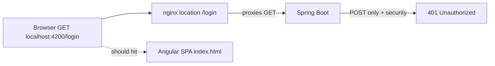

# Fix 401 on `/login` and `/register` navigation (Docker)

## Root cause

Same conflict as the earlier `/profile` issue:



In [`coffeeshop-frontend/nginx.conf`](coffeeshop-frontend/nginx.conf), these blocks take precedence over `location /` + `try_files`:

```nginx
location /login { proxy_pass http://backend:8080; }
location /register { proxy_pass http://backend:8080; }
```

When you type `http://localhost:4200/login` or refresh that URL:

1. Nginx forwards a **GET** to the backend.
2. [`AuthController`](coffeeshop/src/main/java/com/coffeeshop/coffeeshop/auth/AuthController.java) only defines **POST** `/login` and **POST** `/register`.
3. Spring Security treats the GET as a protected request → **401**.

The routes are “public” for **POST** auth API calls, not for browser document loads. The SPA auth pages must be served as static `index.html`, not proxied.

`ng serve` on port 4200 does not have this problem (no nginx proxy). It only appears with the **Docker frontend** image.

## Recommended fix (consistent with `/api/profile`)

### 1. Update nginx — API under `/api`, SPA keeps short URLs

In [`coffeeshop-frontend/nginx.conf`](coffeeshop-frontend/nginx.conf):

- **Remove** `location /login` and `location /register` (and `location /auth/` if present).
- **Add** proxy rules that map API-only paths to the backend:

| Frontend HTTP call | nginx location | Backend target |
|-------------------|----------------|----------------|
| `POST /api/login` | `location = /api/login` | `/login` |
| `POST /api/register` | `location = /api/register` | `/register` |
| `POST /api/auth/*` | `location /api/auth/` | `/auth/` |

Keep existing `location /api/` for `/api/v1/**` and `location = /api/profile` for profile.

After this change, browser **GET** `/login` and `/register` fall through to `location /` → `try_files` → Angular app loads correctly.

### 2. Docker environment — auth API base prefix

In [`coffeeshop-frontend/src/environments/environment.docker.ts`](coffeeshop-frontend/src/environments/environment.docker.ts), add an auth base used only in Docker:

```typescript
export const environment = {
  production: true,
  apiUrl: '',           // /api/v1/... unchanged
  authApiUrl: '/api',   // /api/login, /api/register, /api/auth/...
  profileUrl: '/api/profile',
};
```

Leave [`environment.ts`](coffeeshop-frontend/src/environments/environment.ts) and [`environment.prod.ts`](coffeeshop-frontend/src/environments/environment.prod.ts) as direct backend URLs (`http://localhost:8080` / production API host) for non-Docker runs.

### 3. AuthService — use `authApiUrl` for auth endpoints

In [`coffeeshop-frontend/src/app/services/auth.service.ts`](coffeeshop-frontend/src/app/services/auth.service.ts), centralize the base:

```typescript
private readonly authBase = environment.authApiUrl ?? environment.apiUrl;
```

Then use `${this.authBase}/login`, `/register`, `/auth/refresh`, `/auth/logout` instead of `${environment.apiUrl}/...`.

No backend changes required; security already permits POST on those paths.

### 4. Rebuild frontend container

```bash
docker compose up --build frontend
```

## Verification

| Action | Expected |
|--------|----------|
| Open `http://localhost:4200/login` in browser | Login page HTML (200), no 401 |
| Open `http://localhost:4200/register` | Register page (200) |
| Submit login form | `POST /api/login` → 200 + tokens |
| Refresh `/login` while logged out | Still shows login page |
| `ng serve` + backend on 8080 | Unchanged (uses `environment.ts` without `/api` prefix) |

## Optional follow-up (out of scope)

- Consolidate all auth/profile proxies into one nginx `location ~ ^/api/(login|register|auth/|profile)$` rewrite block to reduce duplication.
- Document Docker URL layout in [`coffeeshop-frontend/frontend.md`](coffeeshop-frontend/frontend.md) § Docker / nginx.
