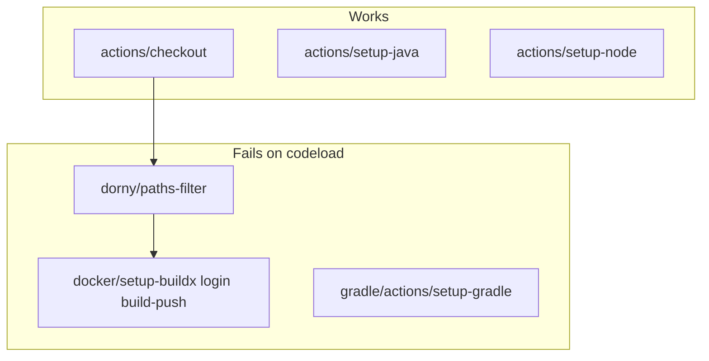

# Fix CI/CD codeload.github.com action download failures

## Problem

Jobs fail in **Prepare all required actions** (2–3s), before any build logic runs:

| Job | Failing action | Owner |
|-----|----------------|-------|
| `changes` | `dorny/paths-filter@v3` | Third-party |
| `build-frontend` | `docker/setup-buildx-action@v3` | Third-party |
| `build-backend` | Likely `docker/*` (log may show a sibling job’s action; this job does not use paths-filter) | Third-party |

`actions/checkout@v4` succeeds — **first-party `actions/*` downloads work**; **non-`actions/` marketplace tarballs from `codeload.github.com` do not**.

This is the same class of failure fixed in [deploy-staging-reusable.yml](.github/workflows/deploy-staging-reusable.yml) by shell-installing kubectl/kustomize.



**Next failures if unaddressed:** `backend-test` / `frontend-test` will hit `gradle/actions/setup-gradle@v4` on the next run that passes `changes`.

---

## Strategy

1. **Replace `dorny/paths-filter`** with a shell step in the `changes` job (same filter rules as today).
2. **Replace all `docker/*` actions** with a **local composite action** (no codeload — resolved from the repo).
3. **Remove `gradle/actions/setup-gradle`** — the repo already has `./gradlew`; the action only adds cache helpers and is third-party.
4. **Keep** first-party `actions/checkout`, `actions/setup-java`, `actions/setup-node` (proven working).

Optional org-side fix (document only, not in scope): **Settings → Actions → Allow all actions** or allowlist `dorny/*`, `docker/*`. Do not rely on this if codeload is blocked network-wide.

---

## Change 1: Shell path filter (`changes` job)

**File:** [.github/workflows/ci-cd-staging.yml](.github/workflows/ci-cd-staging.yml)

Remove:

```yaml
      - uses: dorny/paths-filter@v3
        id: filter
        with:
          filters: |
            ...
```

Replace with one step `id: filter` that sets job outputs `backend`, `frontend`, `deploy` (`true`/`false`) via `git diff --name-only`:

- **Push:** compare `github.event.before` → `github.sha` (fetch `before` if shallow checkout).
- **Edge case:** `before` is `0000000…` (new branch / force) → set all three to `true`.
- **Patterns** (mirror current filters exactly):

| Output | Paths |
|--------|--------|
| `backend` | `coffeeshop/**`, `.github/workflows/backend-ci.yml`, `.github/workflows/ci-cd-staging.yml` |
| `frontend` | `coffeeshop-frontend/**`, `.github/workflows/frontend-ci.yml`, `.github/workflows/ci-cd-staging.yml` |
| `deploy` | `deploy/**`, `.github/workflows/deploy-staging.yml`, `.github/workflows/deploy-staging-reusable.yml`, `.github/workflows/ci-cd-staging.yml` |

Use `grep -qE` on each changed file line. Downstream `if:` conditions on `backend-test`, `frontend-test`, and deploy job stay unchanged.

Add to `checkout` in `changes` only:

```yaml
        with:
          fetch-depth: 0
```

(or `git fetch --depth=1 origin "${{ github.event.before }}"` after default checkout) so diff is reliable.

---

## Change 2: Local composite for Docker build/push

**New file:** `.github/actions/docker-build-push/action.yml`

Composite `run` steps only (bash):

1. `docker buildx create --use --name coffeeshop-builder` (idempotent; ignore if exists)
2. `echo "$GITHUB_TOKEN" | docker login ghcr.io -u "$GITHUB_ACTOR" --password-stdin`
3. `docker buildx build` with inputs:
   - `context` (required)
   - `tags` (multiline string)
   - `push` (`true`/`false`, default `false`)
   - `cache_scope` (optional, for GHA cache isolation)

Example invocation in `build-backend`:

```yaml
      - uses: ./.github/actions/docker-build-push
        with:
          context: coffeeshop
          push: 'true'
          cache_scope: backend
          tags: |
            ghcr.io/mastilovic/coffeeshop-backend:${{ needs.meta.outputs.image_tag }}
            ghcr.io/mastilovic/coffeeshop-backend:latest
```

Preserve existing behavior:

- `permissions: packages: write` on build jobs (unchanged)
- GHA cache: `--cache-from type=gha,scope=${{ inputs.cache_scope }}` and `--cache-to type=gha,mode=max,scope=...`
- PR workflows: `push: false`, single tag (no login needed if `push: false` — skip login step when `push != true`)

**Files to update (remove `docker/setup-buildx-action`, `docker/login-action`, `docker/build-push-action`):**

- [.github/workflows/ci-cd-staging.yml](.github/workflows/ci-cd-staging.yml) — `build-backend`, `build-frontend`
- [.github/workflows/backend-ci.yml](.github/workflows/backend-ci.yml) — `docker` job
- [.github/workflows/frontend-ci.yml](.github/workflows/frontend-ci.yml) — `docker` job

---

## Change 3: Drop `gradle/actions/setup-gradle`

**Files:**

- [ci-cd-staging.yml](.github/workflows/ci-cd-staging.yml) — `backend-test`
- [backend-ci.yml](.github/workflows/backend-ci.yml) — `build-and-test`

Remove the step; keep `actions/setup-java@v4` + `./gradlew build --no-daemon`. Optional later: `actions/cache@v4` keyed on `coffeeshop/.gradle` (first-party only).

---

## Change 4: Doc touch (one paragraph)

Update [deploy/GITHUB_SETUP.md](deploy/GITHUB_SETUP.md) troubleshooting: if logs show `Failed to download archive` from `codeload.github.com` for `dorny/*` or `docker/*`, CI uses shell/local actions instead of marketplace installs (same note as kubectl).

---

## Verification

1. Push workflow changes to **`main`** (touches `.github/workflows/**` → triggers **CI/CD Staging**).
2. Confirm jobs pass setup:
   - **changes** — path filter shell step, outputs set
   - **backend-test** / **frontend-test** — Java/Node + gradlew/npm (no gradle action)
   - **build-backend** / **build-frontend** — composite docker step, images on GHCR
   - **deploy** — reuses fixed [deploy-staging-reusable.yml](.github/workflows/deploy-staging-reusable.yml)
3. Open a small PR touching `coffeeshop/**` — **Backend CI** docker job uses same composite (no codeload).

---

## Out of scope

| Item | Reason |
|------|--------|
| Replacing `actions/setup-java` / `actions/setup-node` | First-party; working |
| Re-adding `workflow_dispatch` / `dev` branch triggers | Separate from codeload fix |
| Repo Settings / allowlist changes | Environment-specific; shell fix is portable |

---

## Success criteria

- **CI/CD Staging** completes past action download for `changes`, `build-backend`, and `build-frontend`.
- No log lines referencing `codeload.github.com/.../paths-filter` or `.../setup-buildx-action`.
- Images still pushed with `sha-*` and `latest` tags; deploy job runs when builds succeed.
