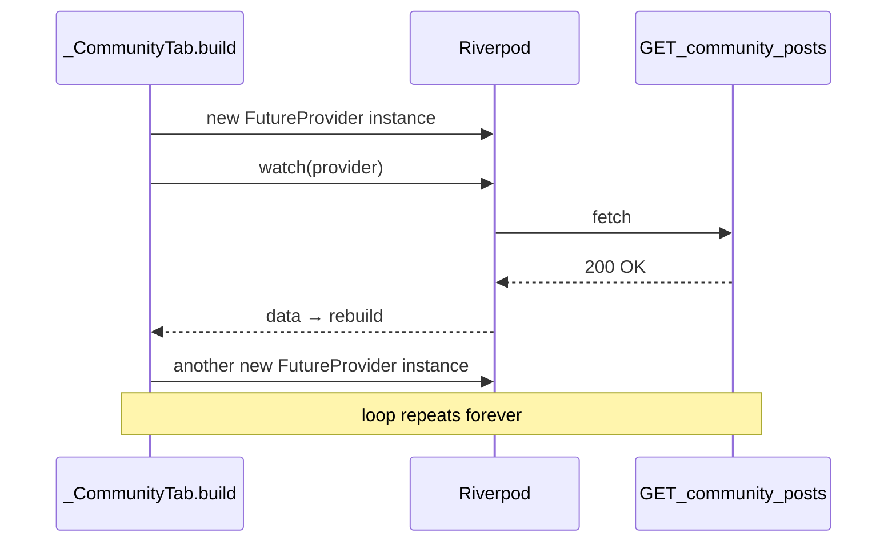

# Fix infinite community posts requests

## Root cause

In [`shop_detail_screen.dart`](coffeeshop-mobile/lib/features/shop_details/shop_detail_screen.dart), `_CommunityTabState.build()` defines a provider **inside** `build`:

```109:115:coffeeshop-mobile/lib/features/shop_details/shop_detail_screen.dart
    final communityProvider = FutureProvider<Map<String, dynamic>>((ref) async {
      final api = ref.watch(communityApiServiceProvider);
      final posts = await api.getPosts(widget.shopId);
      return posts;
    });

    final asyncData = ref.watch(communityProvider);
```



Every rebuild allocates a **new** `FutureProvider` object. Riverpod keys providers by identity, so each frame is a brand-new provider → new fetch → completion → rebuild → repeat. That matches the Network tab showing 1000+ identical `posts?page=0&size=20` calls with `200 OK`.

**Not the cause:** `size=20` is valid for community ([`community.go`](coffeeshop-go/internal/handler/community.go) defaults to 20 with no 10/25/50 restriction). The response succeeds; the loop is purely client-side provider lifecycle.

## Correct pattern (already used in same file)

Other shop-detail tabs hoist providers at module scope with `.family` keyed by `shopId`:

```299:303:coffeeshop-mobile/lib/features/shop_details/shop_detail_screen.dart
final _tablesProvider = FutureProvider.family<List<Map<String, dynamic>>, String>((ref, shopId) async {
  final api = ref.watch(tableApiServiceProvider);
  ...
});
```

Same pattern exists for `_shopEventsProvider`, `_shopReviewsProvider`, `_shopEmployeesProvider`.

## Fix

### 1. Add top-level `_communityPostsProvider`

Near the other tab providers in [`shop_detail_screen.dart`](coffeeshop-mobile/lib/features/shop_details/shop_detail_screen.dart):

```dart
final _communityPostsProvider =
    FutureProvider.family<Map<String, dynamic>, String>((ref, shopId) async {
  final api = ref.watch(communityApiServiceProvider);
  return api.getPosts(shopId);
});
```

### 2. Simplify `_CommunityTab` to `ConsumerWidget`

`_CommunityTabState` holds no local state — only the broken inline provider. Convert to `ConsumerWidget` (matching `_ReviewsTab`, `_EventsTab`, etc.):

- Replace `ref.watch(communityProvider)` with `ref.watch(_communityPostsProvider(shopId))`
- Replace `ref.invalidate(communityProvider)` with `ref.invalidate(_communityPostsProvider(shopId))`
- Remove the inline `FutureProvider` declaration from `build`

### 3. Verify

- Hot-restart Chrome, open a shop → Community tab
- Network tab should show **one** `GET .../community/posts?page=0&size=20` (or two if tab is built twice on first paint — not hundreds)
- Empty posts list still shows "No posts yet"; populated list renders cards with author/date

No changes needed to [`community_api_service.dart`](coffeeshop-mobile/lib/data/services/community_api_service.dart) for this bug.

## Optional follow-up (out of scope)

- Add a widget/provider test asserting `_communityPostsProvider` is stable across rebuilds
- Audit the repo for any other inline `FutureProvider` in `build()` — grep shows only this one occurrence
