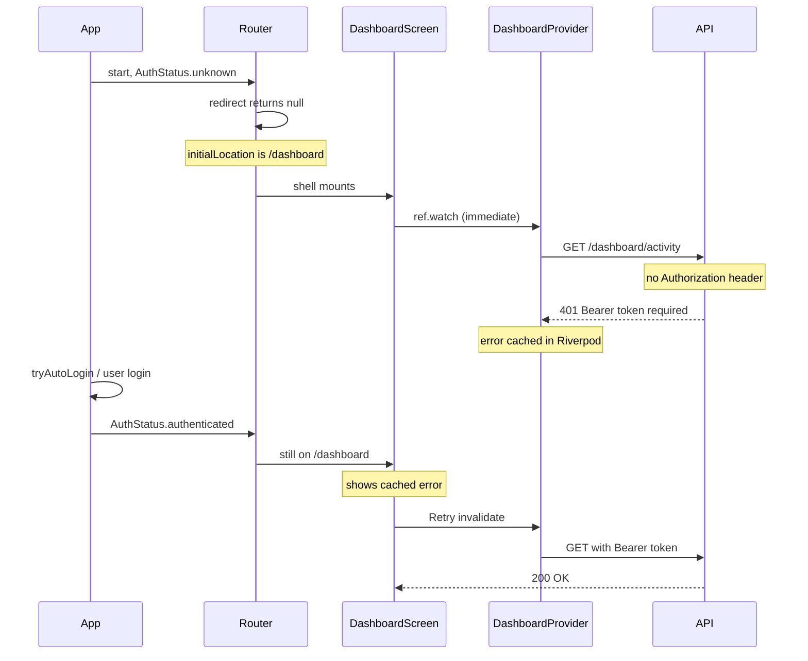

# Fix dashboard "Bearer token required" after login

## Root cause

Two things combine to produce the screenshot error:



1. **Premature fetch** — [`app_router.dart`](coffeeshop-mobile/lib/core/routing/app_router.dart) uses `initialLocation: '/dashboard'` and returns `null` from redirect while `AuthStatus.unknown` (intentional, to avoid login flash during auto-login). The shell mounts and [`dashboard_screen.dart`](coffeeshop-mobile/lib/features/dashboard/dashboard_screen.dart) immediately `ref.watch(dashboardProvider)`.

2. **Cached error** — [`dashboard_provider.dart`](coffeeshop-mobile/lib/features/dashboard/dashboard_provider.dart) has no auth dependency. The first failed fetch is stored as `AsyncError`. After login succeeds and tokens are saved, the provider is **not** re-run automatically — only Retry calls `ref.invalidate(dashboardProvider)`.

Login itself is fine: [`auth_service.dart`](coffeeshop-mobile/lib/core/auth/auth_service.dart) saves tokens before emitting `authenticated` (profile fetch already uses the bearer token).

## Fix (minimal, targeted)

### 1. Gate dashboard UI on auth state

In [`dashboard_screen.dart`](coffeeshop-mobile/lib/features/dashboard/dashboard_screen.dart):

- `ref.watch(authNotifierProvider)` first
- If `AuthStatus.unknown` → show `LoadingIndicator` (do **not** watch `dashboardProvider`)
- If not `authenticated` → show loading or empty (redirect should send user to login; this is defensive)
- Only when `authenticated` → `ref.watch(dashboardProvider)` and render data/error

This prevents any API call until the session is ready.

### 2. Tie provider lifecycle to auth

In [`dashboard_provider.dart`](coffeeshop-mobile/lib/features/dashboard/dashboard_provider.dart):

```dart
final dashboardProvider = FutureProvider<DashboardActivityResponse>((ref) async {
  final auth = ref.watch(authNotifierProvider);
  if (auth.status != AuthStatus.authenticated) {
    throw StateError('Dashboard requires authentication');
  }
  // existing fetch...
});
```

`ref.watch(authNotifierProvider)` ensures the provider **re-executes** when auth transitions to `authenticated`, clearing any stale error from an earlier accidental fetch.

### 3. Invalidate protected data on auth transitions (belt-and-suspenders)

Add a small initializer provider (same pattern as [`interceptor_init.dart`](coffeeshop-mobile/lib/core/network/interceptor_init.dart)) and wire it in [`app.dart`](coffeeshop-mobile/lib/app.dart):

```dart
final authSessionInvalidatorProvider = Provider<void>((ref) {
  ref.listen(authNotifierProvider, (previous, next) {
    if (previous?.status == next.status) return;
    if (next.status == AuthStatus.authenticated ||
        next.status == AuthStatus.unauthenticated) {
      ref.invalidate(dashboardProvider);
    }
  });
});
```

Invalidate on logout too so the next login never inherits a stale error.

### 4. Optional UX polish (same PR, small)

In `dashboard_screen.dart`, format `ApiException` errors for display (reuse the `error.when(...)` pattern from [`login_screen.dart`](coffeeshop-mobile/lib/features/auth/login_screen.dart)) instead of raw `error.toString()`.

## Files to change

| File | Change |
|------|--------|
| [`dashboard_screen.dart`](coffeeshop-mobile/lib/features/dashboard/dashboard_screen.dart) | Auth gate before watching provider; friendly error text |
| [`dashboard_provider.dart`](coffeeshop-mobile/lib/features/dashboard/dashboard_provider.dart) | Watch auth; skip fetch unless authenticated |
| New: `lib/core/auth/auth_session_invalidator.dart` | Invalidate dashboard on auth status change |
| [`app.dart`](coffeeshop-mobile/lib/app.dart) | `ref.watch(authSessionInvalidatorProvider)` |

## Out of scope

- Changing `unknown → null` redirect (would reintroduce login flash for auto-login users unless we add a splash route)
- Gating events/shops tabs (their list endpoints are public; only dashboard activity requires auth today)
- Router `initialLocation` change

## Verification

1. Cold start on Chrome → login as shop owner → dashboard loads data immediately (no error, no Retry)
2. Refresh page with valid stored token → auto-login → dashboard loads without Retry
3. Logout → login again → dashboard still loads on first try
4. No `Bearer token required` in dashboard error state after successful login
