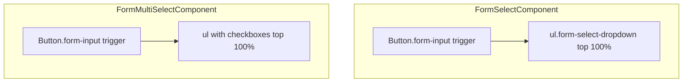

# Fix dropdown menus opening below selects

## Problem

All form dropdowns use native `<select class="form-input">`. The browser/OS draws the options list; CSS cannot position it below the control. On macOS (your screenshot), the list **overlays** the closed field with a checkmark on the current row — exactly what you reported.

Custom menus in this app already work correctly:

```148:152:coffeeshop-frontend/src/styles.css
.city-dropdown {
  position: absolute;
  z-index: 20;
  top: 100%;
  left: 0;
```

Reservations Shop/Event are native only:

```58:78:coffeeshop-frontend/src/app/features/reservations/reservations.component.ts
            <motion class="form-group">
              <label>Shop</label>
              <select class="form-input" formControlName="shopId">
```

## Solution

Add two shared Angular form controls (CVA + `ControlValueAccessor`), styled like existing custom pickers:



### 1. `FormSelectComponent` (single value)

**New file:** [`coffeeshop-frontend/src/app/shared/form-select/form-select.component.ts`](coffeeshop-frontend/src/app/shared/form-select/form-select.component.ts)

- **API:** `options` input `{ value: string; label: string }[]`, `placeholder`, optional `inputId`, `ariaDescribedBy`, `compact` (for table inline selects)
- **Template:** `position: relative` wrapper → trigger `button.form-input` (chevron via CSS) → `ul` panel with `role="listbox"`
- **Behavior:** mirror [`city-search-select.component.ts`](coffeeshop-frontend/src/app/shared/city-search-select/city-search-select.component.ts): open on click/focus, close on outside click, ArrowUp/Down, Enter, Escape; `mousedown` on option to avoid blur race
- **Forms:** `NG_VALUE_ACCESSOR`, string value (`''` = placeholder / empty option)

### 2. `FormMultiSelectComponent` (string array)

**New file:** [`coffeeshop-frontend/src/app/shared/form-multi-select/form-multi-select.component.ts`](coffeeshop-frontend/src/app/shared/form-multi-select/form-multi-select.component.ts)

- **API:** same `options` shape; value `string[]`
- **Trigger label:** e.g. `3 shops selected` or shop names joined when few
- **Panel:** opens below trigger; each row is a checkbox + label; toggling does **not** close panel; close on outside click / Escape
- **Profile:** replace native multi `<select>`; remove “Hold Ctrl/Cmd” hint

### 3. Global styles

**Update:** [`coffeeshop-frontend/src/styles.css`](coffeeshop-frontend/src/styles.css)

Add (reuse city-dropdown visual tokens):

| Class | Purpose |
|-------|---------|
| `.form-select`, `.form-multi-select` | `position: relative` |
| `.form-select-trigger` | full width, left-aligned text, chevron (reuse `select.form-input` SVG background) |
| `.form-select-dropdown`, `.form-multi-select-dropdown` | `position: absolute; top: calc(100% + 0.25rem); left: 0; right: 0; z-index: 20; max-height: 220px; overflow-y: auto` |
| `.form-select-option`, `.form-select-option.active` | match `.city-option` hover/active |
| `.form-select-trigger--compact` | for table inline selects (`width: auto; min-width: 120px`) |

Optional safety: `.form-card { overflow: visible; }` so panels inside cards are not clipped (layout `.content` scroll is unchanged).

Keep `select.form-input` rules only if any native selects remain (none after migration).

### 4. Migrate all native selects

| File | Count | Notes |
|------|-------|-------|
| [`reservations.component.ts`](coffeeshop-frontend/src/app/features/reservations/reservations.component.ts) | 8 | guest, shop, event, table + accept-flow table select (`compact`) |
| [`events.component.ts`](coffeeshop-frontend/src/app/features/events/events.component.ts) | 1 | shop |
| [`shop-details.component.ts`](coffeeshop-frontend/src/app/features/shop-details/shop-details.component.ts) | 2 | itemType + inline table select |
| [`register.component.ts`](coffeeshop-frontend/src/app/features/auth/register.component.ts) | 1 | role |
| [`users.component.ts`](coffeeshop-frontend/src/app/features/users/users.component.ts) | 1 | userType |
| [`profile.component.ts`](coffeeshop-frontend/src/app/features/profile/profile.component.ts) | 1 | `FormMultiSelectComponent` for `favouriteShopIds` |

**Example migration** (reservations Event field):

```html
<app-form-select
  inputId="reservation-event"
  formControlName="eventId"
  placeholder="Select event"
  [options]="eventSelectOptions()"
  [ariaDescribedBy]="shopSelectedWithoutEvents() ? 'reservation-event-hint' : null"
/>
```

Add small computed helpers per component, e.g. `eventSelectOptions()` mapping `selectableEventsForRequest()` to `{ value: event.eventId, label: '...' }`, always including empty placeholder via component’s `placeholder` (value `''`).

Wire `imports: [FormSelectComponent, FormMultiSelectComponent]` in each standalone component.

### 5. Verification (manual)

- My Reservations: Shop and Event panels open **below** trigger and grow downward
- Same for direct-reservation form, events create form, register role, users edit, shop-details menus
- Profile: multi-select panel below trigger; checkboxes toggle without overlaying trigger
- Keyboard: arrows + Enter; Escape closes
- Table inline selects (reservations accept, shop-details): compact width, panel not clipped horizontally
- Reactive forms still validate/submit with same string / string[] values

## Out of scope

- Date/time pickers and city search (already correct)
- CDK overlay / viewport flip (not needed unless panels clip at bottom of viewport — can add later if reported)

## Implementation order

1. Styles + `FormSelectComponent`
2. Migrate reservations + events (highest visibility)
3. Migrate register, users, shop-details
4. `FormMultiSelectComponent` + profile
5. Quick pass: remove unused native `select.form-input` if nothing left
