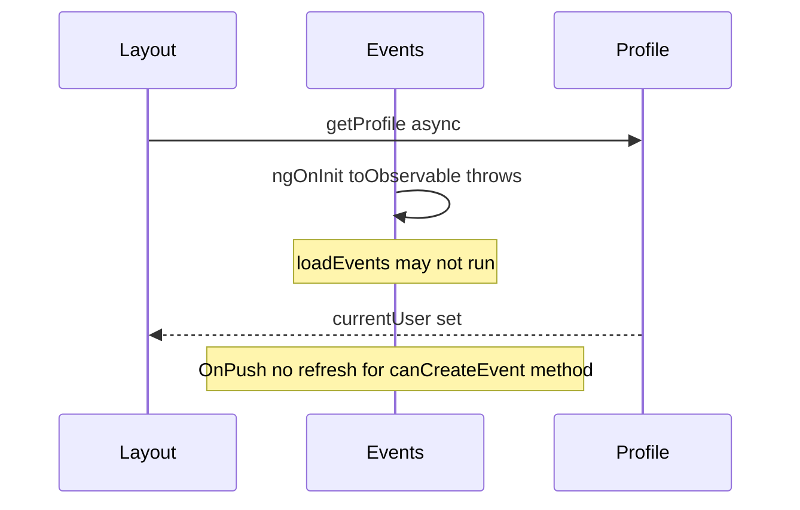

# Fix Events page load and search

## Root causes

### 1. Search API never runs (and init may fail)

In [`events.component.ts`](coffeeshop-frontend/src/app/features/events/events.component.ts), `toObservable(this.searchInput)` is set up inside `ngOnInit()`:

```176:181:coffeeshop-frontend/src/app/features/events/events.component.ts
    toObservable(this.searchInput)
      .pipe(skip(1), debounceTime(300), distinctUntilChanged(), takeUntilDestroyed(this.destroyRef))
      .subscribe(() => {
        this.currentPage.set(0);
        this.loadEvents();
      });
```

Angular requires `toObservable` to run in an **injection context** (constructor, field initializer, or with an explicit `injector` option). Calling it from `ngOnInit` throws **NG0203** at runtime, which can prevent `loadEvents()` from running reliably and leaves the debounced search subscription never wired.

### 2. Add Event button missing

`canCreateEvent()` is a plain method reading `profileService.currentUser()` (a signal), but the template does not read that signal directly. With `ChangeDetectionStrategy.OnPush`, when [`LayoutComponent`](coffeeshop-frontend/src/app/shared/layout/layout.component.ts) loads the profile asynchronously via `getProfile()`, the Events component does not re-check `canCreateEvent()` and the button stays hidden.

The page header/title may still render; the user perceives the page as “not loaded” if they only see “Loading events…” (when `loadEvents` never completes) or no actions.



## Fixes (frontend only)

All changes in [`events.component.ts`](coffeeshop-frontend/src/app/features/events/events.component.ts).

### A. Wire search debounce in injection context

**Option (recommended):** field initializer + `takeUntilDestroyed` in constructor:

```ts
import { computed, inject, Injector } from '@angular/core';

private readonly injector = inject(Injector);

constructor() {
  toObservable(this.searchInput, { injector: this.injector })
    .pipe(skip(1), debounceTime(300), distinctUntilChanged(), takeUntilDestroyed())
    .subscribe(() => {
      this.currentPage.set(0);
      this.loadEvents();
    });
}

ngOnInit(): void {
  this.shopService.getMine().subscribe(...);
  this.loadEvents();
}
```

Alternatively move subscription to a **field initializer** (also valid injection context) and keep `ngOnInit` for data load only.

Remove `skip(1)` only if you guard against double initial fetch; keeping `skip(1)` + explicit `loadEvents()` in `ngOnInit` is fine.

### B. Expose permissions as computeds (OnPush-safe)

Replace method-based checks with computeds that read the profile signal:

```ts
readonly canCreateEvent = computed(() => {
  const profile = this.profileService.currentUser();
  if (!profile) return false;
  return this.authService.isAdmin() || profile.userType === 'SHOP_OWNER';
});
```

Template: keep `@if (canCreateEvent())` (calling the computed signal).

Update `canManageEvent` / `canShowForm` to use `this.canCreateEvent()` (the computed) instead of duplicating profile logic.

### C. Optional hardening

- If `loadEvents` errors (backend down / wrong response shape), log or show a small error message instead of only clearing `loading` — helps distinguish “empty” vs “failed”.
- Verify network: `GET /api/v1/event?page=0&size=10` returns `PageResponseDto` JSON (`content`, `totalElements`, …), not a bare array.

## Verification

1. Navigate to `/events` — no NG0203 in browser console; “Loading events…” then table or empty state.
2. As admin or shop owner — **+ Add Event** appears after profile loads (without navigating away).
3. Type in search — after ~300ms debounce, network tab shows `GET /api/v1/event?q=...&page=0&size=10`.
4. Clear search — list resets to page 0.
5. `npm run build` in `coffeeshop-frontend` succeeds.

## Files to change

| File | Change |
|------|--------|
| [`events.component.ts`](coffeeshop-frontend/src/app/features/events/events.component.ts) | Injection-context `toObservable`, `computed` for `canCreateEvent`, minor permission helper updates |

No backend changes required unless API returns non-paged JSON (separate deployment issue).
