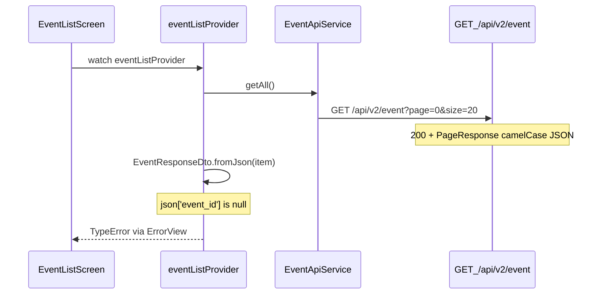

# Fix events tab TypeError on load

## Root cause

The Events tab shows `TypeError: null: type 'Null' is not a subtype of type 'String'` because the HTTP call succeeds, but parsing fails inside `EventResponseDto.fromJson`.



**Mismatch** — Flutter model in [`event_response_dto.dart`](coffeeshop-mobile/lib/data/models/event_response_dto.dart):

| Dart field | Flutter expects | Go sends |
|---|---|---|
| `eventId` | `event_id` | `eventId` |
| `eventName` | `event_name` | `eventName` |
| `eventDate` | `event_date` | `eventDate` |
| `shopId` | `shop_id` | `shopId` |
| `shopName` | `shop_name` | `shopName` |
| `shopCity` | `shop_city` | `shopCity` |

First failure: `json['event_id'] as String` → `null` → the exact error in your screenshot.

Go backend shape ([`event.go`](coffeeshop-go/internal/handler/event.go) lines 42–50) uses camelCase for all fields. `description` already matches; no `@JsonKey` needed there.

This is the same class of bug fixed for profile auth in [fix_profile_parse_error plan](.cursor/plans/fix_profile_parse_error_a53e3564.plan.md).

## Data flow (no provider/UI changes needed)

[`event_providers.dart`](coffeeshop-mobile/lib/features/events/event_providers.dart) already:
- Calls `GET /api/v2/event` with correct camelCase query params (`dateFrom`, `dateTo`)
- Reads paginated `content` array and maps each item through `EventResponseDto.fromJson`

[`event_list_screen.dart`](coffeeshop-mobile/lib/features/events/event_list_screen.dart) surfaces provider errors via `ErrorView` — fixing parsing is sufficient for the tab to load.

## Implementation

### 1. Align `EventResponseDto` JSON keys

In [`event_response_dto.dart`](coffeeshop-mobile/lib/data/models/event_response_dto.dart), remove snake_case `@JsonKey` overrides so freezed/json_serializable uses default camelCase property names:

```dart
const factory EventResponseDto({
  required String eventId,
  required String eventName,
  required String eventDate,
  String? description,
  String? shopId,
  String? shopName,
  String? shopCity,
}) = _EventResponseDto;
```

Also fix request DTOs in the same file (prevents future create/update breakage):
- `EventCreateRequest`: `eventName`, `eventDate`, `shopId` (no `event_name` / `shop_id`)
- `EventUpdateRequest`: same camelCase keys
- `EventSearchParams`: change `date_from`/`date_to` → `dateFrom`/`dateTo` (query builder in [`event_api_service.dart`](coffeeshop-mobile/lib/data/services/event_api_service.dart) already sends camelCase; this keeps the model consistent)

### 2. Regenerate code

From `coffeeshop-mobile/`:

```bash
dart run build_runner build --delete-conflicting-outputs
```

This updates [`event_response_dto.g.dart`](coffeeshop-mobile/lib/data/models/event_response_dto.g.dart) to read `json['eventId']`, etc.

### 3. Update unit tests

[`test/data/models/event_response_dto_test.dart`](coffeeshop-mobile/test/data/models/event_response_dto_test.dart) currently uses snake_case fixtures. Replace with Go-shaped camelCase JSON, e.g.:

```dart
final validJson = {
  'eventId': 'evt-123',
  'eventName': 'Coffee Tasting Workshop',
  'eventDate': '2024-06-15T18:00:00Z',
  'description': 'Learn about coffee brewing',
  'shopId': 'shop-456',
  'shopName': 'Central Perk',
  'shopCity': 'New York',
};
```

Add one test for backend empty-string shop fields (`shopId: ''`, `shopName: ''`) to confirm parsing does not throw.

### 4. Optional UI polish (small, same PR)

Backend sends `""` for missing shop info, not JSON `null`. In [`event_list_screen.dart`](coffeeshop-mobile/lib/features/events/event_list_screen.dart), change:

```dart
if (event.shopName != null)
```

to:

```dart
if (event.shopName?.isNotEmpty == true)
```

Avoids rendering a blank subtitle line.

### 5. Verify

- `dart test test/data/models/event_response_dto_test.dart`
- `dart analyze` in `coffeeshop-mobile/`
- Hot-restart Chrome app (`flutter run -d chrome`), open Events tab — list should render instead of ErrorView

## Out of scope (same bug pattern, separate follow-up)

[`dashboard_activity_response.dart`](coffeeshop-mobile/lib/data/models/dashboard_activity_response.dart) `UpcomingEventItem` and the entire dashboard DTO still use snake_case keys while Go dashboard handler uses camelCase (`upcomingEvents`, `shopId`, etc.). Fixing events tab does not require this unless dashboard upcoming events are also broken.

[`page_response.dart`](coffeeshop-mobile/lib/data/models/page_response.dart) has `total_elements`/`total_pages` mismatch, but events list bypasses it by manually reading `content`.
