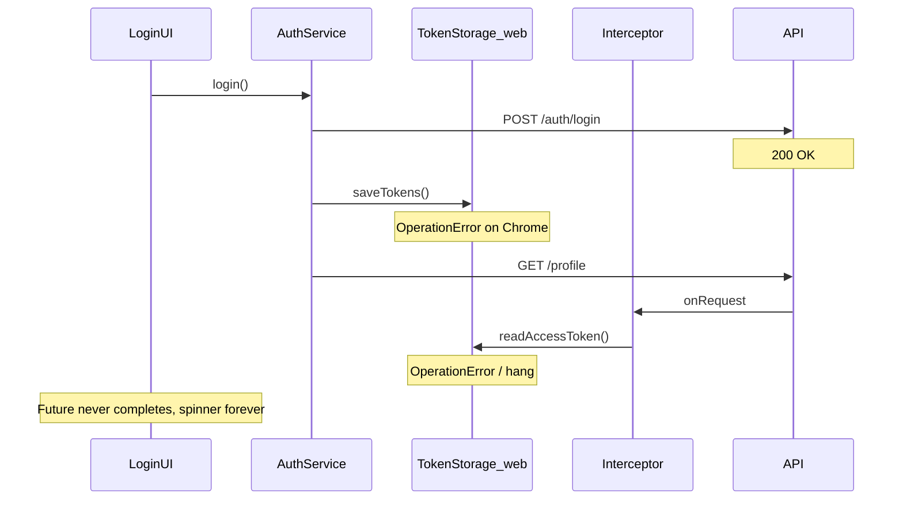

# Fix infinite login spinner on Chrome

## Diagnosis

The login button spinner is controlled by `_isLoading` in [`login_screen.dart`](coffeeshop-mobile/lib/features/auth/login_screen.dart). It only clears in the `finally` block after `await authNotifier.login(...)` **completes**. An infinite spinner means `login()` never resolves.



Your Chrome terminal already shows repeated `RethrownDartError: OperationError` — the same `flutter_secure_storage` failure mode documented in the earlier auth redirect plan.

### Why API calls look successful but UI hangs

| Step | Works? | Notes |
|------|--------|-------|
| `POST /api/v2/auth/login` | Yes | Public path; interceptor skips token read |
| `saveTokens()` | Fails on web | [`token_storage.dart`](coffeeshop-mobile/lib/core/auth/token_storage.dart) uses `FlutterSecureStorage` |
| `GET /api/v2/profile` | Blocked | [`auth_interceptor.dart`](coffeeshop-mobile/lib/core/auth/auth_interceptor.dart) line 36: `await _tokenStorage.readAccessToken()` runs before every protected request; failure/stall prevents Dio from completing |
| `login()` future | Never completes | No error reaches `login_screen` catch/finally timing — request hangs |
| Redirect to `/dashboard` | Never fires | Auth never reaches `authenticated` |

## Implementation plan

### 1. Add web-safe token storage (primary fix)

Update [`token_storage.dart`](coffeeshop-mobile/lib/core/auth/token_storage.dart) to use platform-appropriate persistence:

- **Web (`kIsWeb`)**: `shared_preferences` — reliable on Chrome, no Web Crypto dependency
- **Mobile/desktop**: keep `flutter_secure_storage`

```dart
import 'package:flutter/foundation.dart';
import 'package:shared_preferences/shared_preferences.dart';

// Web: SharedPreferences with same key names
// Native: existing FlutterSecureStorage
```

Add `shared_preferences` to [`pubspec.yaml`](coffeeshop-mobile/pubspec.yaml).

Keep the public `TokenStorage` API unchanged (`saveTokens`, `readAccessToken`, `clearTokens`, etc.) so auth service and interceptor need no structural changes.

### 2. Harden auth interceptor against storage failures (defensive)

In [`auth_interceptor.dart`](coffeeshop-mobile/lib/core/auth/auth_interceptor.dart) `onRequest`, wrap token read:

```dart
String? token;
try {
  token = await _tokenStorage.readAccessToken();
} catch (_) {
  token = null;
}
```

This prevents a storage exception from stalling Dio indefinitely. Without a token, `getProfile` fails fast with 401 → login catch shows an error instead of spinning forever.

Apply the same try/catch pattern in `_getRefreshToken` usage path / `onTokenRefreshed` if needed.

### 3. Improve login UX resilience

In [`login_screen.dart`](coffeeshop-mobile/lib/features/auth/login_screen.dart):

- Add `ref.listen(authNotifierProvider, ...)` to clear `_isLoading` when status becomes `authenticated` (navigation is about to happen)
- Map raw exceptions to a user-friendly message (e.g. storage/network failures) instead of opaque `OperationError` strings

This is belt-and-suspenders; fixing storage is the real cure.

### 4. Verify end-to-end on Chrome

1. Hot restart Chrome app
2. Login with `owner@owner.com` (or any valid user)
3. Expect: spinner stops, redirect to `/dashboard`, no `OperationError` in console
4. Refresh page → auto-login should work (tokens readable from web storage)
5. Logout → returns to `/login`

## Files to change

| File | Change |
|------|--------|
| [`coffeeshop-mobile/pubspec.yaml`](coffeeshop-mobile/pubspec.yaml) | Add `shared_preferences` |
| [`coffeeshop-mobile/lib/core/auth/token_storage.dart`](coffeeshop-mobile/lib/core/auth/token_storage.dart) | Web fallback via `SharedPreferences` |
| [`coffeeshop-mobile/lib/core/auth/auth_interceptor.dart`](coffeeshop-mobile/lib/core/auth/auth_interceptor.dart) | try/catch around `readAccessToken` in `onRequest` |
| [`coffeeshop-mobile/lib/features/auth/login_screen.dart`](coffeeshop-mobile/lib/features/auth/login_screen.dart) | Listen for auth success + friendlier errors |

## Optional follow-up (out of scope unless still broken)

- If `owner@owner.com` logs in but profile returns 404 ("No local profile linked"), that is a **backend data** issue (`keycloak_subject` not linked in `users` table), not a spinner issue — would show an error quickly after storage fix
- Unit test `TokenStorage` with a fake `SharedPreferences` on web path
