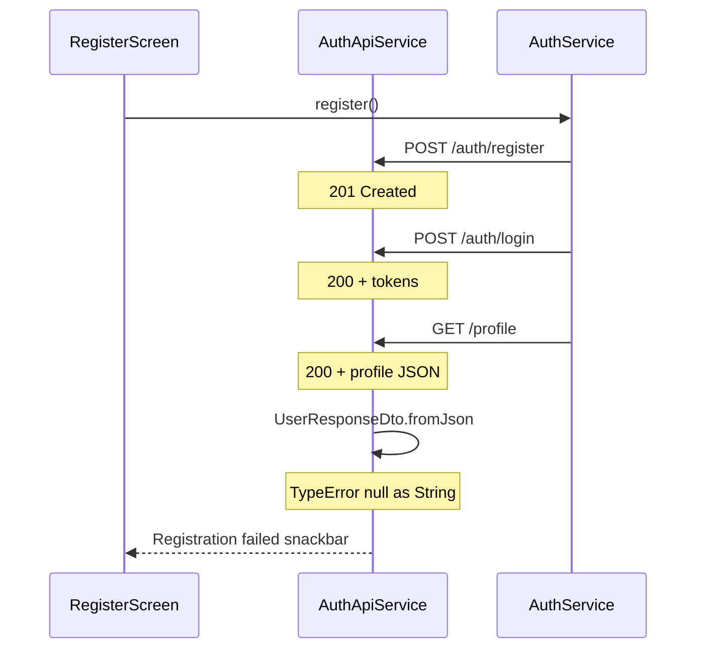

# Fix registration TypeError after successful API calls

## Root cause

Registration flow in [`auth_service.dart`](coffeeshop-mobile/lib/core/auth/auth_service.dart):



All HTTP calls return success. The snackbar appears because `_loadUserProfile()` throws **after** the network layer succeeds, when parsing the profile JSON.

[`auth_api_service.dart`](coffeeshop-mobile/lib/data/services/auth_api_service.dart) line 56:

```dart
return UserResponseDto.fromJson(response.data!);
```

[`UserResponseDto`](coffeeshop-mobile/lib/data/models/user_response_dto.dart) expects:

| Flutter field | JSON key expected | Present in Go profile? |
|---|---|---|
| `userType` | `user_type` | No — backend sends `userType` |
| `isActive` | `is_active` | No |
| `createdAt` | `created_at` | No |
| `updatedAt` | `updated_at` | No |

Go backend profile shape ([`profile.go`](coffeeshop-go/internal/handler/profile.go)):

```go
type profileResponse struct {
    ID       string `json:"id"`
    Name     string `json:"name"`
    Username string `json:"username"`
    Email    string `json:"email"`
    UserType string `json:"userType"`  // camelCase, values like CUSTOMER / SHOP_OWNER
    // + roles, favouriteShops, reviews, reservations
}
```

First parse failure: `json['user_type'] as String` → `null` → **TypeError: null is not a subtype of type 'String'**.

Login has the same bug (also calls `_loadUserProfile()`), so fixing profile parsing fixes both flows once router refresh is in place.

## Implementation

### 1. Fix `UserProfileResponseDto` to match Go `/api/v2/profile`

Update [`user_profile_response_dto.dart`](coffeeshop-mobile/lib/data/models/user_profile_response_dto.dart) — this model already exists for profile but was copied from the wrong API contract.

Replace required snake_case admin fields with the actual profile shape:

```dart
@freezed
class UserProfileResponseDto with _$UserProfileResponseDto {
  const factory UserProfileResponseDto({
    required String id,
    required String name,
    required String username,
    required String email,
    required String userType, // camelCase — matches Go json:"userType"
    // optional nested lists can be added later; json_serializable ignores extras
  }) = _UserProfileResponseDto;
}
```

Run `dart run build_runner build --delete-conflicting-outputs` to regenerate `.g.dart` / `.freezed.dart`.

### 2. Switch auth flow to use `UserProfileResponseDto`

| File | Change |
|---|---|
| [`auth_api_service.dart`](coffeeshop-mobile/lib/data/services/auth_api_service.dart) | `getProfile()` returns `UserProfileResponseDto` |
| [`auth_service.dart`](coffeeshop-mobile/lib/core/auth/auth_service.dart) | `AuthState.user` type → `UserProfileResponseDto?` |

No changes needed in login/register screens — they don't touch the user DTO directly.

### 3. Normalize `userType` for existing role checks

Backend returns `CUSTOMER` / `SHOP_OWNER` ([`user_type.go`](coffeeshop-go/internal/auth/user_type.go)), but screens compare lowercase values:

- [`shop_list_screen.dart`](coffeeshop-mobile/lib/features/shops/shop_list_screen.dart): `userType == 'shop_owner'`
- [`reservation_list_screen.dart`](coffeeshop-mobile/lib/features/reservations/reservation_list_screen.dart): same pattern

Add a small helper in [`lib/core/utils/extensions.dart`](coffeeshop-mobile/lib/core/utils/extensions.dart) or a dedicated `user_type_utils.dart`:

```dart
String normalizeUserType(String raw) {
  switch (raw.toUpperCase()) {
    case 'CUSTOMER': return 'customer';
    case 'SHOP_OWNER': return 'shop_owner';
    case 'ADMIN': return 'admin';
    default: return raw.toLowerCase();
  }
}
```

Apply normalization when building `AuthState` in `_loadUserProfile()` (map parsed DTO → normalized `userType`), **or** expose a getter on the DTO. Normalizing at auth load keeps screens unchanged.

### 4. Fix refresh token request body (related bug, small)

Go refresh handler expects camelCase ([`auth.go`](coffeeshop-go/internal/handler/auth.go)):

```go
type refreshTokenRequest struct {
    RefreshToken string `json:"refreshToken"`
}
```

Mobile sends snake_case in two places:

- [`auth_api_service.dart`](coffeeshop-mobile/lib/data/services/auth_api_service.dart): `{'refresh_token': refreshToken}`
- [`auth_interceptor.dart`](coffeeshop-mobile/lib/core/auth/auth_interceptor.dart): same

Change both to `{'refreshToken': refreshToken}` so token refresh works after the initial login fix.

### 5. Tests and verification

- Add/update a unit test for `UserProfileResponseDto.fromJson` using a real Go-shaped payload:

```dart
{
  'id': '...',
  'name': 'Test',
  'username': 'testuser',
  'email': 'test@example.com',
  'userType': 'CUSTOMER',
  'roles': [],
  'favouriteShops': [],
  'reviews': [],
  'reservations': [],
}
```

- Run `dart analyze` on touched files.
- Manual Chrome test:
  1. Register new user → no TypeError snackbar → redirect to `/dashboard`
  2. Logout → `/login`
  3. Login → `/dashboard`
  4. Shop owner registration → `_canCreateShop` works (normalized `shop_owner`)

## Files to change

- [`coffeeshop-mobile/lib/data/models/user_profile_response_dto.dart`](coffeeshop-mobile/lib/data/models/user_profile_response_dto.dart) — correct profile schema
- [`coffeeshop-mobile/lib/data/services/auth_api_service.dart`](coffeeshop-mobile/lib/data/services/auth_api_service.dart) — use `UserProfileResponseDto`
- [`coffeeshop-mobile/lib/core/auth/auth_service.dart`](coffeeshop-mobile/lib/core/auth/auth_service.dart) — update `AuthState.user` type + normalize userType
- [`coffeeshop-mobile/lib/data/services/auth_api_service.dart`](coffeeshop-mobile/lib/data/services/auth_api_service.dart) + [`auth_interceptor.dart`](coffeeshop-mobile/lib/core/auth/auth_interceptor.dart) — refresh body key fix
- New test file or extend existing model tests
- Regenerated `*.g.dart` / `*.freezed.dart` via build_runner

## Out of scope (leave as-is for now)

- [`UserResponseDto`](coffeeshop-mobile/lib/data/models/user_response_dto.dart) — still wrong for user-list endpoints (`userType` camelCase); separate cleanup
- Full profile nested models (`roles`, `reviews`, etc.) — not needed for auth redirect; `ProfileApiService` already returns raw `Map` for future use
