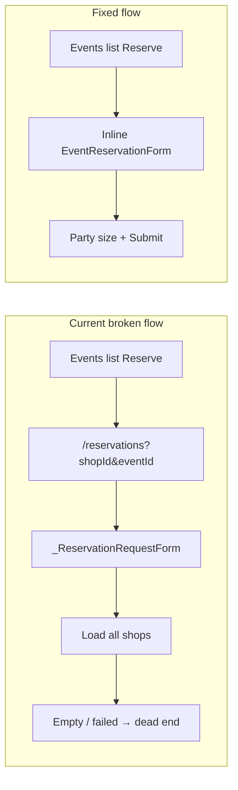

# Fix Reserve Button Dead-End

## Problem

Tapping **Reserve** on the Events list ([`event_list_screen.dart`](coffeeshop-mobile/lib/features/events/event_list_screen.dart)) navigates to `/reservations?shopId=...&eventId=...`, which auto-opens a generic `_ReservationRequestForm` in [`reservation_list_screen.dart`](coffeeshop-mobile/lib/features/reservations/reservation_list_screen.dart).

That form must load the full shop list before the user can submit. When loading fails or returns empty, the user sees only:

> "No shops available for reservation requests."

This is a dead end — even though shop and event are already known from the URL.



## Why not delete the Reservations page

[`ReservationListScreen`](coffeeshop-mobile/lib/features/reservations/reservation_list_screen.dart) is still useful as a bottom-nav hub:

- **Customers**: My Requests / My Reservations tabs
- **Shop owners**: Manage Shops (approve/deny pending requests via [`ReservationsTab`](coffeeshop-mobile/lib/features/shop_details/tabs/reservations_tab.dart))

Only the deep-link entry from Reserve is broken. The page itself has purpose.

## Solution (your choice: inline form)

Match the proven pattern in [`events_tab.dart`](coffeeshop-mobile/lib/features/shop_details/tabs/events_tab.dart) (lines 267–287): Reserve sets a selected event and renders `EventReservationForm` inline below the list.

### 1. Convert `EventListScreen` to stateful for selected event

Change `EventListScreen` from `ConsumerWidget` to `ConsumerStatefulWidget` (or extract a small stateful `_EventListBody`) to hold:

```dart
EventResponseDto? _selectedEventForRequest;
```

### 2. Update Reserve button behavior

In `_EventListTile`, replace navigation:

```dart
// remove
context.push('/reservations?shopId=$shopId&eventId=${event.eventId}');

// add callback
onReserve: () => setState(() => _selectedEventForRequest = event);
```

Pass `onReserve` from parent; only show Reserve when `showReserve` is true (unchanged logic via `canShowReserveButton`).

### 3. Render inline `EventReservationForm`

Below the `ListView.builder` (or at bottom of list), when `_selectedEventForRequest != null`:

```dart
EventReservationForm(
  eventId: event.eventId,
  shopId: event.shopId!,
  eventName: event.eventName,
  eventDate: event.eventDate,
  showCancel: true,
  onCancel: () => setState(() => _selectedEventForRequest = null),
  onSuccess: () => setState(() => _selectedEventForRequest = null),
)
```

Reuse [`event_reservation_form.dart`](coffeeshop-mobile/lib/features/reservations/widgets/event_reservation_form.dart) — no new form needed.

### 4. Optional cleanup on Reservations screen

Remove or simplify the auto-open behavior in `ReservationListScreen.initState`:

```dart
if (widget.initialShopId != null && widget.initialEventId != null) {
  _showRequestForm = true;  // no longer needed from Events list
}
```

Since nothing else passes these query params today, this prevents future dead-ends if someone bookmarks an old URL. The `+` button generic form can remain for manual "request reservation" from the Reservations tab.

## Files to change

| File | Change |
|------|--------|
| [`event_list_screen.dart`](coffeeshop-mobile/lib/features/events/event_list_screen.dart) | Stateful selected event + inline form + remove `/reservations` push |
| [`reservation_list_screen.dart`](coffeeshop-mobile/lib/features/reservations/reservation_list_screen.dart) | Remove auto-open on query params (small safety fix) |

## Test plan

1. Log in as a **customer**, open Events tab, tap **Reserve** on a future event → inline form appears with event name/date and party size field.
2. Submit request → snackbar success, form closes, Reserve button hidden for that event (blocked state).
3. Tap **Cancel** → form dismisses without submitting.
4. Open **Reservations** bottom-nav tab → My Requests shows the submitted request; no empty "Request Reservation" screen on arrival.
5. Log in as **shop owner** on own event → Reserve button hidden (`canManageShopContent`); owner can still manage requests via Reservations → Manage Shops.
