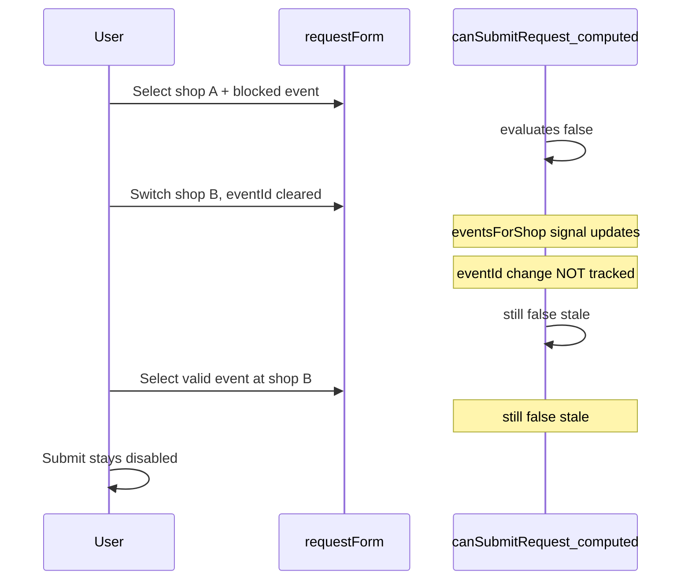

# Fix Submit Request stuck disabled after shop switch

## Root cause

The submit button in [`reservations.component.ts`](coffeeshop-frontend/src/app/features/reservations/reservations.component.ts) is disabled when:

```html
[disabled]="requestForm.invalid || !canSubmitRequest()"
```

`canSubmitRequest` is a **`computed()` signal** that reads **non-signal** form state:

```504:510:coffeeshop-frontend/src/app/features/reservations/reservations.component.ts
  readonly canSubmitRequest = computed(() => {
    const eventId = this.requestForm.controls.eventId.value;
    if (!eventId) return false;
    const userId = this.requestTargetUserId();
    if (!userId) return false;
    return !this.eventIdsBlockedForUser(userId).has(eventId);
  });
```

Angular `computed()` only re-runs when **signal** dependencies change (`allRequests`, `allReservations`, `eventsForShop`, profile, etc.). It does **not** re-run when `eventId` or `guestUserId` change via `setValue()` or the form select.



Shop change **does** clear `eventId` in [`loadEventsForRequestShop`](coffeeshop-frontend/src/app/features/reservations/reservations.component.ts) (line 751), but that does not refresh `canSubmitRequest`. The same bug affects **`canSubmitDirectReservation`** and **`requestTargetUserId`** (reads `guestUserId` from the form).

This is not a backend or blocked-events-across-shops issue; it is frontend reactivity.

## Fix (minimal, in one file)

### 1. Bridge form values with `toSignal`

In [`reservations.component.ts`](coffeeshop-frontend/src/app/features/reservations/reservations.component.ts):

- Import `toSignal` from `@angular/core/rxjs-interop`.
- After `requestForm` / `directForm` are created, add:

```typescript
private readonly requestEventId = toSignal(this.requestForm.controls.eventId.valueChanges, {
  initialValue: this.requestForm.controls.eventId.value,
});
private readonly requestGuestUserId = toSignal(this.requestForm.controls.guestUserId.valueChanges, {
  initialValue: this.requestForm.controls.guestUserId.value,
});
// same pattern for directForm eventId + guestUserId
```

### 2. Update computeds to use bridged signals

- **`requestTargetUserId`**: use `this.requestGuestUserId()` instead of `this.requestForm.controls.guestUserId.value`.
- **`canSubmitRequest`**: use `this.requestEventId()`; require the event to appear in **`selectableEventsForRequest()`** (not only “not globally blocked”), e.g.:

```typescript
readonly canSubmitRequest = computed(() => {
  const eventId = this.requestEventId();
  if (!eventId) return false;
  const userId = this.requestTargetUserId();
  if (!userId) return false;
  return this.selectableEventsForRequest().some(e => e.eventId === eventId);
});
```

This covers stale `eventId` values from a previous shop if the select ever retains them.

- **`canSubmitDirectReservation`**: mirror with `directEventId`, `directGuestUserId`, and `selectableEventsForDirect()`.

### 3. No template or DialogService changes

`requestForm.invalid` already updates via Angular forms change detection; only the signal-based `canSubmit*` guards need fixing.

## Verification

Manual on `/reservations` (customer or owner request form):

1. Select shop where you already have requests/reservations for **all** events → Submit disabled (expected).
2. Switch to another shop with available events → pick an event → **Submit Request becomes enabled**.
3. Switch shops again without picking an event → Submit stays disabled until a valid event is chosen.
4. Repeat for owner **direct reservation** form (`+ Create reservation`) if used.

No backend changes. No new tests unless you want a small component test later; manual check is sufficient for this UI reactivity fix.
