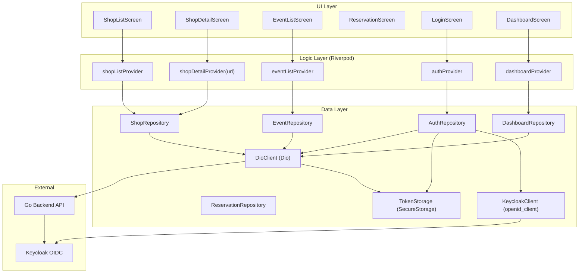

# Flutter Mobile App — Full Implementation Plan

## Decisions from your answers
- **Scope**: All Angular frontend features (10+ pages with sub-features)
- **Auth**: Keycloak-direct via `openid_client` (OIDC Authorization Code Flow + PKCE), with registration going through the Go backend's `/api/v2/auth/register` to ensure local DB user creation
- **State management**: Riverpod
- **Routing**: go_router
- **Platforms**: iOS + Android only
- **Design**: Fresh mobile-native Material Design 3

## Which agents can help
**Directly applicable**:
- `mobile-design` — mobile-first design principles (touch targets, responsive layout, bottom nav, accessibility), transferable to Flutter despite being Angular-focused
- `frontend-agent` — understands the full Angular feature set being replicated; useful as a reference when determining which screens, states, and edge cases to replicate

**Flutter skills** (in `.agents/skills/`, invoked during implementation, not agents):
- `flutter-apply-architecture-best-practices` — project structure, layer separation
- `flutter-setup-declarative-routing` — go_router configuration
- `flutter-use-http-package` — HTTP client setup with Dio + interceptors
- `flutter-implement-json-serialization` — model classes from JSON
- `flutter-build-responsive-layout` — responsive UI for phones/tablets
- `flutter-add-widget-test`, `flutter-add-integration-test` — testing
- `flutter-add-widget-preview` — preview system for UI development
- `dart-run-static-analysis` — code quality enforcement
- `dart-add-unit-test` — unit testing providers and repositories

**DevOps**:
- `devops-agent` — CI/CD pipeline setup, Docker, deployment

No dedicated Flutter agent exists. The work will be done directly with the Flutter skills as guidance.

---

## Architecture Overview

```
┌──────────────────────────────────────────────────────────────────┐
│                        UI Layer                                   │
│  Screens (pages) + Widgets (reusable components)                  │
│  Each screen: StatelessWidget or ConsumerWidget                   │
├──────────────────────────────────────────────────────────────────┤
│                      Logic Layer (Riverpod)                       │
│  Providers: StateNotifierProvider, AsyncNotifierProvider,         │
│  FutureProvider, StreamProvider                                   │
│  Each feature has its own providers file                          │
├──────────────────────────────────────────────────────────────────┤
│                      Data Layer                                   │
│  Repositories (abstract + impl) → API Services (Dio) → Models     │
│  TokenStorage (flutter_secure_storage)                            │
│  AuthService (openid_client)                                      │
├──────────────────────────────────────────────────────────────────┤
│                      Core Layer                                   │
│  Config, Theme, Routing, Auth interceptor, Error handling         │
└──────────────────────────────────────────────────────────────────┘
```

### Keycloak-Direct Auth Flow
```
App Launch
  │
  ├─ Has valid stored tokens? ──Yes──► Call /api/v2/profile to validate
  │                                      │
  │                                      ├─ 200 OK ──► Go to Dashboard
  │                                      └─ 401 ──► Try refresh via Keycloak
  │                                                   │
  │                                                   ├─ Success ──► Go to Dashboard
  │                                                   └─ Fail ──► Go to Login
  │
  └─ No tokens ──► Show Login with Keycloak button
                     │
                     ▼
              Open browser (OIDC PKCE)
              User authenticates on Keycloak
              Callback to app with auth code
              Exchange code for tokens
              Store tokens securely
              Call /api/v2/profile to load user
              ──► Go to Dashboard
```

**Registration flow**: User submits form → calls Go backend `/api/v2/auth/register` (creates Keycloak user + local DB user) → auto-login via Keycloak OIDC → fetch profile → dashboard.

---

## Phases

### Phase 1: Project Foundation
**Goal**: Scaffolded Flutter project with all dependencies and folder structure.

**Dependencies** (`pubspec.yaml`):
```yaml
dependencies:
  flutter_riverpod, riverpod_annotation
  go_router
  openid_client         # Keycloak OIDC
  dio                   # HTTP client
  flutter_secure_storage # Token storage
  json_annotation, freezed_annotation
  intl                  # Date formatting
  cached_network_image  # Image caching
  shimmer               # Loading skeletons
  material_design_icons_flutter

dev_dependencies:
  riverpod_generator, build_runner
  json_serializable, freezed
  go_router_builder
  flutter_test
  mocktail              # Mocking
  integration_test
```

**Folder structure**:
```
coffeeshop-mobile/lib/
├── main.dart
├── app.dart
├── core/
│   ├── config/ (app_config.dart, api_config.dart, theme/)
│   ├── auth/ (auth_service.dart, token_storage.dart, auth_interceptor.dart)
│   ├── network/ (dio_client.dart, api_exception.dart)
│   ├── routing/ (app_router.dart, auth_guard.dart)
│   └── utils/ (extensions.dart, validators.dart)
├── data/
│   ├── models/ (all DTOs as freezed classes)
│   ├── repositories/ (abstract interfaces + dio implementations)
│   └── services/ (api services: shop_api.dart, event_api.dart, etc.)
├── features/
│   ├── auth/ (login_screen, register_screen, providers)
│   ├── dashboard/ (dashboard_screen, widgets/, providers)
│   ├── shops/ (shop_list_screen, shop_card, providers)
│   ├── shop_details/ (tabs: community, menu, tables, reservations, events, reviews, employees)
│   ├── events/ (event_list_screen, event_form, providers)
│   ├── reservations/ (reservation_list_screen, reservation_form, providers)
│   ├── users/ (user_list_screen, providers)
│   └── profile/ (profile_screen, providers)
└── shared/
    ├── widgets/ (app_scaffold, loading_indicator, error_widget, empty_state, etc.)
    └── extensions/
```

**Tasks**: Flutter create, pubspec.yaml, folder scaffolding, environment configs (dev/staging/prod), `.env` support via `--dart-define`.

---

### Phase 2: Core Infrastructure
**Goal**: Auth, networking, routing, and error handling fully working.

**Auth module** (`core/auth/`):
- `AuthService`: wraps `openid_client` — `login()`, `register()`, `logout()`, `refreshToken()`, streams for `isAuthenticated`, `currentUser`
- `TokenStorage`: `flutter_secure_storage` wrapper for access/refresh tokens, with `read()`, `write()`, `delete()`, `hasValidToken()`
- `AuthInterceptor`: Dio interceptor that attaches `Authorization: Bearer <token>`, auto-refreshes on 401, retries request, logs out on refresh failure
- `AuthState`: Riverpod `Notifier` holding auth state (loading, authenticated, unauthenticated)

**Networking** (`core/network/`):
- `DioClient`: configured Dio instance with base URL (`apiUrl`), auth interceptor, logging interceptor, connect/read timeouts
- `ApiException`: freezed sealed class — `NetworkException`, `ServerException`, `UnauthorizedException`, `ValidationException`, `UnknownException`

**Routing** (`core/routing/`):
- `AppRouter`: `GoRouter` instance with all routes, redirect for auth guard
- `AuthGuard`: redirect logic — unauthenticated users → `/login`, authenticated users on guest routes → `/dashboard`
- Route tree:
  ```
  /login        → LoginScreen
  /register     → RegisterScreen
  /dashboard    → DashboardScreen
  /events       → EventListScreen
  /events/new   → EventFormScreen
  /events/:id   → EventDetailScreen
  /reservations → ReservationListScreen
  /shops        → ShopListScreen
  /shops/:id    → ShopDetailScreen (with tab routing)
  /users        → UserListScreen
  /profile      → ProfileScreen
  /             → redirect to /dashboard
  ```

**Error handling** (`core/utils/`):
- Global error widget for unhandled exceptions
- Toast/snackbar utility for user-facing messages

**Tasks**: Implement all core modules, write unit tests for auth service and interceptor, verify Keycloak OIDC flow end-to-end.

---

### Phase 3: Data Layer
**Goal**: All 17 API services + 14+ model classes generated with JSON serialization, plus abstract repository interfaces.

**Models** (freezed classes, mirroring Angular `models/`):
| Model | Angular source |
|-------|---------------|
| `UserResponseDto`, `UserProfileResponseDto`, `UserListItemDto`, `UserCreateRequest`, `UserUpdateRequest`, `TokenResponse`, `LoginRequest`, `RegisterRequest` | `user.model.ts` |
| `ShopResponseDto`, `ShopSummaryDto`, `ShopCreateRequest`, `ShopUpdateRequest`, `ShopSearchParams` | `shop.model.ts` |
| `EventResponseDto`, `EventCreateRequest`, `EventUpdateRequest` | `event.model.ts` |
| `ReservationResponseDto`, `ReservationCreateRequest`, `ReservationUpdateRequest`, `ReservationRequestResponseDto`, `ReservationRequestCreateRequest` | `reservation.model.ts` |
| `ReviewResponseDto`, `ReviewCreateRequest`, `ReviewUpdateRequest`, `ReviewCommentResponseDto`, `ReviewCommentCreateRequest` | `review.model.ts`, `review-comment.model.ts` |
| `MenuResponseDto`, `MenuItemResponseDto` | `menu.model.ts` |
| `CommunityPostResponseDto`, `CommunityPostCreateRequest` | `community.model.ts` |
| `DashboardActivityResponse`, `DashboardActivityItem`, `DashboardAggregate`, `TopShopItem`, `UpcomingEventItem`, `DashboardPersonalSummary`, `DashboardNotification` | `dashboard.model.ts` |
| `TableResponseDto`, `TableCreateRequest` | `table.model.ts` |
| `RoleResponseDto`, `RoleCreateRequest` | `role.model.ts` |
| `LoyaltyPlanResponseDto`, `LoyaltyPlanCreateRequest` | `loyalty-plan.model.ts` |
| `ContactResponseDto`, `ContactCreateRequest` | `contact.model.ts` |
| `ShopEmployeeDto`, `AssignEmployeeRequest` | `shop-employee.model.ts` |
| `PageResponseDto<T>` (generic pagination) | used across Angular |

**API Services** (one per domain, using Dio):
| Service | Base path | Methods |
|---------|-----------|---------|
| `ShopApiService` | `/api/v2/shop` | getAll, getMine, getById, create, update, delete, addFavourite, removeFavourite, getMenus, createMenu |
| `EventApiService` | `/api/v2/event` | getAll, search, getById, getByShopId, create, update, delete |
| `ReservationApiService` | `/api/v2/reservation` | getAll, getById, create, update, delete |
| `ReservationRequestApiService` | `/api/v2/reservation-request` | getAll, create, accept, deny |
| `ReviewApiService` | `/api/v2/review` | getAll, getById, create, update, delete, getComments, createComment |
| `UserApiService` | `/api/v2/user` | getAll, getById, create, update, delete |
| `AuthApiService` | `/api/v2/auth` | login, register, refresh, logout |
| `ProfileApiService` | `/api/v2/profile` | getProfile |
| `DashboardApiService` | `/api/v2/dashboard` | getActivity |
| `MenuApiService` | `/api/v2/menu` | getAll, getById, create, update, delete |
| `MenuItemApiService` | `/api/v2/menu-item` | getAll, getById, create, update, delete |
| `TableApiService` | `/api/v2/table` | getAll, getById, create, update, delete |
| `CommunityApiService` | `/api/v2/shop/{id}/community` | getPosts, getMembers, createAnnouncement, deletePost |
| `ShopEmployeeApiService` | `/api/v2/shop-employees` | getEmployees, assign, remove, getMyEmployeeShops |
| `RoleApiService` | `/api/v2/role` | getAll, getById, create, update, delete |
| `LoyaltyPlanApiService` | `/api/v2/loyalty-plan` | getAll, getById, create, update, delete |
| `ContactApiService` | `/api/v2/contact` | getAll, getById, create, update, delete |
| `ReferenceApiService` | `/api/v2/reference` | getCities |

**Repositories** (abstract interface + Dio implementation):
- Each repository wraps the API service, adds caching logic (where appropriate), error mapping
- Examples: `ShopRepository`, `EventRepository`, `ReservationRepository`, etc.
- `DashboardRepository` — aggregates multiple API calls into a single dashboard response

**Tasks**: Generate all models with freezed + json_serializable; implement all API services; implement repository interfaces; write unit tests for serialization.

---

### Phase 4: Design System
**Goal**: Material Design 3 theme, reusable widgets, and navigation patterns ready before building screens.

**Theme** (`core/config/theme/`):
- Color scheme: warm coffee-inspired palette
  - Primary: rich brown (#6D4C41 or similar)
  - Secondary: cream/beige (#FFF8E1 or similar)
  - Surface variants for cards, dialogs
  - Light and dark theme support
- Typography: Material 3 type scale with system font
- Component theming: cards, chips, buttons, inputs, bottom nav, app bars

**Reusable widgets** (`shared/widgets/`):
- `AppScaffold` — bottom navigation bar + AppBar wrapper
- `LoadingIndicator` — centered spinner with optional message
- `ErrorView` — error message with retry button
- `EmptyStateView` — empty state icon + message + action button
- `ShopCard` — card widget for shop list grid
- `CompactRow` — horizontal row with leading avatar, title, subtitle, trailing actions (mirrors Angular `compact-row` pattern)
- `StarRating` — interactive 1-5 star widget
- `PillTabs` — horizontal scrollable pill-shaped tabs
- `SearchBar` — animated search bar with debounced input
- `PaginationControls` — previous/next buttons with page indicator
- `ConfirmDialog` — confirmation dialog with danger variant
- `FormSelect` / `FormMultiSelect` — custom dropdown selectors
- `DateTimePicker` — date+time picker sheet
- `ImageWithPlaceholder` — cached network image with shimmer loading

**Navigation patterns**:
- Bottom navigation bar (5 items): Dashboard, Events, Shops, Reservations, Profile
- Additional screens accessed via navigation (not in bottom bar): Shop Details, Event Detail, Users, Login, Register
- Nested navigation within Shop Details (tabs with TabBar)
- Deep linking support via go_router

**Tasks**: Implement Material 3 theme with light/dark mode; build all reusable widgets; create widget previews using the preview system; write widget tests for key reusable components.

---

### Phase 5: Auth Screens
**Goal**: Login and Registration screens with full Keycloak OIDC integration.

**Login Screen**:
- Keycloak-branded login button (opens browser for OIDC PKCE flow)
- Alternative: email/password form that calls Go backend `/api/v2/auth/login` (fallback)
- Loading state while OIDC flow completes
- Error handling (invalid credentials, network error, Keycloak unavailable)
- Redirect to dashboard on success

**Register Screen**:
- Form: name, username, email, password, confirm password, role selector (customer / shop_owner)
- Calls Go backend `/api/v2/auth/register` (creates Keycloak user + local DB user)
- Auto-login after successful registration (triggers OIDC flow)
- Validation: email format, password strength, username availability feedback
- Error handling: duplicate email/username, Keycloak errors

**Auth providers** (Riverpod):
- `authNotifierProvider` — manages auth state, login, register, logout methods
- `currentUserProvider` — caches current user profile, refreshes on auth state change

**Tasks**: Implement login and register screens; wire up auth providers; test OIDC flow on both iOS and Android simulators.

---

### Phase 6: Dashboard Screen
**Goal**: Replicate the Angular dashboard with activity feed, aggregate stats, and sidebar widgets — redesigned for mobile.

**Screen layout** (vertical scroll):
```
┌──────────────────────────┐
│  Stats Bar (horizontal)  │  ← shops, reviews, members, events counts
│  [Shops] [Reviews] [M..] │
├──────────────────────────┤
│  Notifications (if any)  │  ← pending reservation requests, recent reviews
│  • 3 pending requests    │     (only for non-customer users)
├──────────────────────────┤
│  Top Shops (horizontal)  │  ← horizontally scrollable shop cards
│  [Card] [Card] [Card]    │
├──────────────────────────┤
│  Upcoming Events         │  ← vertically stacked event rows
│  • Event 1               │
│  • Event 2               │
├──────────────────────────┤
│  Personal Summary        │  ← favourites count, reservations, reviews
│  ♥ 5 shops   📅 3 res   │
├──────────────────────────┤
│  Recent Activity Feed    │  ← mixed feed: reviews, posts, events
│  • Review by User A      │     (30-day window)
│  • Post in Shop B        │
│  • Event in Shop C       │
└──────────────────────────┘
```

**Providers**:
- `dashboardProvider` — `FutureProvider` that calls `/api/v2/dashboard/activity`
- Pull-to-refresh support

**Widgets**:
- `StatsBar` — horizontal row of stat cards with icon + count + label
- `TopShopsCarousel` — horizontal page view of shop cards
- `UpcomingEventsList` — event compact rows
- `PersonalSummaryCard` — user's stats summary
- `ActivityFeed` — lazy list of activity items
- `NotificationsBanner` — expandable notification section

**Tasks**: Implement dashboard screen and all sub-widgets; implement dashboard provider; add widget tests.

---

### Phase 7: Shops (List + Details)
**Goal**: Shop browsing grid and detailed shop view with all sub-tabs.

**Shop List Screen**:
- Searchable grid of shop cards (responsive: 2 columns on phone, 3 on tablet)
- Search bar with debounced API calls
- Pagination with load-more at bottom
- Filter/chip pills for city (populated from reference API)
- Create shop FAB (for shop_owners / admins)
- Each card: image area, name, city, star rating, member count, favourite heart toggle
- Tap card → `/shops/:id`

**Shop Detail Screen** (TabBar with sub-tabs):
| Tab | Content | Visibility |
|-----|---------|------------|
| Community | Posts list (pinned first), members list, create announcement (owner) | All |
| Menu | Current menu with items (food, drinks, desserts, other), create/edit menu (owner) | All |
| Tables | Table list with number + capacity, add/edit/delete (owner) | Owner/Employee/Admin only |
| Reservations | Reservation requests list, accept/deny (owner), create request (customer) | All |
| Events | Shop events list, create/edit/delete (owner) | All |
| Reviews | Review list with star ratings, create review, comments | All |
| Employees | Employee list, assign/remove employee (owner) | Owner/Admin only |

**Providers**:
- `shopListProvider` — searchable, paginated, with filters
- `shopDetailProvider(id)` — single shop with all relations
- `favouriteProvider` — toggle favourite, optimistic updates

**Widgets**:
- `ShopCard` — for the grid
- `CommunityPostTile` — post with author, timestamp, pin indicator, delete action
- `MenuItemCard` — item with image, name, description, price, type chip
- `TableTile` — table number + capacity
- `ReservationRequestTile` — party size, status badge, accept/deny buttons
- `ReviewCard` — rating stars, title, description, user, date, comments section
- `EmployeeTile` — name, email, role badge, remove button

**Tasks**: Implement shop list screen; implement shop detail with TabBar and all 7 sub-tabs; implement all shop-related providers; widget tests for cards and tiles.

---

### Phase 8: Events
**Goal**: Browse, search, create, edit, and delete events.

**Event List Screen**:
- Filter pills: All / Today / This Week / This Month
- Searchable list
- Date range picker for custom range
- Pagination
- Create event FAB (for shop owners)
- Create reservation from event (for customers)
- Each event row: name, date, shop name, city, status (full seats block reservations)

**Event Form Screen** (create/edit):
- Form fields: name, date (date picker), description, shop (select from owned shops)
- Validation: future date, required name
- If creating from a specific shop, pre-select shop

**Providers**:
- `eventListProvider` — searchable, filterable, paginated
- `eventDetailProvider(id)` — single event
- `eventFormProvider` — form state, validation, submit

**Tasks**: Implement event list screen; implement event form screen; implement event providers; create/delete/edit flows.

---

### Phase 9: Reservations
**Goal**: View, create, and manage reservations and reservation requests.

**Reservation List Screen**:
- Tabs for different user types:
  - **Customer**: "My Requests" (pending/denied) + "My Reservations" (confirmed)
  - **Shop Owner**: "Pending" / "Approved" / "Denied" tab management
- Reservation request: party size, shop, event, status badge
- Confirmed reservation: party size, shop, table, event
- Accept/deny buttons for pending requests (owner)
- Create reservation request FAB (customer)

**Reservation Request Form**:
- Fields: shop (select), event (optional, select), party size, date/time
- Validation: party size > 0, shop required

**Providers**:
- `reservationListProvider` — tab-aware, filtered by user role
- `reservationRequestListProvider` — with shop filter support
- `reservationFormProvider` — form state, submit, accept, deny

**Tasks**: Implement reservation list screen with role-aware tabs; implement reservation request form; implement reservation providers.

---

### Phase 10: Users Screen (Admin)
**Goal**: User list with search, edit, and delete for admins.

**User List Screen**:
- Searchable list
- Pagination
- Each row: avatar (initials), name, username, email, user type badge
- Tap → inline edit or edit sheet
- Delete with confirmation dialog

**Edit User Sheet**:
- Editable fields: name, username, email, user type (dropdown)

**Providers**:
- `userListProvider` — searchable, paginated
- `userEditProvider(id)` — form state for editing

**Tasks**: Implement user list screen; implement user edit sheet; implement delete flow with confirmation.

---

### Phase 11: Profile Screen
**Goal**: View and edit own profile, view connected shops and activity.

**Profile Screen**:
- Avatar (initials-based), name, username, email, user type
- Edit mode: toggle between view and edit
- Editable fields: name, username, email
- Favourite shops list (horizontal scroll)
- My reservations summary
- My reviews summary
- Employee shops list (if any)
- Logout button at bottom

**Providers**:
- `profileProvider` — wraps `ProfileApiService`, `currentUserProvider`
- `profileEditProvider` — form state, validation, submit

**Tasks**: Implement profile screen with view/edit toggle; implement profile providers.

---

### Phase 12: Testing
**Goal**: Comprehensive test coverage across all layers.

**Unit Tests**:
- All model serialization/deserialization (JSON ↔ Dart)
- All API services (mocked Dio)
- All repositories (mocked API services)
- Auth service (mocked openid_client)
- Auth interceptor (mocked Dio + token storage)
- All providers (mocked repositories)
- Utility functions (validators, extensions, date formatting)

**Widget Tests**:
- All reusable widgets (`ShopCard`, `CompactRow`, `StarRating`, `PillTabs`, `SearchBar`, `PaginationControls`, `ConfirmDialog`, etc.)
- Key screens: Login, Register, Dashboard, Shop List, Shop Detail (each tab), Event List, Reservation List
- Loading, error, and empty states for each screen

**Integration Tests**:
- Full auth flow (register → login → dashboard → logout)
- Browse shops → view detail → join community → leave → view reviews
- Create reservation request → accept → view confirmed reservation
- Create event → edit → delete
- Search and filter flows

**Tasks**: Write unit tests as each module is built (not a separate phase — integrated into phases 3-11); write widget tests for each screen; write critical-path integration tests.

---

### Phase 13: CI/CD & Polish
**Goal**: Production-ready build pipeline, app store preparation, and polish.

**CI/CD** (following existing `.github/workflows/` patterns):
- Flutter analyze (static analysis) on every PR
- Flutter test on every PR (unit + widget)
- Integration test on staging deployments
- Build APK/IPA on merge to main
- Automated version bump

**Polish**:
- App icon (adaptive for Android, all sizes for iOS)
- Splash screen with branding
- Pull-to-refresh on all list screens
- Skeleton loading (shimmer) for all cards and lists
- Haptic feedback on key interactions
- Accessibility: semantic labels, sufficient contrast, large touch targets (min 48x48dp)
- Error boundaries with retry
- Offline awareness: show banner when no connectivity
- Keyboard-aware layouts for forms
- Deep link handling (e.g., `coffeeshop://shops/{id}`)

**Performance**:
- Image caching via `cached_network_image`
- List virtualization via `ListView.builder`
- Provider disposal on screen exit
- Lazy loading of features/screens (deferred loading)
- Minimize rebuilds with `const` constructors

**Tasks**: Set up GitHub Actions; configure app icons and splash screen; add polish features; performance profiling; accessibility audit.

---

## Data Flow Diagram



---

## Implementation Order (within each phase)
1. Models (freezed + json_serializable)
2. API services (Dio-wrapped calls)
3. Repository interfaces + implementations
4. Riverpod providers
5. Reusable widgets
6. Screen implementations
7. Tests (unit → widget → integration)

---

## Key Architectural Decisions

1. **Keycloak OIDC PKCE for mobile**: Uses `openid_client` with browser-based authentication — the mobile standard for OAuth. Registration still goes through the Go backend (to create the local DB user). Login and token refresh go directly to Keycloak.

2. **Riverpod over BLoC/Provider**: Better compile-time safety, no context dependency, easy testing, built-in disposal, and `AsyncNotifier` pattern maps well to the API-call-then-render pattern used throughout the app.

3. **go_router with nested navigation**: Supports deep linking, query parameters (for pre-filling reservation forms), and nested TabBar navigation within Shop Detail.

4. **Repository pattern**: Abstracts the data source, allowing easy swapping of API implementations or adding local caching later (e.g., `drift` for offline support).

5. **Freezed for models**: Immutable data classes with union types for API response states (loading, data, error) — `sealed class AsyncValue<T>` pattern.
