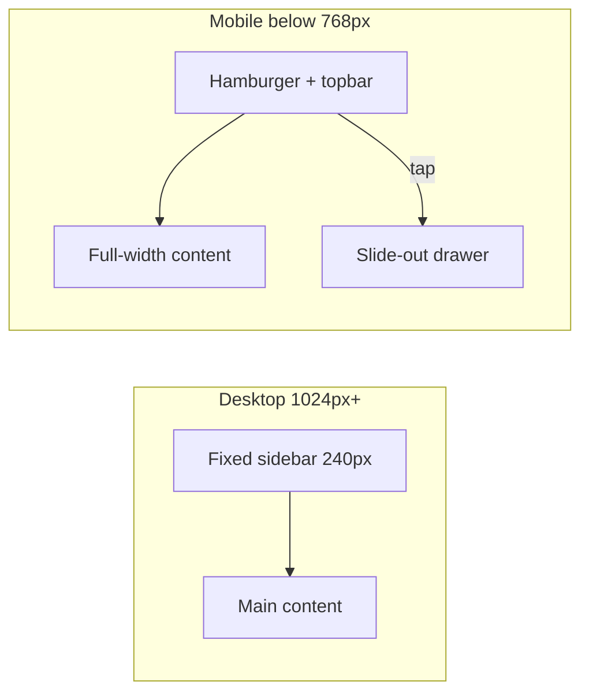

# Full Frontend Responsive Design

## Current state

The app lives in [`coffeeshop-frontend/`](coffeeshop-frontend/) — **Angular 21**, global CSS in [`styles.css`](coffeeshop-frontend/src/styles.css), almost no component-level styles. Viewport meta is already set in [`index.html`](coffeeshop-frontend/src/index.html).

**Main blockers on phone (~375px):**
- Fixed **240px sidebar** always visible in [`layout.component.ts`](coffeeshop-frontend/src/app/shared/layout/layout.component.ts) — content area is unusable
- **2-column `.form-row`** everywhere with no mobile stack rule
- **7-column Events table**, **5-column Users table**, and many tables in Reservations / Shop Details rely on horizontal scroll only
- Fixed `min-width` values (e.g. `.reservation-actions { min-width: 260px }`) fight flex-wrap
- Only **2 media queries** exist in the entire app (one is unused dead CSS)

Auth pages (`/login`, `/register`) and the Shops card grid are already reasonably mobile-friendly.



## Breakpoint strategy

Add CSS custom properties at the top of [`styles.css`](coffeeshop-frontend/src/styles.css):

| Token | Value | Use |
|-------|-------|-----|
| `--bp-sm` | 640px | Phone — stack forms, card tables |
| `--bp-md` | 768px | Tablet — drawer nav threshold |
| `--bp-lg` | 1024px | Desktop — full sidebar |

Consolidate the existing ad-hoc `640px` (Shops) and `768px` (dead rule) breakpoints to these tokens.

## Phase 1 — Mobile app shell (highest priority)

**File:** [`layout.component.ts`](coffeeshop-frontend/src/app/shared/layout/layout.component.ts)

Implement hamburger + slide-out drawer (your chosen pattern):

- Add `mobileNavOpen` signal; hamburger button in `.topbar-left` (hidden on desktop via CSS)
- Below `--bp-md`: sidebar becomes `position: fixed`, off-screen (`transform: translateX(-100%)`), slides in when `.mobile-nav-open`
- Semi-transparent **backdrop overlay**; tap backdrop or nav link to close
- Subscribe to `Router` navigation events to auto-close drawer after route change
- Hide desktop `.sidebar-toggle` (collapse) on mobile; drawer always shows full labels
- Optional: `window.matchMedia('(min-width: 768px)')` listener to close drawer when resizing to desktop

```62:80:coffeeshop-frontend/src/app/shared/layout/layout.component.ts
    .layout {
      display: flex;
      height: 100vh;
      overflow: hidden;
    }

    .sidebar {
      width: 240px;
      ...
```

Topbar gets a compact title or logo on mobile so the shell feels app-like even with an empty `.topbar-left` today.

## Phase 2 — Global responsive utilities

**File:** [`styles.css`](coffeeshop-frontend/src/styles.css) — add a dedicated `@media` section (or block per breakpoint).

| Class | Mobile behavior |
|-------|-----------------|
| `.page` | `padding: 1rem` (from `2rem`) |
| `.page-header` | `flex-direction: column; align-items: stretch; gap: 0.75rem` — title above, full-width action buttons |
| `.page-title` | `font-size: 1.375rem` |
| `.form-row` | `grid-template-columns: 1fr` |
| `.form-card`, `.card`, `.auth-card` | Reduced internal padding |
| `.form-actions` | `flex-direction: column` — buttons full width via `.btn-block` or `width: 100%` |
| `.events-toolbar` | Already wraps; ensure search + date picker stack full-width |
| `.pagination-bar` | Stack page info above controls |
| `.reservation-actions` | Remove `min-width: 260px`; stack select + buttons vertically |
| `.date-time-picker` | `flex-wrap: wrap` — time input below calendar trigger |
| `.card:hover` transform | Disable on touch (`@media (hover: hover)`) to avoid sticky hover on mobile |

These changes automatically improve **Events, Users, Profile, Shop Details forms, and Reservations forms** without per-page CSS.

## Phase 3 — Mobile card tables (mobile-like lists)

Horizontal scroll alone is not a mobile design. Introduce a reusable **stacked table** pattern:

**CSS** in `styles.css`:

```css
@media (max-width: 768px) {
  .data-table--responsive thead { display: none; }
  .data-table--responsive tbody tr {
    display: block;
    border-bottom: 1px solid #2a2a3e;
    padding: 1rem;
  }
  .data-table--responsive td {
    display: flex;
    justify-content: space-between;
    gap: 1rem;
    padding: 0.375rem 0;
    border: none;
  }
  .data-table--responsive td::before {
    content: attr(data-label);
    font-weight: 600;
    color: #aaa;
    flex-shrink: 0;
  }
  .data-table--responsive td[data-label=""]::before { display: none; }
}
```

**Template updates** — add `class="data-table data-table--responsive"` and `data-label="Column Name"` on each `<td>`:

| Component | Tables to update |
|-----------|------------------|
| [`events.component.ts`](coffeeshop-frontend/src/app/features/events/events.component.ts) | Events list (7 cols) |
| [`users.component.ts`](coffeeshop-frontend/src/app/features/users/users.component.ts) | Users list (5 cols) |
| [`reservations.component.ts`](coffeeshop-frontend/src/app/features/reservations/reservations.component.ts) | Guest + owner tables (multiple) |
| [`shop-details.component.ts`](coffeeshop-frontend/src/app/features/shop-details/shop-details.component.ts) | Menu, Tables, Reservations, Events, Reviews tabs |

For **action cells** (buttons, form-selects), use `data-label=""` and let the cell span full width with action buttons stacked — add a modifier class `.data-table__actions` for full-width button groups on mobile.

Keep `.table-container` wrapper; on mobile it becomes a card list (no horizontal scroll).

## Phase 4 — Tabs and nested navigation

**Shop Details** ([`shop-details.component.ts`](coffeeshop-frontend/src/app/features/shop-details/shop-details.component.ts)) — 6 horizontal tabs overflow on phone:

- Make `.tabs` horizontally scrollable: `overflow-x: auto; flex-wrap: nowrap; -webkit-overflow-scrolling: touch; scroll-snap-type: x mandatory`
- Reduce tab padding on mobile; keep labels readable

**Reservations** ([`reservations.component.ts`](coffeeshop-frontend/src/app/features/reservations/reservations.component.ts)) — two-level `.tabs-nav`:

- Primary tabs: same scrollable pattern (already wraps on desktop; switch to horizontal scroll on mobile for cleaner app feel)
- Sub-tabs: allow horizontal scroll inside panel header

## Phase 5 — Shared component polish

| Component | Change |
|-----------|--------|
| [`date-time-picker.component.ts`](coffeeshop-frontend/src/app/shared/date-time-picker/date-time-picker.component.ts) | Stack calendar + time on `<640px` |
| [`date-range-picker.component.ts`](coffeeshop-frontend/src/app/shared/date-range-picker/date-range-picker.component.ts) | Popover: `left: 0; right: auto; max-width: calc(100vw - 2rem)` on mobile to prevent clipping |
| [`form-select`](coffeeshop-frontend/src/app/shared/form-select/form-select.component.ts) | Ensure dropdown panel respects viewport width |
| [`shops.component.ts`](coffeeshop-frontend/src/app/features/shops/shops.component.ts) | Align existing `640px` breakpoint with `--bp-sm`; verify card grid + form at 375px |

## Phase 6 — Pages needing little or no work

- **Dashboard** — `.card-grid` already uses `auto-fill minmax(280px)`; works on phone (single column)
- **Login / Register** — centered `.auth-card`; minor padding tweak only
- **Profile** — benefits from global `.form-row` stack

## Verification checklist

Test in browser DevTools at these widths with `docker compose up` frontend running:

| Width | What to verify |
|-------|----------------|
| **375px** (iPhone) | Drawer opens/closes; no horizontal page scroll; tables show as labeled cards; forms stack; tabs scroll |
| **768px** (tablet) | Drawer vs sidebar transition; 2-col forms may still stack |
| **1280px+** (desktop) | Unchanged desktop layout; sidebar collapse still works |

Also verify: profile dropdown, confirm dialogs, city-search autocomplete, and favourite button on shop cards do not clip off-screen.

## File change summary

| Priority | Files |
|----------|-------|
| P0 | `layout.component.ts` |
| P1 | `styles.css` (breakpoints + global responsive + table card CSS) |
| P2 | `events.component.ts`, `users.component.ts`, `reservations.component.ts`, `shop-details.component.ts` |
| P3 | `date-time-picker.component.ts`, `date-range-picker.component.ts`, `shops.component.ts` |
| P4 | `profile.component.ts` (only if action buttons need tweaks beyond global CSS) |

No new dependencies, no Tailwind/MUI — stays consistent with the existing global CSS design system.
