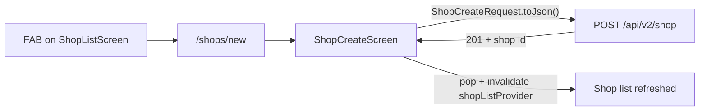

# Implement Create Shop (Flutter Mobile)

## Current state

The FAB on the shop list already navigates correctly, but the route renders a placeholder:

```105:109:coffeeshop-mobile/lib/core/routing/app_router.dart
                  GoRoute(
                    path: 'new',
                    builder: (context, state) => const Scaffold(
                      body: Center(child: Text('Create Shop - Coming Soon')),
                    ),
```

**Already implemented (no backend or DTO work needed):**

| Layer | Status |
|-------|--------|
| Route + FAB | [`shop_list_screen.dart`](coffeeshop-mobile/lib/features/shops/shop_list_screen.dart) pushes `/shops/new`; gated by `shop_owner` / `admin` |
| API client | [`ShopApiService.create()`](coffeeshop-mobile/lib/data/services/shop_api_service.dart) → `POST /api/v2/shop` |
| Request DTO | [`ShopCreateRequest`](coffeeshop-mobile/lib/data/models/shop_response_dto.dart) with camelCase JSON |
| Cities list | [`citiesProvider`](coffeeshop-mobile/lib/features/shops/shop_providers.dart) → `/api/v2/reference/serbia-cities` |
| Auth user id | `ref.read(authNotifierProvider).user?.id` from [`UserProfileResponseDto`](coffeeshop-mobile/lib/data/models/user_profile_response_dto.dart) |

**Reference behavior** (Angular [`shops.component.ts`](coffeeshop-frontend/src/app/features/shops/shops.component.ts) `onSubmit`):

- Create payload: `name`, `address`, `city`, `phoneNumber`, `ownerUserId` (from logged-in profile)
- Email is **edit-only** on web — omit on create
- After success: return to browse list and refresh



## Implementation

### 1. Add `ShopCreateScreen`

**New file:** [`coffeeshop-mobile/lib/features/shops/shop_create_screen.dart`](coffeeshop-mobile/lib/features/shops/shop_create_screen.dart)

Follow patterns from [`register_screen.dart`](coffeeshop-mobile/lib/features/auth/register_screen.dart):

- `ConsumerStatefulWidget` with `_formKey`, text controllers, `_isLoading`
- AppBar title: **Create Shop**; leading back pops route
- Form fields:
  - **Name** — `TextFormField`, `Validators.required`
  - **Address** — `TextFormField`, `Validators.required`
  - **City** — `FormSelect<String>` wired to `ref.watch(citiesProvider)` (reuse [`form_select.dart`](coffeeshop-mobile/lib/shared/widgets/form_select.dart)); show loading/error states for cities async
  - **Phone** — optional `TextFormField`
- Primary **Create** button (disabled while loading)
- **Auth guard:** if user is not `shop_owner` or `admin`, show an error/empty state with back button (defense against direct URL navigation)

**Submit handler:**

```dart
final request = ShopCreateRequest(
  name: _nameController.text.trim(),
  address: _addressController.text.trim(),
  city: _selectedCity!,
  phoneNumber: _phoneController.text.trim().isEmpty
      ? null
      : _phoneController.text.trim(),
  ownerUserId: ref.read(authNotifierProvider).user!.id,
);
final created = await ref.read(shopApiServiceProvider).create(request.toJson());
ref.invalidate(shopListProvider);
if (context.mounted) {
  context.pop();
  ScaffoldMessenger.of(context).showSnackBar(
    SnackBar(content: Text('Shop "${created['name']}" created')),
  );
}
```

Catch `ApiException` (via existing Dio error mapping) and show a `SnackBar` with the message — same pattern as login/register error handling.

### 2. Wire the router

**Edit:** [`coffeeshop-mobile/lib/core/routing/app_router.dart`](coffeeshop-mobile/lib/core/routing/app_router.dart)

- Import `ShopCreateScreen`
- Replace the stub `Scaffold` at `/shops/new` with `const ShopCreateScreen()`

No other routing changes needed — nested route under `/shops` keeps the bottom nav shell intact.

### 3. Optional provider helper (skip unless needed)

A dedicated `createShopProvider` / `AsyncNotifier` is **not required** for this scope — a single-screen form with local loading state matches existing auth screens and keeps the diff small. Add a provider only if you later unify create + edit into one form screen.

## Out of scope (this task)

- **Edit shop** — web uses the same form with `ShopUpdateRequest`; mobile has no edit entry point yet on [`shop_detail_screen.dart`](coffeeshop-mobile/lib/features/shop_details/shop_detail_screen.dart). Can follow the same screen pattern later as `/shops/:id/edit`.
- **Create Event** — separate stub at `/events/new` (same router file).
- **Widget test** — optional; only add if you want regression coverage for form validation + submit button state.

## Verification

Manual test with `flutter run -d chrome` (shop owner account):

1. Log in as `shop_owner` → Shops tab → tap **+** FAB
2. Confirm form appears (not "Coming Soon")
3. Submit with empty required fields → inline validation errors
4. Submit valid shop (name, address, city) → returns to list, new shop visible
5. Log in as `customer` → FAB hidden; navigating to `/shops/new` directly shows unauthorized message
6. Network error / 403 → SnackBar with readable error, form stays open

No `build_runner` needed — `ShopCreateRequest` is already generated.
