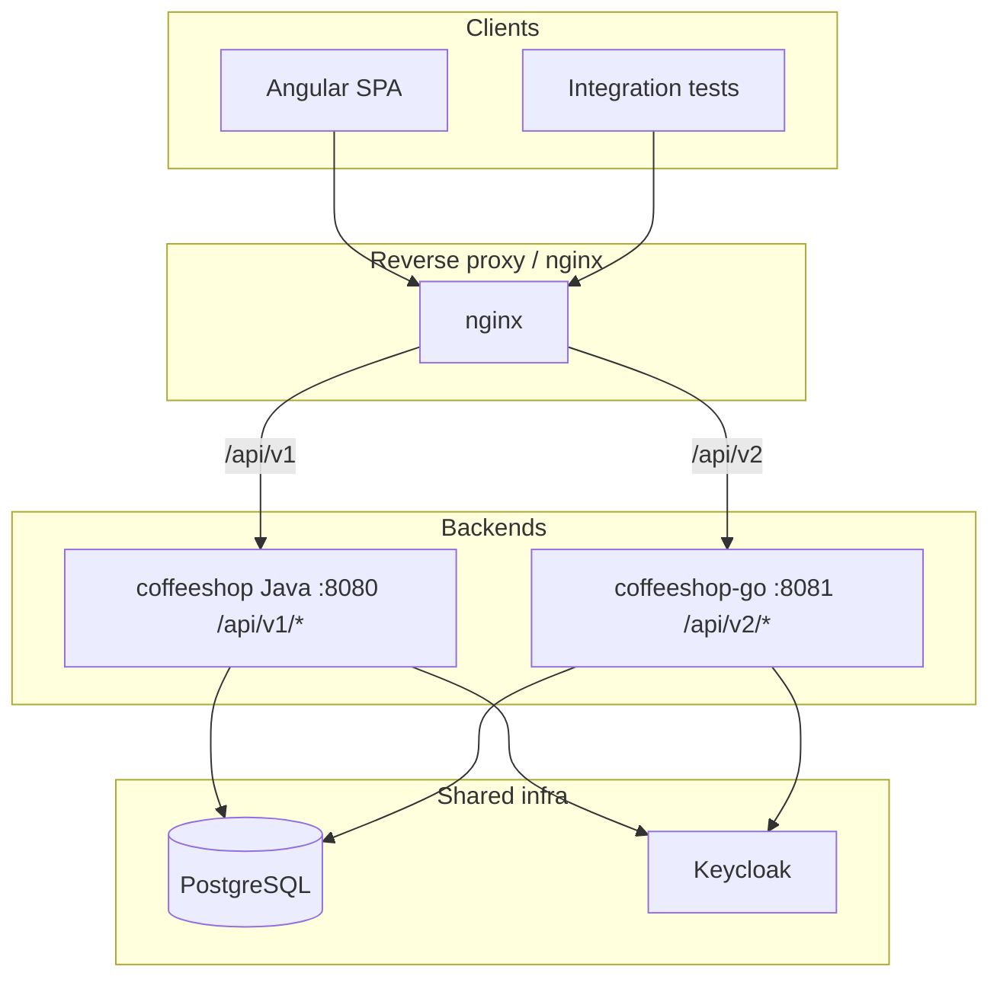
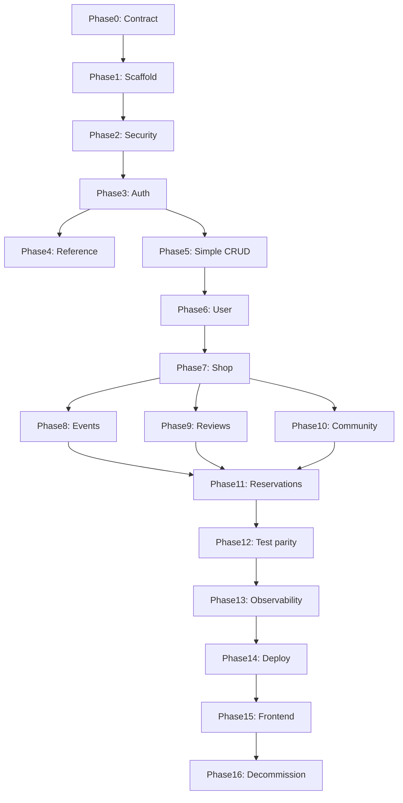

# Coffeeshop Java to Go Migration Plan

## Current State

- **Java module**: [coffeeshop/](coffeeshop/) — Spring Boot 4.0.6, Java 25, Gradle
- **API surface**: 16 controllers (~77 routes), all under `/api/v1`
- **Auth**: Keycloak JWT resource server + token/admin HTTP clients
- **Data**: PostgreSQL 18, 15 JPA entities, Hibernate `ddl-auto: update` (no Flyway)
- **Tests**: 23 test classes (integration + unit) using testcontainers
- **Deploy**: Single `backend` container :8080, frontend nginx proxies `/api/` to backend
- **Go module**: Does not exist yet — greenfield `coffeeshop-go/`

## Target Architecture (Strangler Pattern)



**Path rule**: Every Java route `GET /api/v1/shop/{id}` becomes `GET /api/v2/shop/{id}` with the same request/response JSON, status codes, and query parameters.

## Technology Stack for Go Service

- **Router**: `go-chi/chi` v5
- **ORM**: `gorm.io/gorm` + `gorm.io/driver/postgres` (prod) + `gorm.io/driver/sqlite` (test)
- **JWT**: Custom middleware using `github.com/golang-jwt/jwt/v5` with JWKS fetching
- **HTTP Client**: Standard `net/http` for Keycloak token/admin calls
- **Validation**: `github.com/go-playground/validator/v10`
- **Testing**: `testing` + `net/http/httptest` + SQLite in-memory (via GORM dialect switch)
- **Config**: `github.com/caarlos0/env/v11`
- **Logging**: `log/slog` (stdlib structured logging)
- **Error tracking**: `github.com/getsentry/sentry-go`

## Go Project Layout

```
coffeeshop-go/
  cmd/api/main.go           # entry point: config, DI wiring, graceful shutdown
  internal/
    config/config.go        # env-based config struct
    middleware/             # jwt.go, cors.go, recover.go, requestid.go, publicbearer.go
    handler/               # 1 file per Java controller (shop.go, event.go, etc.)
    service/               # ports of Java *ServiceImpl
    repository/            # GORM queries
    auth/                  # keycloak_token_client.go, keycloak_admin_client.go, current_user.go
    model/                 # entities (GORM models) + request/response DTOs
    apperror/              # error types + central error handler middleware
    util/                  # search normalizer, rating aggregation, date parsing
  test/                    # shared test helpers, fixtures, SQLite setup
  Dockerfile
  go.mod
  README.md                # v1 to v2 endpoint mapping matrix
```

## Database Strategy

- Read/write existing Hibernate-created tables — do not introduce a second schema in Go
- Map explicit table names from JPA `@Table` annotations (e.g., `User` -> `users`, `UserShop` -> `user_shop`)
- Match column types: UUID PKs, `Event.eventId` as string PK, enums stored as strings
- No migrations in Go — schema remains owned by Java/Hibernate until decommission phase
- For tests: SQLite in-memory with GORM AutoMigrate from model structs (fast, no Docker needed)

## Security Parity (Critical)

Must mirror [SecurityConfiguration.java](coffeeshop/src/main/java/com/coffeeshop/coffeeshop/config/SecurityConfiguration.java) and [PublicEndpointBearerTokenResolver.java](coffeeshop/src/main/java/com/coffeeshop/coffeeshop/config/PublicEndpointBearerTokenResolver.java):

- `GET /api/v2/**` -> public (except authenticated GETs below)
- `POST/PUT/PATCH/DELETE /api/v2/**` -> authenticated
- `GET /api/v2/profile` -> authenticated
- `GET /api/v2/shop/mine` -> authenticated
- `GET /api/v2/shop?page=N` (paginated) -> authenticated
- `GET /api/v2/reservation-request*` -> authenticated
- Auth routes (`/api/v2/auth/*`) + health -> public
- Public GETs: ignore invalid Bearer tokens (return no auth, don't 401)

## Error Response Parity

From [GlobalExceptionHandler.java](coffeeshop/src/main/java/com/coffeeshop/coffeeshop/exception/GlobalExceptionHandler.java):

```json
{"message": "error description here"}
```

- `ResourceNotFoundException` -> 404
- `IllegalArgumentException` -> 400
- `MethodArgumentNotValidException` -> 422 (first field error message)
- `ResponseStatusException` -> status from exception
- `KeycloakAuthException` -> 401 "Authentication failed. Please try again."

---

## Phase 0 — API Contract Baseline

**Goal**: Document the complete v1 -> v2 endpoint matrix before writing code.

**Tasks**:
- Create `coffeeshop-go/README.md` with full endpoint mapping table (all 77 routes)
- Document all enums: `UserType`, `UserShopRelationshipType`, `MenuItemType`, `ReservationStatus`, `RoleType`, `LoyaltyPlanType`, `CommunityPostType`
- Document pagination shape (`PageResponseDto`: `content`, `page`, `size`, `totalElements`, `totalPages`)
- Document error body shape and status code mapping
- Document allowed page sizes: 10, 25, 50

**Source files to reference**:
- All 14 controllers in [controller/](coffeeshop/src/main/java/com/coffeeshop/coffeeshop/controller/)
- [AuthController.java](coffeeshop/src/main/java/com/coffeeshop/coffeeshop/auth/AuthController.java), [ProfileController.java](coffeeshop/src/main/java/com/coffeeshop/coffeeshop/auth/ProfileController.java)
- All 46 DTO files in [model/dto/](coffeeshop/src/main/java/com/coffeeshop/coffeeshop/model/dto/)

**Exit criteria**: Written contract doc; no runtime code.

---

## Phase 1 — Go Project Scaffold and Platform

**Goal**: Bootable Go service with health endpoints and Postgres connectivity.

**Tasks**:
- `go mod init github.com/mastilovic/coffeeshop-go`
- `cmd/api/main.go`: config load, slog setup, graceful shutdown with `context`
- `internal/config/config.go`: env struct (`DATABASE_URL`, `KEYCLOAK_*`, `CORS_ALLOWED_ORIGINS`, `PORT`)
- Health endpoints: `GET /health/ready`, `GET /health/live`
- GORM Postgres connection pool
- Chi router with `/api/v2` subrouter
- `Dockerfile` (multi-stage: build with Go, run with distroless/alpine)
- Add `backend-go` service to [docker-compose.yaml](coffeeshop/docker-compose.yaml) on port 18081 (host) / 8080 (container)
- Basic test that server starts and health returns 200

**Exit criteria**: Container starts, connects to Postgres, `GET /health/ready` returns 200.

---

## Phase 2 — Cross-cutting HTTP Layer (Security + Error Handling)

**Goal**: JWT middleware, public bearer skip, CORS, error handler, validation — all before domain APIs.

**Tasks**:
- `internal/middleware/jwt.go`: validate JWT via JWKS from Keycloak issuer URI
- `internal/middleware/publicbearer.go`: port `PublicEndpointBearerTokenResolver` logic for `/api/v2` paths
- `internal/middleware/cors.go`: configurable origins from env
- `internal/middleware/recover.go`: panic recovery
- `internal/middleware/requestid.go`: X-Request-ID generation
- `internal/apperror/handler.go`: central error response middleware matching Java status/message shape
- `internal/apperror/errors.go`: `NotFoundError`, `ValidationError`, `BadRequestError`, `AuthError`
- Request validation setup with `go-playground/validator`
- `internal/model/page.go`: `PageResponse[T]` generic struct
- `internal/util/search.go`: port [SearchTextNormalizer](coffeeshop/src/main/java/com/coffeeshop/coffeeshop/util/SearchTextNormalizer.java)

**Exit criteria**: Security integration test skeleton passes — 401 on protected POST without token; public GET works with garbage Bearer token.

---

## Phase 3 — Auth and Profile

**Goal**: Port auth controller and profile endpoint — blocking for all mutating domain APIs.

**Source files**: [AuthController.java](coffeeshop/src/main/java/com/coffeeshop/coffeeshop/auth/AuthController.java), [ProfileController.java](coffeeshop/src/main/java/com/coffeeshop/coffeeshop/auth/ProfileController.java), [AuthService.java](coffeeshop/src/main/java/com/coffeeshop/coffeeshop/auth/AuthService.java), [RegistrationService.java](coffeeshop/src/main/java/com/coffeeshop/coffeeshop/auth/RegistrationService.java), [KeycloakTokenClient.java](coffeeshop/src/main/java/com/coffeeshop/coffeeshop/auth/KeycloakTokenClient.java), [KeycloakAdminClient.java](coffeeshop/src/main/java/com/coffeeshop/coffeeshop/auth/KeycloakAdminClient.java), [CurrentUserService.java](coffeeshop/src/main/java/com/coffeeshop/coffeeshop/auth/CurrentUserService.java)

**Endpoints**:
- `POST /api/v2/auth/login` — Keycloak password grant + local user check
- `POST /api/v2/auth/register` — 201, Keycloak user creation + local User entity
- `POST /api/v2/auth/refresh` — token refresh via Keycloak
- `POST /api/v2/auth/logout` — 204, revoke refresh token
- `GET /api/v2/profile` — resolve JWT `sub` claim -> `User.keycloakSubject`

**Go files to create**:
- `internal/auth/keycloak_token_client.go`
- `internal/auth/keycloak_admin_client.go`
- `internal/auth/current_user.go`
- `internal/handler/auth.go`
- `internal/handler/profile.go`
- `internal/service/auth_service.go`
- `internal/service/registration_service.go`

**Exit criteria**: Port [AuthIntegrationTest](coffeeshop/src/test/java/com/coffeeshop/coffeeshop/AuthIntegrationTest.java) and [ApiSecurityIntegrationTest](coffeeshop/src/test/java/com/coffeeshop/coffeeshop/ApiSecurityIntegrationTest.java) scenarios.

---

## Phase 4 — Reference Data (No DB)

**Source**: [ReferenceController.java](coffeeshop/src/main/java/com/coffeeshop/coffeeshop/controller/ReferenceController.java), [SerbiaCityCatalog.java](coffeeshop/src/main/java/com/coffeeshop/coffeeshop/reference/SerbiaCityCatalog.java)

**Endpoint**: `GET /api/v2/reference/serbia-cities?q=`

**Exit criteria**: Port [ReferenceControllerIntegrationTest](coffeeshop/src/test/java/com/coffeeshop/coffeeshop/ReferenceControllerIntegrationTest.java).

---

## Phase 5 — Simple CRUD Resources

**Goal**: Migrate low-coupling CRUD controllers in parallel.

**Resources** (each = handler + service + repository + model + DTOs):

| Resource | Java Controller | Endpoints |
|----------|----------------|-----------|
| Role | `RoleController` | `/api/v2/role` CRUD |
| Contact | `ContactController` | `/api/v2/contact` CRUD |
| Table | `TableController` | `/api/v2/table` CRUD |
| Loyalty Plan | `LoyaltyPlanController` | `/api/v2/loyalty-plan` CRUD |
| Menu | `MenuController` | `/api/v2/menu` CRUD + set current |
| Menu Item | `MenuItemController` | `/api/v2/menu-item` CRUD |

**Exit criteria**: CRUD round-trip tests per resource; 404/400 parity with Java.

---

## Phase 6 — User Domain

**Source**: [UserController.java](coffeeshop/src/main/java/com/coffeeshop/coffeeshop/controller/UserController.java), [UserServiceImpl.java](coffeeshop/src/main/java/com/coffeeshop/coffeeshop/service/impl/UserServiceImpl.java) (180 LOC), [UserShopServiceImpl.java](coffeeshop/src/main/java/com/coffeeshop/coffeeshop/service/impl/UserShopServiceImpl.java) (192 LOC)

**Key behaviors**:
- List with optional pagination (`q`, `page`, `size`; no `page` param -> full list)
- CRUD + `UserType` / role assignment rules
- `keycloakSubject` linking used by auth
- `UserShop` relationship management (OWNER, FAVOURITE)

**Exit criteria**: Port [UserCreateIntegrationTest](coffeeshop/src/test/java/com/coffeeshop/coffeeshop/UserCreateIntegrationTest.java), [UserPaginationIntegrationTest](coffeeshop/src/test/java/com/coffeeshop/coffeeshop/UserPaginationIntegrationTest.java).

---

## Phase 7 — Shop Domain (Core Product)

**Source**: [ShopController.java](coffeeshop/src/main/java/com/coffeeshop/coffeeshop/controller/ShopController.java), [ShopServiceImpl.java](coffeeshop/src/main/java/com/coffeeshop/coffeeshop/service/impl/ShopServiceImpl.java) (206 LOC), [ShopOwnershipService.java](coffeeshop/src/main/java/com/coffeeshop/coffeeshop/auth/ShopOwnershipService.java)

**Endpoints**:
- `GET /api/v2/shop` — list all (no page param) or paginated search (with `page`, `q`)
- `GET /api/v2/shop/mine` — authenticated, current user's owned shops
- `GET /api/v2/shop/{id}` — single shop
- `POST /api/v2/shop` — create (with `ownerUserIdForCreate`)
- `PUT /api/v2/shop/{id}` — update (with optional `newOwnerUserIdForUpdate`)
- `DELETE /api/v2/shop/{id}` — ownership check
- `POST /api/v2/shop/{shopId}/favourite` — add to favourites
- `DELETE /api/v2/shop/{shopId}/favourite` — remove from favourites
- `GET /api/v2/shop/{shopId}/menus` — nested menus with `current` flag
- `POST /api/v2/shop/{shopId}/menus` — create menu for shop (sets as current)

**Key complexity**: Ownership via `UserShop` (OWNER relationship), `ALLOWED_PAGE_SIZES` validation, `currentMenu` semantics.

**Exit criteria**: Port shop integration tests (create, mine, ownership, multi-owner, search/pagination, favourite).

---

## Phase 8 — Events

**Source**: [EventController.java](coffeeshop/src/main/java/com/coffeeshop/coffeeshop/controller/EventController.java), [EventServiceImpl.java](coffeeshop/src/main/java/com/coffeeshop/coffeeshop/service/impl/EventServiceImpl.java)

**Endpoints**:
- `GET /api/v2/event?shopId=` — list by shop (no pagination)
- `GET /api/v2/event?q=&dateFrom=&dateTo=&page=&size=` — paginated search sorted by eventDate DESC
- `GET /api/v2/event/{eventId}` — single (string PK)
- `POST/PUT/DELETE /api/v2/event/{eventId}` — CRUD with ownership checks

**Key complexity**: String `eventId` PK (not UUID), date validation (`dateFrom` must not be after `dateTo`, format `yyyy-MM-dd`), ownership aligned with shop owners.

**Exit criteria**: Port [EventSearchIntegrationTest](coffeeshop/src/test/java/com/coffeeshop/coffeeshop/EventSearchIntegrationTest.java), [EventOwnershipIntegrationTest](coffeeshop/src/test/java/com/coffeeshop/coffeeshop/EventOwnershipIntegrationTest.java), [EventDateValidationIntegrationTest](coffeeshop/src/test/java/com/coffeeshop/coffeeshop/EventDateValidationIntegrationTest.java).

---

## Phase 9 — Reviews and Comments

**Source**: [ReviewController.java](coffeeshop/src/main/java/com/coffeeshop/coffeeshop/controller/ReviewController.java), [ReviewServiceImpl.java](coffeeshop/src/main/java/com/coffeeshop/coffeeshop/service/impl/ReviewServiceImpl.java), [ReviewCommentServiceImpl.java](coffeeshop/src/main/java/com/coffeeshop/coffeeshop/service/impl/ReviewCommentServiceImpl.java)

**Endpoints**:
- `GET/POST/PUT/DELETE /api/v2/review` — review CRUD
- `GET /api/v2/review/{reviewId}/comments` — nested comments
- `POST /api/v2/review/{reviewId}/comments` — add comment

**Key complexity**: Rating aggregation ([RatingAggregationUtils](coffeeshop/src/main/java/com/coffeeshop/coffeeshop/util/RatingAggregationUtils.java)).

**Exit criteria**: Port [ReviewIntegrationTest](coffeeshop/src/test/java/com/coffeeshop/coffeeshop/ReviewIntegrationTest.java), [ReviewCommentIntegrationTest](coffeeshop/src/test/java/com/coffeeshop/coffeeshop/ReviewCommentIntegrationTest.java).

---

## Phase 10 — Shop Community

**Source**: [ShopCommunityController.java](coffeeshop/src/main/java/com/coffeeshop/coffeeshop/controller/ShopCommunityController.java), [CommunityPostServiceImpl.java](coffeeshop/src/main/java/com/coffeeshop/coffeeshop/service/impl/CommunityPostServiceImpl.java)

**Endpoints**:
- `GET /api/v2/shop/{shopId}/community/posts`
- `POST /api/v2/shop/{shopId}/community/posts`
- `DELETE /api/v2/shop/{shopId}/community/posts/{postId}`
- `GET /api/v2/shop/{shopId}/community/members`
- `POST /api/v2/shop/{shopId}/community/announcements`

**Exit criteria**: Port [ShopCommunityIntegrationTest](coffeeshop/src/test/java/com/coffeeshop/coffeeshop/ShopCommunityIntegrationTest.java).

---

## Phase 11 — Reservations and Reservation Requests (Highest Complexity)

**Source**: [ReservationController.java](coffeeshop/src/main/java/com/coffeeshop/coffeeshop/controller/ReservationController.java), [ReservationRequestController.java](coffeeshop/src/main/java/com/coffeeshop/coffeeshop/controller/ReservationRequestController.java), [ReservationRequestServiceImpl.java](coffeeshop/src/main/java/com/coffeeshop/coffeeshop/service/impl/ReservationRequestServiceImpl.java) (283 LOC)

**Endpoints**:
- `GET/POST/PUT/DELETE /api/v2/reservation` — reservation CRUD
- `GET /api/v2/reservation-request` — list for current user (JWT-only), optional `?shopId=`
- `POST /api/v2/reservation-request` — create request (userId, shopId, eventId, partySize)
- `POST /api/v2/reservation-request/{id}/accept` — accept with table assignment
- `POST /api/v2/reservation-request/{id}/deny` — deny request

**Key complexity**: Status transitions (`ReservationStatus`: PENDING -> ACCEPTED/DENIED), table availability via [EventTableAvailabilityService](coffeeshop/src/main/java/com/coffeeshop/coffeeshop/service/EventTableAvailabilityService.java), cross-entity workflow.

**Exit criteria**: Port [ReservationRequestIntegrationTest](coffeeshop/src/test/java/com/coffeeshop/coffeeshop/ReservationRequestIntegrationTest.java), [ReservationEventCreateIntegrationTest](coffeeshop/src/test/java/com/coffeeshop/coffeeshop/ReservationEventCreateIntegrationTest.java).

---

## Phase 12 — Full Integration Test Parity

**Goal**: Ensure all Java test scenarios pass against Go.

**Tasks**:
- SQLite test harness with GORM AutoMigrate + test JWT strategy (bearer = user UUID, matching [TestcontainersConfiguration](coffeeshop/src/test/java/com/coffeeshop/coffeeshop/TestcontainersConfiguration.java) approach)
- Port remaining unit tests: `SearchTextNormalizer`, `RatingAggregationUtils`, date parser/validator
- Verify all 23 Java test class scenarios have Go equivalents
- Optional: contract test runner that hits v1 and v2 with same fixtures and diffs JSON responses

**Exit criteria**: `go test ./...` green with coverage comparable to Java `./gradlew build`.

---

## Phase 13 — Observability and API Docs

**Tasks**:
- Sentry Go SDK integration (parity with `sentry-spring-boot-4-starter` in [build.gradle](coffeeshop/build.gradle))
- OpenAPI 3 spec for `/api/v2` (using `swaggo/swag` or manual spec)
- Structured logs with correlation ID (request ID propagation)
- Health endpoints aligned with K8s probes

**Exit criteria**: Errors visible in Sentry; OpenAPI available for frontend team.

---

## Phase 14 — CI/CD and Kubernetes Deployment

**Tasks**:
- GitHub Actions workflow `.github/workflows/backend-go-ci.yml`: lint, test, build/push container
- Extend staging deployment to include `backend-go` service
- K8s manifests: `deploy/k8s/base/backend-go/` (Deployment, Service, ConfigMap)
- Update nginx to split: `/api/v1` -> Java backend, `/api/v2` -> Go backend
- Staging overlay env from [config.env.example](deploy/k8s/overlays/staging/config.env.example)

**Exit criteria**: Staging runs both backends; smoke tests pass on `/api/v2`.

---

## Phase 15 — Frontend Cutover

**Tasks**:
- Update all Angular services under [coffeeshop-frontend/src/app/services/](coffeeshop-frontend/src/app/services/) from `/api/v1` to `/api/v2`
- Update [auth.interceptor.ts](coffeeshop-frontend/src/app/services/auth.interceptor.ts) refresh path
- Refresh [api-docs.json](coffeeshop-frontend/api-docs.json)
- E2E smoke test (login, profile, shops, reservations)

**Exit criteria**: Production traffic on v2 only.

---

## Phase 16 — Java Decommission

**Tasks**:
- Remove `backend` from docker-compose and K8s
- Archive [coffeeshop/](coffeeshop/) module
- Consolidate schema ownership: introduce Go-managed migrations (golang-migrate or Atlas)
- Remove `/api/v1` nginx routing

**Exit criteria**: Single Go backend serves all traffic.

---

## Implementation Order Rationale



Auth and security before domain code prevents rework. Shop before events/reviews/community because ownership and `UserShop` are shared dependencies. Reservations last due to cross-entity workflow complexity.

---

## Risk Register

- **SQLite vs Postgres drift in tests**: GORM abstracts most differences, but UUID generation and some string operations differ. Mitigate by using `string` type for UUIDs in Go models and generating UUIDs in application code, not DB.
- **Hibernate vs GORM column naming**: Use explicit `gorm:"column:..."` tags derived from JPA `@Column` annotations. Integration tests on real Postgres catch drift.
- **Dual-write during parallel run**: Keep writes on one API version per feature until tested. Use contract tests before enabling v2 writes in staging.
- **Keycloak issuer URL mismatch**: Same env vars as Java; document per-environment values.
- **Public GET + invalid JWT behavior**: Port `PublicEndpointBearerTokenResolver` logic exactly in Phase 2.

---

## Execution Strategy

Use `migrate-java-to-golang-agent` for each phase:
1. Phases 0-2 in one branch (`feat/go-scaffold-security`)
2. Phase 3 auth in second branch (`feat/go-auth-v2`)
3. Phase 4 reference as quick validation of E2E stack
4. Phases 5-11 each in separate branches per domain
5. Phases 12-16 as infrastructure/cutover branches

Each phase deliverable: updated `coffeeshop-go/README.md` endpoint matrix + green tests.
