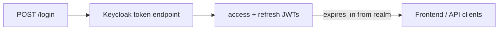

# Keycloak token lifetimes (1h access, 60d refresh)

## Context

Tokens are issued by **Keycloak**; the Spring app ([`KeycloakTokenClient`](coffeeshop/src/main/java/com/coffeeshop/coffeeshop/auth/KeycloakTokenClient.java)) forwards `expires_in` unchanged. There is no TTL logic in Java or Angular today.

Current [`realm-coffeeshop.json`](coffeeshop/docker/keycloak/realm-coffeeshop.json) omits lifespan fields, so defaults apply (~**300s** access token).



## Target values (seconds)

| Setting | Value | Meaning |
|---------|-------|---------|
| `accessTokenLifespan` | **3600** | 1 hour access token |
| `ssoSessionMaxLifespan` | **5184000** | 60 days — hard cap on user session |
| `clientSessionMaxLifespan` | **5184000** | 60 days — hard cap on refresh token ([Keycloak docs](https://github.com/keycloak/keycloak/blob/main/docs/documentation/server_admin/topics/sessions/timeouts.adoc)) |
| `ssoSessionIdleTimeout` | **2592000** | 30 days idle — per your choice: 60-day **max**, earlier logout if inactive |
| `clientSessionIdleTimeout` | **2592000** | 30 days client idle (explicit; `0` would inherit realm SSO idle) |

60 days = `60 × 24 × 3600` = **5,184,000** s  
30 days idle = **2,592,000** s

## Implementation

### 1. Update realm import JSON

Edit [`coffeeshop/docker/keycloak/realm-coffeeshop.json`](coffeeshop/docker/keycloak/realm-coffeeshop.json): add realm-level fields immediately after `"resetPasswordAllowed": true`:

```json
"accessTokenLifespan": 3600,
"ssoSessionIdleTimeout": 2592000,
"ssoSessionMaxLifespan": 5184000,
"clientSessionIdleTimeout": 2592000,
"clientSessionMaxLifespan": 5184000,
```

**Optional (not required):** per-client overrides on `coffeeshop-backend` via `attributes` (`access.token.lifespan`, `client.session.max.lifespan`, etc.). Realm-level settings are enough for this single backend client.

No changes to [`AuthController`](coffeeshop/src/main/java/com/coffeeshop/coffeeshop/auth/AuthController.java), security config, or [`auth.service.ts`](coffeeshop-frontend/src/app/services/auth.service.ts).

### 2. Update documentation

In [`coffeeshop/docs/keycloak.md`](coffeeshop/docs/keycloak.md):

- Change example `expires_in` from `300` to **`3600`**
- Add a short **Token lifetimes** subsection documenting realm JSON fields and the 1h / 60d max / 30d idle policy
- Note that refresh remains valid up to 60 days if the user is active at least once within 30 days (refresh bumps idle)

### 3. Apply settings in Docker

[`entrypoint.sh`](coffeeshop/docker/keycloak/entrypoint.sh) runs `kc.sh import` on every Keycloak start. After editing JSON:

```bash
cd coffeeshop && docker compose up -d --force-recreate keycloak
```

**If `expires_in` is still 300 after restart** (import may not overwrite an existing realm DB):

- Confirm in Admin UI: **Realm settings → Tokens** (Access Token Lifespan = 1h) and **Sessions** (SSO/Client max = 60d, idle = 30d), **or**
- Reset Keycloak data: `docker compose down` + remove volume `postgres_keycloak_data`, then `docker compose up` (destructive; dev-only)

Existing tokens in `localStorage` keep old `exp` until login/refresh.

## Verification

1. `POST /login` (or `/auth/login`) on backend (`http://localhost:18080` in Docker).
2. Response body: **`expires_in": 3600`**
3. Decode access JWT: `exp - iat` ≈ 3600 seconds.
4. After ~5+ minutes (old default), access token still works until 1h.
5. `POST /auth/refresh` with `refresh_token` succeeds within 30 days of last activity; fails after session idle/max per Keycloak rules.

No new automated tests required unless you want an integration test asserting `expires_in` (would couple tests to Keycloak config).

## Out of scope

- Proactive frontend refresh before access expiry (still refreshes on **401** via [`auth.interceptor.ts`](coffeeshop-frontend/src/app/services/auth.interceptor.ts))
- Production Keycloak outside Docker (same realm fields; apply via import or Admin UI)
