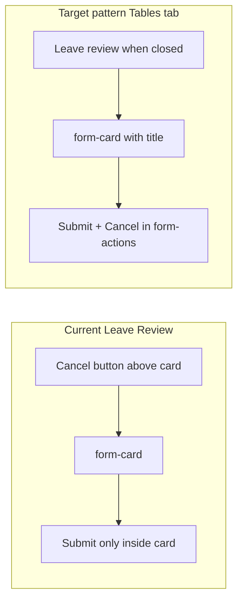

# Leave Review form redesign

## Problem summary

The screenshot matches the inline form in [`shop-details.component.ts`](coffeeshop-frontend/src/app/features/shop-details/shop-details.component.ts) (Reviews tab, ~lines 397–436). Two separate issues drive the bad first-time experience:

1. **Toggle overlap** — `.form-group label` forces `display: block` and bottom margin on *every* label, including `<label class="toggle-switch">`. That overrides `.toggle-switch { display: inline-flex }` in [`styles.css`](coffeeshop-frontend/src/styles.css) (lines 95–101 vs 447–453), breaking the horizontal slider + text layout.

2. **Inconsistent UX** — Other forms in this app (including **Tables** on the same page) use: closed state → single primary CTA; open state → `.form-card` with **Submit + Cancel** in `.form-actions`. Leave review instead toggles **Cancel** on a button *above* the card while **Submit** sits alone inside it — which feels disconnected and unlike Events/Shops/Profile.



## Design reference (already in repo)

Follow [`frontend.md` §10](coffeeshop-frontend/frontend.md): surface `#1a1a2e`, inputs `#16213e`, accent `#d4a574`, `.form-card` / `.form-group` / `.form-actions` / `.btn-primary` / `.btn-secondary`.

**Canonical in-file pattern** — Tables tab in the same component:

```225:230:coffeeshop-frontend/src/app/features/shop-details/shop-details.component.ts
                <motion.div class="form-actions">
                  <button type="submit" class="btn btn-primary" ...>...</button>
                  <button type="button" class="btn btn-secondary" (click)="showTableForm.set(false); ...">Cancel</button>
                </div>
```

*(Actual source uses `<motion.div>` → `<div>`.)*

## Implementation plan

### 1. Fix toggle CSS globally (required)

In [`styles.css`](coffeeshop-frontend/src/styles.css), add rules after `.toggle-switch` block so toggles work inside `.form-group` and on review cards:

```css
.form-group label.toggle-switch {
  display: inline-flex;
  margin-bottom: 0;
  font-weight: inherit;
  color: inherit;
}

.toggle-switch {
  position: relative; /* contain absolutely positioned checkbox */
}
```

Optional helper for semantic grouping:

```css
.form-group--toggle {
  display: flex;
  flex-direction: column;
  gap: 0.5rem;
}
```

This fixes the leave-review form **and** author toggles on review cards (same class, line ~451).

### 2. Restructure Leave Review markup (primary UX fix)

In [`shop-details.component.ts`](coffeeshop-frontend/src/app/features/shop-details/shop-details.component.ts) Reviews section (~397–436):

| State | UI |
|-------|-----|
| Form hidden | Single `btn btn-primary mb-2`: **Leave review** (same as `+ Add Table`) |
| Form visible | `.form-card.mb-3` only — no outer Cancel button |

**Inside the card:**

- Optional heading: `<h3 class="mb-2">Leave a review</h3>` (matches Menu tab section headings).
- **Rating** — keep block `<label>` + `app-star-rating` (unchanged).
- **Description** — keep `textarea.form-input` with `placeholder="Share your experience"` (already correct).
- **Comments toggle** — prefer split label + control (clearer, matches other fields):

```html
<div class="form-group form-group--toggle">
  <span class="form-label">Allow comments on this review</span>
  <label class="toggle-switch">
    <input type="checkbox" formControlName="commentsEnabled" />
    <span class="toggle-slider" aria-hidden="true"></span>
    <span class="sr-only">Allow comments on this review</span>
  </label>
</div>
```

Add `.form-label` in `styles.css` mirroring `.form-group label` styles (or reuse existing label styles on `span.form-label`).

- **Actions** — `.form-actions` with:
  - `btn btn-primary` — Submit review (disabled when invalid)
  - `btn btn-secondary` — Cancel → `toggleReviewForm()` / reset touched state if needed

Remove inline `style="margin-bottom:..."` on the form; use utility `.mb-3` like other forms.

**Logic:** `toggleReviewForm()` stays; only template changes. When opening, optionally `reviewForm.reset({ commentsEnabled: true })` if cancel should discard drafts (match table form cancel behavior).

### 3. Minor polish (scoped to leave-review only)

- Add `.form-label` token in global CSS (one rule block).
- Add `.sr-only` utility if not present (for toggle screen-reader text when visible label is separate).
- **Do not** refactor review list cards / comment grays in this pass — out of scope unless you want full Reviews tab consistency later.

### 4. Optional follow-up (not required for “fits project”)

- Align star fill color in [`star-rating.component.ts`](coffeeshop-frontend/src/app/shared/star-rating/star-rating.component.ts) from `#fbbf24` to accent `#d4a574` (visual consistency across app).
- Extract `LeaveReviewFormComponent` from the 800+ line shop-details file — improves maintainability but not required for the redesign.

## Files to change

| File | Change |
|------|--------|
| [`coffeeshop-frontend/src/styles.css`](coffeeshop-frontend/src/styles.css) | Toggle fix, `.form-label`, `.form-group--toggle`, optional `.sr-only` |
| [`coffeeshop-frontend/src/app/features/shop-details/shop-details.component.ts`](coffeeshop-frontend/src/app/features/shop-details/shop-details.component.ts) | Reviews tab template restructure (~15–25 lines) |

No API, routing, or backend changes.

## Verification

Manual check on `/shops/:id` → **Reviews** tab as a customer who can leave a review:

1. Click **Leave review** — card appears with title, no floating Cancel above card.
2. Toggle row — slider and label on one clean row, no overlap.
3. **Cancel** in form-actions closes form; **Leave review** button reappears.
4. Submit still posts via existing `onReviewSubmit()` / `ReviewService`.
5. Author “Allow comments” toggle on existing review cards still aligns correctly (same CSS fix).

Run frontend build/lint if available: `npm run build` in `coffeeshop-frontend`.

## Delegation

Implementation should use **frontend-agent** per your request, following the Tables-tab pattern and global CSS fixes above.
