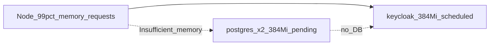

# Lower staging memory for Keycloak

## Problem (from your cluster)

On a single **~2 GB** DOKS node, allocatable memory was **~99% requested** (`1461Mi / ~1476Mi`). The scheduler could place **Keycloak** (384Mi request) but not **both Postgres StatefulSets** (192Mi × 2 = **384Mi** additional requests). Keycloak then **CrashLoopBackOff** because `postgres-keycloak` never started.



**Important:** Kubernetes schedules on **requests**, not actual RAM usage. Freeing headroom requires lowering **requests** on other workloads (or resizing the node).

## Strategy

| Workload | Action | Rationale |
|----------|--------|-----------|
| **Keycloak** | **No request reduction** | You asked to protect Keycloak; keep `384Mi` request / `768Mi` limit in base |
| **postgres** + **postgres-keycloak** | Lower via staging patch | Largest reclaimable block; empty staging DBs tolerate smaller limits |
| **backend** | Lower via staging patch | Go service already lean ([`backend/deployment.yaml`](deploy/k8s/base/backend/deployment.yaml): `64Mi` request) |
| **frontend** | Lower via staging patch | Static nginx; minimal footprint |
| **ingress-nginx / Hubble** | Document only | Not in repo; DOKS addons consume ~hundreds of Mi on small nodes |

**Staging-only scope** (per your choice): patches live under [`deploy/k8s/overlays/staging/`](deploy/k8s/overlays/staging/), base manifests unchanged for a future prod overlay.

## Target resource values (staging patch)

Proposed **requests / limits** (tune after first deploy if OOMKilled):

| Workload | Current (base) | Staging patch |
|----------|----------------|---------------|
| postgres-app | 192Mi / 384Mi | **96Mi / 256Mi** |
| postgres-keycloak | 192Mi / 384Mi | **96Mi / 256Mi** |
| backend | 64Mi / 256Mi | **32Mi / 192Mi** |
| frontend | 64Mi / 128Mi | **32Mi / 96Mi** |
| keycloak | 384Mi / 768Mi | **unchanged** |

**Namespace request total (app only):** ~896Mi → **~640Mi** (~256Mi freed).

That is **not always enough** on a 2GB node with full DOKS system pods (~900Mi+). After patches, either:

- **A)** Node still tight → use **bootstrap order** (below) on first deploy, and/or resize pool to **s-2vcpu-4gb** (still recommended in docs), and/or trim ingress/Hubble via DO console/Helm.

- **B)** Steady state fits when Keycloak and both Postgres can coexist (~640Mi app + system).

## Implementation

### 1. Add Kustomize strategic-merge patches

Create [`deploy/k8s/overlays/staging/patches/resources-small-node.yaml`](deploy/k8s/overlays/staging/patches/resources-small-node.yaml) with four documents (or split per workload), each patching `spec.template.spec.containers[0].resources` on:

- `StatefulSet/postgres`
- `StatefulSet/postgres-keycloak`
- `Deployment/backend`
- `Deployment/frontend`

Example shape (Postgres):

```yaml
apiVersion: apps/v1
kind: StatefulSet
metadata:
  name: postgres
spec:
  template:
    spec:
      containers:
        - name: postgres
          resources:
            requests:
              memory: 96Mi
              cpu: 50m
            limits:
              memory: 256Mi
```

Wire into [`deploy/k8s/overlays/staging/kustomization.yaml`](deploy/k8s/overlays/staging/kustomization.yaml) under `patches:` (same pattern as existing [`patches/ingress-cert-manager-issuer.yaml`](deploy/k8s/overlays/staging/patches/ingress-cert-manager-issuer.yaml)).

### 2. Optional: staging bootstrap replicas patch

If patches alone still leave Postgres **Pending**, add a second patch file [`patches/bootstrap-scale-to-zero.yaml`](deploy/k8s/overlays/staging/patches/bootstrap-scale-to-zero.yaml) **only for first-time bring-up** (document as manual / one-time):

- Set `Deployment/keycloak` and `Deployment/backend` to `replicas: 0` in overlay.

**Not recommended as permanent default** (stack stays down). Prefer documenting operational steps instead:

```bash
kubectl scale deployment keycloak backend -n coffeeshop-staging --replicas=0
# wait for postgres-0 and postgres-keycloak-0 Running
kubectl scale deployment keycloak backend -n coffeeshop-staging --replicas=1
```

### 3. Update documentation

[`deploy/README.md`](deploy/README.md) **Resource sizing** section is **out of sync** with base (lists backend `384Mi`; actual base is `64Mi`). Update to:

- Two tables: **base defaults** vs **staging small-node patch**
- New **Bootstrap on 2GB nodes** subsection (scale order above)
- Note: `kubectl top` needs metrics-server (optional, unrelated to scheduling)
- Keep recommendation: **≥2 vCPU / 4 GB** for reliable single-node staging

Add a short pointer in [`deploy/GITHUB_SETUP.md`](deploy/GITHUB_SETUP.md) linking to the bootstrap steps.

### 4. Optional infra (outside repo, document only)

For clusters that stay on **2 GB** without resizing:

- **ingress-nginx**: lower controller requests via Helm values when installing ([deploy/README.md](deploy/README.md) Helm section)
- **DigitalOcean**: disable or reduce **Hubble** / observability if not needed (frees system-namespace requests on your node)

## Verification (after `kubectl apply -k deploy/k8s/overlays/staging`)

```bash
kubectl describe node | grep -A6 "Allocated resources"
kubectl get pods -n coffeeshop-staging
kubectl wait --for=condition=ready pod/postgres-keycloak-0 pod/postgres-0 -n coffeeshop-staging --timeout=180s
kubectl rollout status deployment/keycloak -n coffeeshop-staging
kubectl logs deployment/keycloak -n coffeeshop-staging --tail=40
```

**Healthy end state:**

| Pod | Status |
|-----|--------|
| `postgres-0`, `postgres-keycloak-0` | Running, Ready |
| `keycloak-*` | Running (not CrashLoopBackOff) |
| `backend-*` | Running after DB + Keycloak up |

If Postgres pods show **OOMKilled**, bump staging Postgres limits to `128Mi` request / `320Mi` limit (not Keycloak).

## Risk summary

| Risk | Mitigation |
|------|------------|
| Postgres OOM under load | Staging-only limits; increase if OOMKilled |
| Keycloak still Pending on 2GB | Bootstrap scale order or 4GB node |
| Backend slow start on 32Mi request | Raise to 48Mi if probes fail |

## Out of scope

- Changing Keycloak memory (protected)
- Merging app + Keycloak into one Postgres instance
- Editing DOKS system manifests in-repo
- Production overlay (future)
