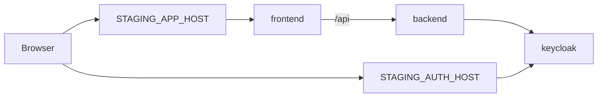

# Map Keycloak to kafenerija.online (HTTP-first)

## Already done (your side)

You have set GitHub Actions **Variables**:

- `STAGING_APP_HOST`
- `STAGING_AUTH_HOST`

The deploy pipeline already consumes these in [`.github/workflows/deploy-staging-reusable.yml`](.github/workflows/deploy-staging-reusable.yml) for `config.env`, Ingress hosts (via Kustomize), and `KC_HOSTNAME` on Keycloak.

**Important:** Variables alone do **not** update a running cluster until the next **deploy** job runs. If the cluster still shows old hosts (`staging.app.coffeeshop.com`), run **Deploy Staging (DOKS)** or push to `main` after repo changes below.

---

## Verify your GitHub values (manual, 2 min)

Confirm they match Namecheap DNS (recommended for `kafenerija.online`):

| Variable | Expected value (no `http://`) |
|----------|-------------------------------|
| `STAGING_APP_HOST` | `app.kafenerija.online` |
| `STAGING_AUTH_HOST` | `auth.kafenerija.online` |

```bash
kubectl get ingress coffeeshop -n coffeeshop-staging \
  -o custom-columns='APP:.spec.rules[0].host,AUTH:.spec.rules[1].host'
```

If Ingress still shows `staging.app.coffeeshop.com`, redeploy after variables are correct.

**Still to add on GitHub** (not set yet per plan):

| Variable | Value |
|----------|--------|
| `STAGING_PUBLIC_SCHEME` | `http` |

Used for HTTP-first JWT issuer and CORS (see Part B).

---

## Target mapping (unchanged)



| Config | Source |
|--------|--------|
| Ingress app host | `STAGING_APP_HOST` → `APP_HOST` in ConfigMap |
| Ingress auth host | `STAGING_AUTH_HOST` → `AUTH_HOST` |
| Keycloak `KC_HOSTNAME` | `AUTH_HOST` from ConfigMap ([`keycloak/deployment.yaml`](deploy/k8s/base/keycloak/deployment.yaml)) |
| Backend `KEYCLOAK_JWT_ISSUER_URI` | `${STAGING_PUBLIC_SCHEME}://${STAGING_AUTH_HOST}/realms/coffeeshop` *(after Part B)* |
| Realm redirect/web origins | `http(s)://${STAGING_APP_HOST}` in template *(after Part B)* |

Frontend uses backend `/api` only — no direct browser Keycloak URL in Angular ([`environment.docker.ts`](coffeeshop-frontend/src/environments/environment.docker.ts)).

---

## Part A — Manual (remaining)

### 1. Namecheap Advanced DNS (if not done)

Two **A** records → same ingress LB IP:

- `app` → `app.kafenerija.online`
- `auth` → `auth.kafenerija.online`

### 2. GitHub variable (add one)

Add **`STAGING_PUBLIC_SCHEME`** = `http` (keep existing `STAGING_APP_HOST` / `STAGING_AUTH_HOST` as-is if already correct).

### 3. Redeploy

After Part B is merged: **Deploy Staging (DOKS)** or push to `main`.

---

## Part B — Repo changes (DevOps)

### 1. Scheme-aware `config.env` in workflow

**File:** [`.github/workflows/deploy-staging-reusable.yml`](.github/workflows/deploy-staging-reusable.yml)

- Use `vars.STAGING_PUBLIC_SCHEME` (default `http` if unset); validate `http` or `https`.
- Replace hardcoded `https://` with:

```text
KEYCLOAK_JWT_ISSUER_URI=${SCHEME}://${STAGING_AUTH_HOST}/realms/coffeeshop
CORS_ALLOWED_ORIGINS=${SCHEME}://${STAGING_APP_HOST}
```

- Add `STAGING_AUTH_HOST` empty check (mirror `STAGING_APP_HOST`).

Existing GitHub host variables require **no rename** — only scheme wiring changes.

### 2. Realm template

**File:** [`deploy/k8s/overlays/staging/realm-coffeeshop.json.template`](deploy/k8s/overlays/staging/realm-coffeeshop.json.template)

Add `http://${STAGING_APP_HOST}/*` alongside existing `https://` entries in `redirectUris` and `webOrigins` (HTTP-first + future TLS).

### 3. Docs and examples

- [`config.env.example`](deploy/k8s/overlays/staging/config.env.example) — `kafenerija.online` examples + `http://` issuer/CORS
- [`GITHUB_SETUP.md`](deploy/GITHUB_SETUP.md) — document three variables (`STAGING_APP_HOST`, `STAGING_AUTH_HOST`, `STAGING_PUBLIC_SCHEME`); note hosts are already set by user
- [`README.md`](deploy/README.md) — DNS + verify Ingress matches GitHub vars
- [`render-local.sh`](deploy/k8s/overlays/staging/render-local.sh) — optional `PUBLIC_SCHEME` for local parity

### 4. No Keycloak Deployment manifest change

`KC_HOSTNAME` already reads `AUTH_HOST` from the ConfigMap generated from your GitHub `STAGING_AUTH_HOST`.

---

## Part C — Java (verify only)

- [`application.yaml`](coffeeshop/src/main/resources/application.yaml): `${KEYCLOAK_JWT_ISSUER_URI}` — no code change.
- No CORS bean today; same-origin `/api` via nginx — OK.

---

## Part D — Realm already imported?

If Keycloak ran before with old hosts, `--import-realm` may **not** update client URIs. After redeploy:

- **Admin UI:** `http://<STAGING_AUTH_HOST>` → client `coffeeshop-backend` → add `http://<STAGING_APP_HOST>/*`, or  
- Staging-only: reset Keycloak DB / re-import (document in `GITHUB_SETUP.md`).

---

## Verification

```bash
kubectl get ingress coffeeshop -n coffeeshop-staging
kubectl exec -n coffeeshop-staging deploy/backend -- env | grep KEYCLOAK_JWT_ISSUER_URI
curl -sS -o /dev/null -w "%{http_code}\n" "http://$(kubectl get cm coffeeshop-config -n coffeeshop-staging -o jsonpath='{.data.APP_HOST}')/"
```

Browser: `http://<STAGING_APP_HOST>/` — login/register; token `iss` must match `KEYCLOAK_JWT_ISSUER_URI`.

---

## Success criteria

- Ingress hosts equal GitHub `STAGING_APP_HOST` / `STAGING_AUTH_HOST`.
- Backend issuer uses `http://` + auth host (until TLS → set scheme to `https`).
- Realm allows app host over HTTP.
- Public access works without `/etc/hosts`.
