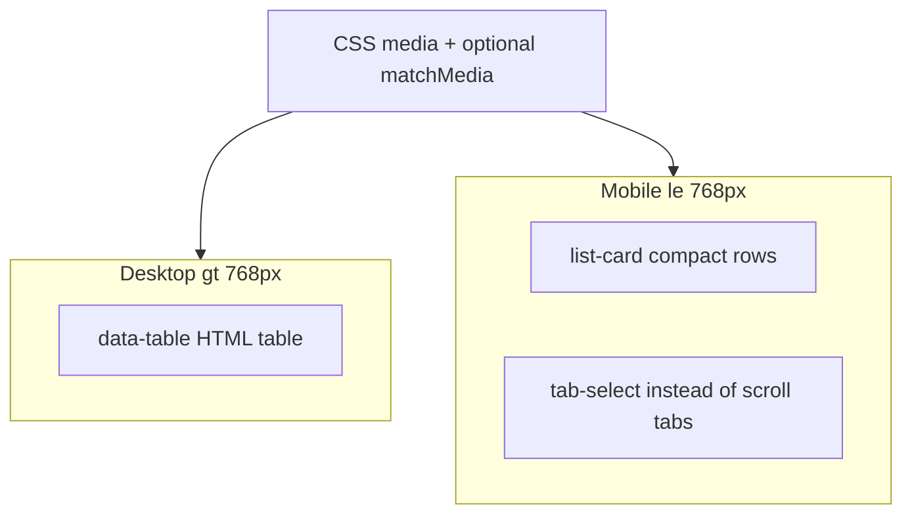

# Mobile-friendly frontend redesign

## Problem diagnosis

The app ([coffeeshop-frontend](coffeeshop-frontend)) uses **custom CSS only** (no Material/Tailwind). Mobile layout breaks down in two different ways:

| Area | Current pattern | Why only 2–3 items fit |
|------|-----------------|------------------------|
| **Users** ([users.component.ts](coffeeshop-frontend/src/app/features/users/users.component.ts)) | `data-table--responsive` stacks **every column** as a labeled row | ~6 vertical blocks per user + 1rem padding per `<tr>` ([styles.css](coffeeshop-frontend/src/styles.css) L1362–1405) |
| **Shops** ([shops.component.ts](coffeeshop-frontend/src/app/features/shops/shops.component.ts)) | Card grid with **4 detail rows** each | Tall cards + `min-height: calc(100vh - 56px)` pushes pagination to bottom, shrinking list area |
| **Events / Reservations / Shop details** | Same responsive table pattern (7+ columns in events) | Same stacked-row bloat; reservations also had `min-width: 260px` on actions (partially fixed at ≤768px) |

Horizontal scroll sources today:
- `.table-container { overflow-x: auto }` on desktop (disabled at ≤768px for responsive tables)
- **Tab strips** with intentional `overflow-x: auto` ([styles.css](coffeeshop-frontend/src/styles.css) L1416–1465) in [shop-details.component.ts](coffeeshop-frontend/src/app/features/shop-details/shop-details.component.ts)
- Wide inline flex rows (actions, compact selects) and long unbroken strings (no `word-break` on responsive cells)



## Design direction

**Goal:** ~6–8 list items visible on a typical phone (~667px height) after topbar (56px) + search + compact pagination.

**Approach:** Introduce a reusable **`.list-card`** pattern (~56–72px per row) and show it on mobile while keeping existing HTML tables on desktop (CSS show/hide, no new npm deps).

**No horizontal scroll rule:** `overflow-x: hidden` on `.content` is a last resort; fix causes: drop tab `overflow-x: auto` on mobile, zero out action `min-width`s, `word-break: break-word` on values, full-width toolbars.

---

## 1. Shared design system ([styles.css](coffeeshop-frontend/src/styles.css))

Add new utilities (names can match existing BEM-ish style):

**`.list-card` / `.list-card-grid`**
- Row: flex column or single block with **primary** (title + optional badge), **meta** (one muted line, ellipsis), **actions** (icon buttons or wrapped `btn-sm`)
- Target height: `padding: 0.625rem 0.75rem`, `gap: 0.25rem`, single border between items
- `word-break: break-word` / `overflow-wrap: anywhere` on meta text

**`.list-card-grid`** — `display: flex; flex-direction: column; gap: 0; border-radius: 12px; border: 1px solid #2a2a3e` (replaces `.table-container` visually on mobile)

**`.view-desktop-only` / `.view-mobile-only`**
```css
@media (max-width: 768px) {
  .view-desktop-only { display: none !important; }
}
@media (min-width: 769px) {
  .view-mobile-only { display: none !important; }
}
```

**Compact chrome**
- `.pagination-bar--compact` at ≤768px: single row, icon prev/next, hide redundant “Page X of Y” text or move to `aria-live` summary only
- `.page-header--compact`: smaller title, inline actions
- `.events-toolbar`: ensure search + date filters **stack** (events already has toolbar; verify date picker wraps without nowrap overflow)

**Overflow hardening**
- `.content { overflow-x: clip; }` in [layout.component.ts](coffeeshop-frontend/src/app/shared/layout/layout.component.ts) (clip avoids scroll chaining issues vs hidden)
- Global: `.table-container { overflow-x: auto }` → only apply at `min-width: 769px`
- Responsive `td` values: add `min-width: 0; word-break: break-word` in existing `data-table--responsive` block (fallback for any table not yet migrated)

**Tab mobile pattern**
- New `.tab-select` (styled `<select>` mirroring `.tab` labels) shown with `.view-mobile-only`
- Hide `.tabs` scroll containers at ≤768px (remove `overflow-x: auto` rules L1416–1465 for mobile — replace with select, not wrap, per your requirement)

---

## 2. Users search ([users.component.ts](coffeeshop-frontend/src/app/features/users/users.component.ts))

**Mobile template** (duplicate `@for` inside `.view-mobile-only`):
```html
<article class="list-card">
  <div class="list-card__primary">
    <span class="list-card__title">{{ user.name }}</span>
    <span class="list-card__subtitle">{{ user.username }}</span>
  </div>
  <div class="list-card__meta">
    <span class="badge badge-role">{{ user.userType }}</span>
    <!-- roles: comma-separated or first badge + "+N" if many -->
  </div>
  <div class="list-card__actions">...</div>
</article>
```

**Desktop:** keep existing `<table class="data-table">` inside `.view-desktop-only`.

**Optional:** increase default `pageSize` to 15 on mobile via `matchMedia` in component (no CDK needed) — small win without layout change.

---

## 3. Shops search ([shops.component.ts](coffeeshop-frontend/src/app/features/shops/shops.component.ts))

**Layout fixes**
- Remove `min-height: calc(100vh - 56px)` from `:host`, `.shops-page` — let list flow naturally; pagination follows content
- Add `@media (max-width: 640px) { .shop-card-grid { grid-template-columns: 1fr } }` in global styles (parity with `.card-grid`)

**Compact mobile card** (`.shop-card--compact` at ≤768px via modifier class):
- Line 1: name + favourite/joined badge
- Line 2: `city · address` (truncate with ellipsis)
- Line 3 (optional): rating/members inline
- Hide email/phone rows on mobile (detail page still has full info)
- Owner actions: icon-only or single overflow menu row

---

## 4. Events ([events.component.ts](coffeeshop-frontend/src/app/features/events/events.component.ts))

Same dual-view pattern as users:
- Primary: event name
- Meta: `shop · city · date` (one line)
- Secondary meta (mobile collapsed): description truncated to 1 line (`-webkit-line-clamp: 1`) or omitted with expand on tap (optional; skip expand if scope-sensitive — truncation is enough)
- Actions: reserve icon + edit/delete in `list-card__actions`

Stack `events-toolbar` vertically on mobile so date-range picker does not force horizontal scroll.

---

## 5. Reservations ([reservations.component.ts](coffeeshop-frontend/src/app/features/reservations/reservations.component.ts))

Multiple nested tables — apply `.list-card` mobile blocks for each list section (pending, accepted, etc.).

Verify [.reservation-actions](coffeeshop-frontend/src/styles.css) at ≤768px: confirm `min-width: 0`, stack select + buttons vertically, full-width buttons.

---

## 6. Shop details ([shop-details.component.ts](coffeeshop-frontend/src/app/features/shop-details/shop-details.component.ts))

Largest surface area (~8 responsive tables + tab UI).

**Tabs (primary + sub):**
- At ≤768px render `<select class="tab-select">` bound to active tab index/signal
- Hide scrolling `.tabs` / `.tabs--primary` / `.tabs--sub`

**Per-tab tables** (menu, tables, reservations, events, members, etc.):
- Each gets mobile `.list-card` variant with tab-specific primary/meta fields (e.g. menu item: name + price; member: name + username)
- Reuse one ng-template per entity type where duplicated within the file to limit template bloat

**Community posts** already use cards — only tighten spacing on mobile.

---

## 7. Layout shell ([layout.component.ts](coffeeshop-frontend/src/app/shared/layout/layout.component.ts))

No structural change needed (drawer + 56px topbar already work at 768px).

- Slightly reduce `.page` padding at ≤640px (`0.75rem`) for more list viewport
- Ensure `.content` uses `overflow-x: clip`

---

## 8. Implementation order (frontend-agent)

| Step | Files | Outcome |
|------|-------|---------|
| 1 | `styles.css`, `layout.component.ts` | Shared `.list-card`, view toggles, overflow fixes, compact pagination |
| 2 | `users.component.ts`, `shops.component.ts` | User-reported pain points fixed first |
| 3 | `events.component.ts`, `reservations.component.ts` | Other top-level lists |
| 4 | `shop-details.component.ts` | Tab select + all tab tables |
| 5 | Manual QA | Chrome DevTools iPhone SE / 14 Pro widths |

---

## Verification checklist

- [ ] `/users` search: ≥6 rows visible without scrolling on ~667px viewport
- [ ] `/shops` search: ≥5 shop cards visible; no footer “stuck” empty space above pagination
- [ ] `/events`, `/reservations`, shop detail tabs: no horizontal scroll while swiping page
- [ ] Desktop (≥1024px): tables unchanged, no regression
- [ ] Long email/username/address: wraps or ellipsizes, never widens page
- [ ] `npm run build` passes

---

## Out of scope (unless you ask later)

- Adding Angular CDK or a UI library
- Separate mobile routes or PWA install UX
- Backend pagination API changes
