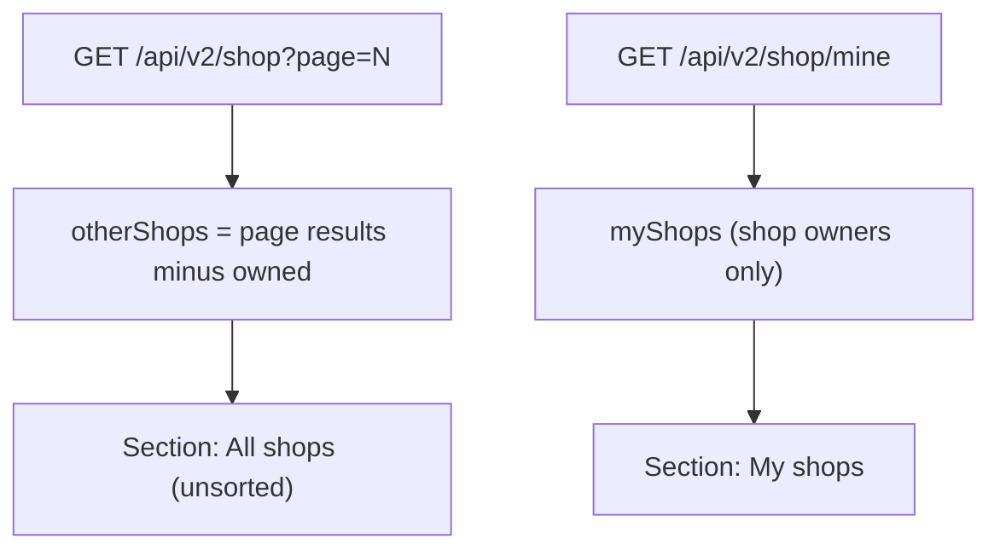
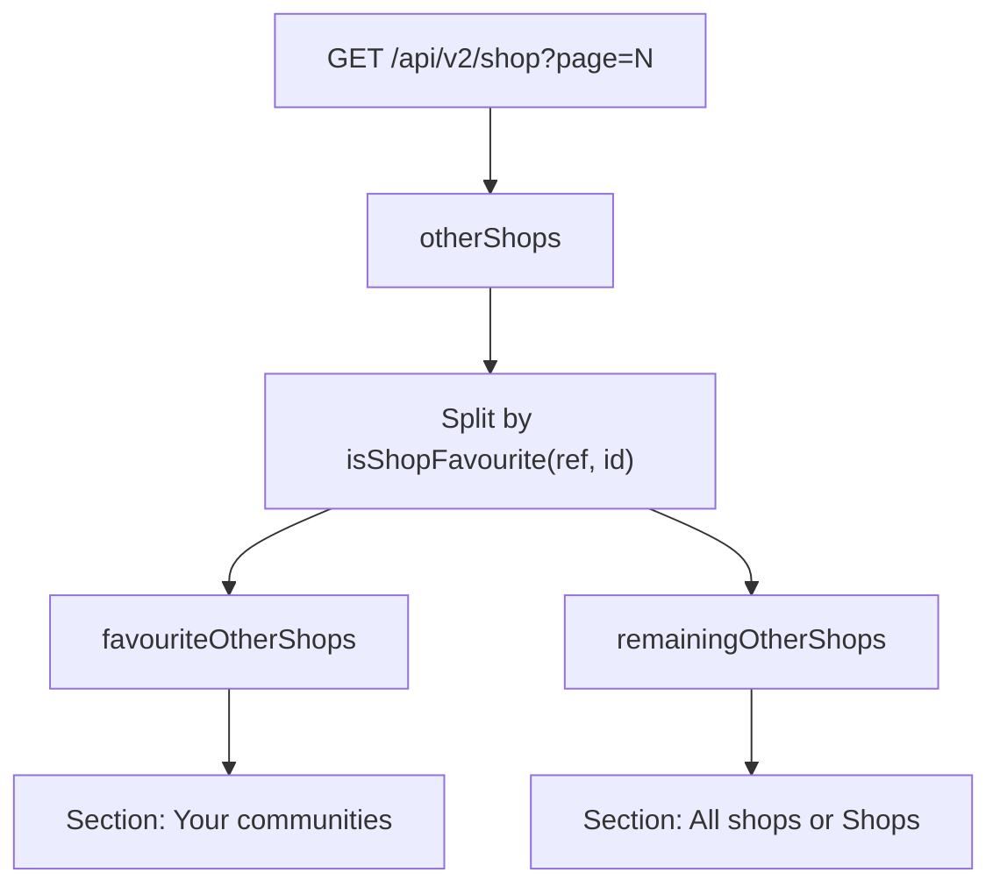

# Mobile: Favourites first in All shops

## Goal

In [`coffeeshop-mobile/lib/features/shops/shop_list_screen.dart`](coffeeshop-mobile/lib/features/shops/shop_list_screen.dart), users should see favourited shops before non-favourited ones inside the non-owned shop area — using two subsections, current page only, mobile only.

## Current behavior



- Favourite state already exists via `authNotifierProvider.user.favouriteShops` and `isShopFavourite()`.
- The web app already splits the paginated list client-side in [`coffeeshop-frontend/src/app/features/shops/shops.component.ts`](coffeeshop-frontend/src/app/features/shops/shops.component.ts) (`favouriteShopsList` / `otherShopsList`).
- Mobile does not split yet; it renders all `otherShops` in one grid.

## Target behavior



Section order on screen:

1. **My shops** — unchanged (shop owners only)
2. **Your communities** — non-owned shops on the current page that the user has favourited (hidden if empty)
3. **All shops** — remaining non-owned shops on the current page (title becomes **Shops** when section 2 is hidden, matching web)

Pagination, search, and city filters stay server-driven; only the current page’s `otherShops` list is split. Favourites on other pages stay on those pages.

## Implementation

### 1. Add a small split helper (same file)

Near existing `isShopFavourite`, add something like:

```dart
(List<ShopResponseDto> favourites, List<ShopResponseDto> others) splitShopsByFavourite(
  WidgetRef ref,
  List<ShopResponseDto> shops,
) {
  final favouriteShops = <ShopResponseDto>[];
  final otherShops = <ShopResponseDto>[];
  for (final shop in shops) {
    (isShopFavourite(ref, shop.id) ? favouriteShops : otherShops).add(shop);
  }
  return (favouriteShops, otherShops);
}
```

Preserve API order within each bucket (no extra sort) so toggling favourite only moves a card between sections, not reshuffles neighbours.

### 2. Update the `CustomScrollView` slivers

After computing `otherShops` (~line 240), call the helper:

```dart
final (favouriteOtherShops, remainingOtherShops) =
    splitShopsByFavourite(ref, otherShops);
```

Replace the single “All shops” block with:

- `if (favouriteOtherShops.isNotEmpty)` → title **Your communities** + grid
- `if (remainingOtherShops.isNotEmpty)` → title **All shops** if favourites exist, else **Shops** + grid

Update the empty-state guard to account for all three lists:

```dart
if (myShops.isEmpty && favouriteOtherShops.isEmpty && remainingOtherShops.isEmpty)
```

### 3. Improve favourite toggle UX (small, related fix)

In `_toggleFavourite`, remove `ref.invalidate(shopListProvider)` after a successful toggle. Profile refresh (`refreshProfile()`) is enough for the shop to move between **Your communities** and **All shops** without refetching the paginated list (same approach as the web [`shops_favourite_no_resort`](.cursor/plans/shops_favourite_no_resort_4b214c07.plan.md) plan). Keep `ref.invalidate(dashboardProvider)` if dashboard stats should update.

## Files to change

| File | Change |
|------|--------|
| [`coffeeshop-mobile/lib/features/shops/shop_list_screen.dart`](coffeeshop-mobile/lib/features/shops/shop_list_screen.dart) | Split `otherShops`, add subsection UI, stop list refetch on favourite toggle |

No backend or provider changes required.

## Manual test plan

- **Customer, page 1, has favourites on this page**: sees **Your communities** then **All shops**; order within each section matches API order.
- **Customer, no favourites on page**: only **Shops** section (no empty communities header).
- **Shop owner**: **My shops** still first; favourites among non-owned shops appear under **Your communities**.
- **Toggle favourite** on a shop mid-list: card moves between sections; neighbours do not reshuffle; no extra `/api/v2/shop` request.
- **Search / city filter / pagination**: favourites split applies only to shops returned on the current page.
- **Favourite on another page**: stays on that page (expected per your choice).
