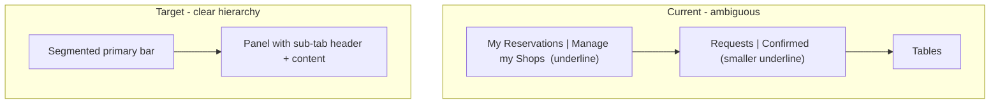

# Nested reservations tab design

## Problem

In [`reservations.component.ts`](coffeeshop-frontend/src/app/features/reservations/reservations.component.ts), outer and inner tabs both use `.tabs` + underline `.tab.active`. Sub-tabs only shrink via `.tabs--sub` in [`styles.css`](coffeeshop-frontend/src/styles.css) (lines 576–584) — they read as two identical rows, not parent → child.



## Design direction

Match the app’s dark theme (`#121212` bg, `#1a1a2e` surface, `#d4a574` accent per [`frontend.md`](coffeeshop-frontend/frontend.md)):

| Level | Pattern | Visual cues |
|-------|---------|-------------|
| **Primary** (My Reservations / Manage my Shops) | Segmented control | Rounded track (`#1a1a2e`), active pill with accent tint + bold label; no bottom border |
| **Secondary** (Requests / Pending / etc.) | Inset panel header | Content sits in a bordered panel; sub-tabs are smaller text tabs with underline on active only |
| **Counts** | Optional badge chip | Separate `.tab__count` pill so labels stay scannable |

Non-owner flat tabs stay on the existing `.tabs` underline style (single level, no hierarchy needed).

## 1. Global CSS — reusable tab hierarchy

**File:** [`coffeeshop-frontend/src/styles.css`](coffeeshop-frontend/src/styles.css)

Add after the existing tab block (~line 574):

- **`.tabs-nav`** — vertical stack wrapper; `margin-bottom: 1.5rem`
- **`.tabs--primary`** — segmented bar:
  - `display: flex`, `gap: 0.25rem`, `padding: 0.25rem`, `background: #1a1a2e`, `border: 1px solid #2a2a3e`, `border-radius: 10px`
  - `.tab` — flex `1`, centered, `border-radius: 8px`, no bottom border
  - `.tab.active` — `background: rgba(212, 165, 116, 0.18)`, `color: #d4a574`, `font-weight: 600`
  - `.tab:hover:not(.active)` — subtle `#2a2a3e` background
- **`.tabs-nav__panel`** — child container:
  - `margin-top: 0.75rem`, `background: #1a1a2e`, `border: 1px solid #2a2a3e`, `border-radius: 12px`, `overflow: hidden`
- **`.tabs-nav__panel-header`** — sub-tab row inside panel top edge
- **Replace/enhance `.tabs--sub`** when inside panel:
  - `margin: 0`, `padding: 0 0.5rem`, `border-bottom: 1px solid #2a2a3e`, `background: #16213e` (slightly elevated header strip)
  - `.tab` — smaller font (`0.8125rem`), more horizontal padding
  - `.tab.active` — accent underline only (keep existing border-bottom accent)
- **`.tab__label` / `.tab__count`** — flex row inside tab button:
  - `.tab__count` — `font-size: 0.75rem`, `padding: 0.125rem 0.5rem`, `border-radius: 999px`, muted bg; brighter when `.tab.active`

Keep existing `.tabs` / `.tab` rules for shop-details top-level tabs and non-owner reservations (no breaking change).

## 2. Reservations template markup

**File:** [`reservations.component.ts`](coffeeshop-frontend/src/app/features/reservations/reservations.component.ts) — owner block only (~lines 115–346)

Wrap the owner tab UI:

```html
<div class="tabs-nav">
  <div class="tabs tabs--primary" role="tablist" aria-label="Reservation sections">
    <button class="tab" role="tab" [attr.aria-selected]="ownerMainTab() === 'personal'" ...>
      <span class="tab__label">My Reservations</span>
    </button>
    ...
  </div>

  @if (ownerMainTab() === 'personal') {
    <div class="tabs-nav__panel">
      <div class="tabs-nav__panel-header">
        <div class="tabs tabs--sub" role="tablist" aria-label="My reservations">
          <button class="tab" role="tab" ...>
            <span class="tab__label">Reservation Requests</span>
            <span class="tab__count">{{ myPersonalRequests().length }}</span>
          </button>
          ...
        </div>
      </div>
      <div class="tabs-nav__panel-body">
        <!-- existing tables / empty states -->
      </div>
    </div>
  }

  @if (ownerMainTab() === 'manage') {
    <div class="tabs-nav__panel">
      <!-- same pattern for Pending / Approved / Denied -->
    </div>
  }
</div>
```

- Add `role="tab"` and `aria-selected` on primary/sub buttons for accessibility.
- Split count from label on sub-tabs (Pending, Approved, Denied, Requests, Confirmed) using `.tab__count`.
- Move table/empty/loading blocks into `.tabs-nav__panel-body` with `padding: 1rem 1.25rem 1.25rem` so content is visually inside the panel.

No TypeScript/logic changes beyond markup/classes.

## 3. Optional consistency (out of scope unless you want it)

[`shop-details.component.ts`](coffeeshop-frontend/src/app/features/shop-details/shop-details.component.ts) uses the same weak `.tabs--sub` for shop reservation management (line 396). The new panel + sub styles can be applied there in a follow-up for consistency; this plan focuses on the reservations page only.

## Verification

As shop owner:

1. Primary bar looks like a segmented control; only one section active at a time.
2. Sub-tabs sit inside a card/panel below the primary bar; content is clearly nested under the active sub-tab.
3. Count chips visible on sub-tabs; switching primary tabs swaps panel + sub-tabs together.
4. Pending table dropdown still works (`table-container--dropdown-safe` unchanged inside panel body).

As non-owner: single underline tab row unchanged.

Build: `npm run build` in `coffeeshop-frontend`.
