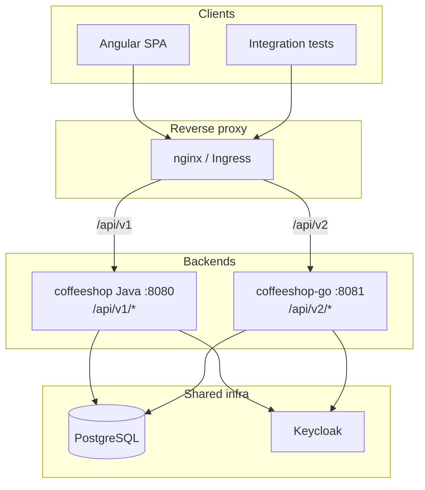
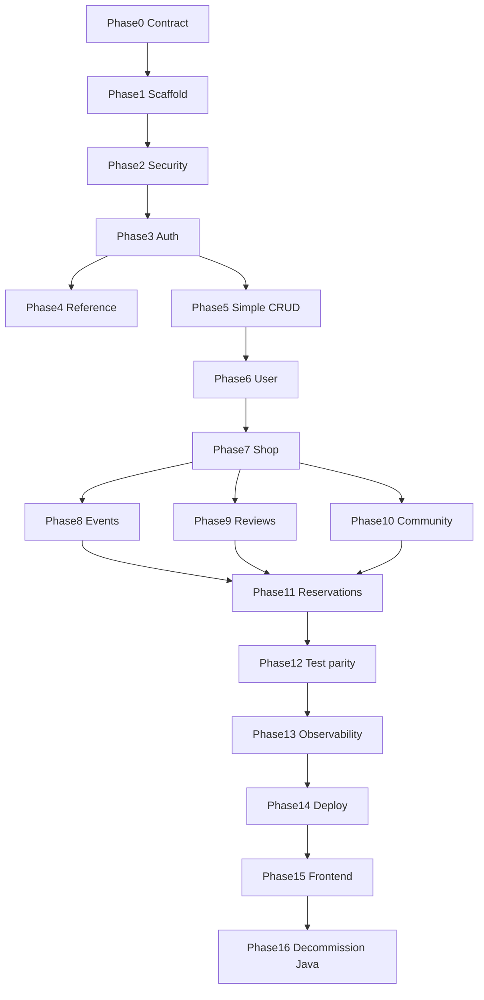

# Coffeeshop Java → Go migration plan

## Current state

| Area | Details |
|------|---------|
| Java module | [coffeeshop/](coffeeshop/) — Spring Boot 4.0.6, Java 25, Gradle |
| API surface | **16 controllers**, **~77 routes**, all under `/api/v1` |
| Auth | Keycloak JWT resource server + token/admin HTTP clients ([`auth/`](coffeeshop/src/main/java/com/coffeeshop/coffeeshop/auth/)) |
| Data | PostgreSQL, **15 JPA entities**, Hibernate `ddl-auto: update` (no Flyway) |
| Tests | **29** test classes (integration + unit) under `src/test/java` |
| Deploy | Single `backend` container :8080, frontend nginx proxies `/api/` → Java ([`nginx.conf`](coffeeshop-frontend/nginx.conf)) |
| Go module | **Does not exist yet** — greenfield `coffeeshop-go/` |

## Target architecture (strangler)

You confirmed **shared PostgreSQL**: Java and Go run in parallel; clients choose API version by path prefix.



**Path rule:** Every Java route `GET /api/v1/shop/{id}` becomes `GET /api/v2/shop/{id}` with the **same** request/response JSON, status codes, and query parameters.

**Agent conventions** ([`.cursor/agents/migrate-java-to-golang-agent.md`](.cursor/agents/migrate-java-to-golang-agent.md)): Standard Go layout, `chi` router, explicit constructor DI, `gorm.io/gorm` (or `pgx` + `sqlc` if you prefer raw SQL), table-driven `httptest` tests, master endpoint mapping in `coffeeshop-go/README.md`.

---

## Recommended `coffeeshop-go` layout

```
coffeeshop-go/
  cmd/api/main.go
  internal/
    config/          # env: DB, Keycloak, CORS, port
    middleware/      # JWT, public-bearer-skip, authz, CORS, logging
    handler/         # HTTP adapters (1 file per Java controller)
    service/         # ports of Java *ServiceImpl
    repository/      # DB access (GORM models matching JPA tables)
    auth/            # Keycloak token + admin clients, current user
    model/           # entities + request/response DTOs (json tags)
    apperror/        # ErrorResponse + status mapping
  test/integration/  # testcontainers postgres + parity with Java ITs
  Dockerfile
  README.md          # v1 → v2 endpoint matrix
  go.mod
```

**Port:** `8081` locally (avoid clash with Keycloak on `8080` and Java backend on `18080`); `8080` inside its own K8s/Docker container.

---

## Security parity (must land in Phase 2 before domain APIs)

Mirror these Java files exactly for `/api/v2`:

1. [`SecurityConfiguration.java`](coffeeshop/src/main/java/com/coffeeshop/coffeeshop/config/SecurityConfiguration.java)
   - `GET /api/v2/**` → public (except authenticated GETs below)
   - `POST/PUT/PATCH/DELETE /api/v2/**` → authenticated
   - `GET /api/v2/profile` → authenticated
   - Auth routes + `/health` (Go) public

2. [`PublicEndpointBearerTokenResolver.java`](coffeeshop/src/main/java/com/coffeeshop/coffeeshop/config/PublicEndpointBearerTokenResolver.java)
   - On “public” GETs, **ignore invalid optional Bearer tokens** (return no token to validator)
   - **Do not skip** JWT for: `/api/v2/profile`, `/api/v2/shop/mine`, paginated `GET /api/v2/shop?page=…`, all `/api/v2/reservation-request*`
   - Unpaginated `GET /api/v2/shop` (no `page` param) is public

3. [`KeycloakRealmRoleConverter.java`](coffeeshop/src/main/java/com/coffeeshop/coffeeshop/auth/KeycloakRealmRoleConverter.java) — map `realm_access.roles` → `ROLE_*`

4. Service-layer authorization (not on controllers): `UserType`, `ROLE_ADMIN`, `ShopOwnershipService` / `UserShop` (`OWNER`, `FAVOURITE`)

---

## Database strategy

- **Read/write existing Hibernate-created tables** — do not introduce a second schema in Go.
- Map explicit table names from entities (e.g. `User` → `users`, `Role` → `roles`).
- Match column types: `UUID` PKs, `Event.eventId` **string PK**, enums as stored strings.
- **No Flyway in Go initially** — schema remains owned by Java/Hibernate until a later consolidation phase.
- Startup backfills in Java ([`MenuShopMigration`](coffeeshop/src/main/java/com/coffeeshop/coffeeshop/config/MenuShopMigration.java), [`UsernameBackfillRunner`](coffeeshop/src/main/java/com/coffeeshop/coffeeshop/config/UsernameBackfillRunner.java)) stay on Java until cutover; document any ordering assumptions for Go tests.

---

## Phase breakdown

### Phase 0 — Inventory and contract baseline

- Generate OpenAPI snapshot from running Java (`/v3/api-docs`) or reuse [`coffeeshop-frontend/api-docs.json`](coffeeshop-frontend/api-docs.json).
- Create `coffeeshop-go/README.md` endpoint matrix: Java path → Go path → controller/service source file.
- Document all enums, pagination (`PageResponseDto`, page sizes 10/25/50), and error body shape from [`GlobalExceptionHandler`](coffeeshop/src/main/java/com/coffeeshop/coffeeshop/exception/GlobalExceptionHandler.java) (`{ "message": "..." }`, 404/400/422/401).

**Exit:** Written contract doc; no runtime code required.

---

### Phase 1 — Go project scaffold and platform

- `go mod init` (module path aligned with monorepo convention, e.g. `github.com/mastilovic/coffeeshop-go`).
- `cmd/api/main.go`: config load, structured logging, graceful shutdown.
- Health: `GET /health/ready`, `GET /health/live` (replace Spring Actuator for Go container probes).
- PostgreSQL connection pool (`pgx` or GORM).
- Chi router mounted at `/api/v2` (subrouter).
- [`Dockerfile`](coffeeshop/Dockerfile) + `docker-compose` service `backend-go` in root [`docker-compose.yaml`](docker-compose.yaml) / [`coffeeshop/docker-compose.yaml`](coffeeshop/docker-compose.yaml).
- Env parity with Java: `KEYCLOAK_*`, `DATABASE_URL`, `CORS_ALLOWED_ORIGINS`.

**Exit:** Container starts, connects to Postgres, returns 200 on health.

---

### Phase 2 — Cross-cutting HTTP layer

- Middleware stack: request ID, recover, CORS.
- JWT validation via OIDC issuer (`KEYCLOAK_JWT_ISSUER_URI`) — equivalent to `spring.security.oauth2.resourceserver.jwt.issuer-uri`.
- Public bearer-token skip middleware (v2 paths).
- Method-based auth middleware matching `SecurityConfiguration` rules for `/api/v2`.
- Central error handler matching Java statuses/messages.
- Request validation (Go `validator` tags mirroring Jakarta Bean Validation on DTOs).
- Shared `PageResponseDto` and search normalizer ([`SearchTextNormalizer`](coffeeshop/src/main/java/com/coffeeshop/coffeeshop/util/SearchTextNormalizer.java)).

**Exit:** Security integration test skeleton passes (401 on protected POST without token; public GET works with garbage Bearer).

---

### Phase 3 — Auth and profile (blocking for all mutating domain APIs)

**Java sources:** [`AuthController`](coffeeshop/src/main/java/com/coffeeshop/coffeeshop/auth/AuthController.java), [`ProfileController`](coffeeshop/src/main/java/com/coffeeshop/coffeeshop/auth/ProfileController.java), `AuthService`, `RegistrationService`, `KeycloakTokenClient`, `KeycloakAdminClient`, `CurrentUserService`, `JwtAccessTokenClaims`.

| v2 endpoint | Notes |
|-------------|-------|
| `POST /api/v2/auth/login` | Local user check + Keycloak password grant |
| `POST /api/v2/auth/register` | 201, Keycloak user + local `User` |
| `POST /api/v2/auth/refresh` | |
| `POST /api/v2/auth/logout` | 204 |
| `GET /api/v2/profile` | Resolve `sub` → `User.keycloakSubject` |

**Exit:** Port [`AuthIntegrationTest`](coffeeshop/src/test/java/com/coffeeshop/coffeeshop/AuthIntegrationTest.java), [`ApiSecurityIntegrationTest`](coffeeshop/src/test/java/com/coffeeshop/coffeeshop/ApiSecurityIntegrationTest.java) scenarios against Go.

---

### Phase 4 — Reference data (no DB)

**Java:** [`ReferenceController`](coffeeshop/src/main/java/com/coffeeshop/coffeeshop/controller/ReferenceController.java) + [`SerbiaCityCatalog`](coffeeshop/src/main/java/com/coffeeshop/coffeeshop/reference/SerbiaCityCatalog.java).

- `GET /api/v2/reference/serbia-cities?q=`

**Exit:** Port [`ReferenceControllerIntegrationTest`](coffeeshop/src/test/java/com/coffeeshop/coffeeshop/ReferenceControllerIntegrationTest.java).

---

### Phase 5 — Simple CRUD resources (low coupling)

Migrate in one PR or parallel handler packages; each follows Java `*Controller` + `*ServiceImpl` + repository:

| Resource | Controller | ~LOC service |
|----------|------------|--------------|
| Role | `RoleController` | 67 |
| Contact | `ContactController` | 77 |
| Table | `TableController` | 97 |
| Loyalty plan | `LoyaltyPlanController` | 70 |
| Menu | `MenuController` | 143 |
| Menu item | `MenuItemController` | 130 |

**v2 paths:** `/api/v2/role`, `/contact`, `/table`, `/loyalty-plan`, `/menu`, `/menu-item` (same subpaths as v1).

**Exit:** CRUD round-trip tests per resource; 404/400 parity.

---

### Phase 6 — User domain

**Java:** [`UserController`](coffeeshop/src/main/java/com/coffeeshop/coffeeshop/controller/UserController.java), [`UserServiceImpl`](coffeeshop/src/main/java/com/coffeeshop/coffeeshop/service/impl/UserServiceImpl.java) (180 LOC), [`UserShopServiceImpl`](coffeeshop/src/main/java/com/coffeeshop/coffeeshop/service/impl/UserShopServiceImpl.java) (192 LOC).

- List with optional pagination (`q`, `page`, `size`; no `page` → full list).
- CRUD + `UserType` / role assignment rules.
- `keycloakSubject` linking used by auth.

**Exit:** Port [`UserCreateIntegrationTest`](coffeeshop/src/test/java/com/coffeeshop/coffeeshop/UserCreateIntegrationTest.java), [`UserPaginationIntegrationTest`](coffeeshop/src/test/java/com/coffeeshop/coffeeshop/UserPaginationIntegrationTest.java).

---

### Phase 7 — Shop domain (core product)

**Java:** [`ShopController`](coffeeshop/src/main/java/com/coffeeshop/coffeeshop/controller/ShopController.java), [`ShopServiceImpl`](coffeeshop/src/main/java/com/coffeeshop/coffeeshop/service/impl/ShopServiceImpl.java) (206 LOC), ownership via [`ShopOwnershipService`](coffeeshop/src/main/java/com/coffeeshop/coffeeshop/auth/ShopOwnershipService.java).

Endpoints:

- `GET/POST/PUT/DELETE /api/v2/shop`, `GET /shop/mine`, `GET /shop/{id}`
- Search `q`, pagination, favourite POST/DELETE
- Nested `GET/POST /shop/{shopId}/menus`
- `currentMenu` semantics from [`MenuServiceImpl`](coffeeshop/src/main/java/com/coffeeshop/coffeeshop/service/impl/MenuServiceImpl.java)

**Exit:** Port shop ITs: create, mine, ownership, multi-owner, search/pagination, favourite.

---

### Phase 8 — Events

**Java:** [`EventController`](coffeeshop/src/main/java/com/coffeeshop/coffeeshop/controller/EventController.java), [`EventServiceImpl`](coffeeshop/src/main/java/com/coffeeshop/coffeeshop/service/impl/EventServiceImpl.java), [`EventTableAvailabilityService`](coffeeshop/src/main/java/com/coffeeshop/coffeeshop/service/EventTableAvailabilityService.java), date parsing/validation utils.

- String `eventId` PK; list by `shopId` or search (`q`, `dateFrom`, `dateTo`, pagination).
- Ownership checks aligned with shop owners / admin.

**Exit:** Port event ITs (search, ownership, date validation, reservation-on-event create).

---

### Phase 9 — Reviews and comments

**Java:** [`ReviewController`](coffeeshop/src/main/java/com/coffeeshop/coffeeshop/controller/ReviewController.java), [`ReviewServiceImpl`](coffeeshop/src/main/java/com/coffeeshop/coffeeshop/service/impl/ReviewServiceImpl.java), comment loader/service.

- Review CRUD + nested `GET/POST /review/{reviewId}/comments`
- Rating aggregation ([`RatingAggregationUtils`](coffeeshop/src/main/java/com/coffeeshop/coffeeshop/util/RatingAggregationUtils.java))

**Exit:** Port [`ReviewIntegrationTest`](coffeeshop/src/test/java/com/coffeeshop/coffeeshop/ReviewIntegrationTest.java), [`ReviewCommentIntegrationTest`](coffeeshop/src/test/java/com/coffeeshop/coffeeshop/ReviewCommentIntegrationTest.java).

---

### Phase 10 — Shop community

**Java:** [`ShopCommunityController`](coffeeshop/src/main/java/com/coffeeshop/coffeeshop/controller/ShopCommunityController.java), [`CommunityPostServiceImpl`](coffeeshop/src/main/java/com/coffeeshop/coffeeshop/service/impl/CommunityPostServiceImpl.java).

- `GET .../posts`, `GET .../members`, `POST .../announcements`, `DELETE .../posts/{postId}`

**Exit:** Port [`ShopCommunityIntegrationTest`](coffeeshop/src/test/java/com/coffeeshop/coffeeshop/ShopCommunityIntegrationTest.java).

---

### Phase 11 — Reservations and reservation requests (highest complexity)

**Java:** [`ReservationController`](coffeeshop/src/main/java/com/coffeeshop/coffeeshop/controller/ReservationController.java), [`ReservationRequestController`](coffeeshop/src/main/java/com/coffeeshop/coffeeshop/controller/ReservationRequestController.java), [`ReservationRequestServiceImpl`](coffeeshop/src/main/java/com/coffeeshop/coffeeshop/service/impl/ReservationRequestServiceImpl.java) (**283 LOC**).

- Reservation CRUD
- Request list (JWT-only `GET`), create, `POST .../accept` (table assignment), `POST .../deny`
- Status transitions ([`ReservationStatus`](coffeeshop/src/main/java/com/coffeeshop/coffeeshop/model/enums/ReservationStatus.java))

**Exit:** Port [`ReservationRequestIntegrationTest`](coffeeshop/src/test/java/com/coffeeshop/coffeeshop/ReservationRequestIntegrationTest.java), [`ReservationEventCreateIntegrationTest`](coffeeshop/src/test/java/com/coffeeshop/coffeeshop/ReservationEventCreateIntegrationTest.java).

---

### Phase 12 — Full integration test parity and contract verification

- `testcontainers-go` Postgres + test JWT strategy (mirror [`TestcontainersConfiguration`](coffeeshop/src/test/java/com/coffeeshop/coffeeshop/TestcontainersConfiguration.java): bearer = user UUID).
- Port remaining unit tests: `EventDateParser`, `EventDateValidator`, `SearchTextNormalizer`, `RatingAggregationUtils`, `SerbiaCityValidator`.
- Optional: contract test runner that hits v1 and v2 with same fixtures and diffs JSON responses.

**Exit:** Go CI job green with coverage comparable to Java `./gradlew build`.

---

### Phase 13 — Observability and API docs

- Sentry Go SDK (parity with `sentry-spring-boot` in [`build.gradle`](coffeeshop/build.gradle)).
- OpenAPI 3 spec for `/api/v2` (oapi-codegen or swag) — dev-only route like Java springdoc.
- Structured logs with correlation ID.

**Exit:** Staging can debug Go errors in Sentry; OpenAPI published for frontend team.

---

### Phase 14 — CI/CD and Kubernetes

- New workflow [`.github/workflows/backend-go-ci.yml`](.github/workflows/backend-go-ci.yml): `go test`, build/push `ghcr.io/.../coffeeshop-backend-go`.
- Extend [`ci-cd-staging.yml`](.github/workflows/ci-cd-staging.yml) / [`deploy-staging-reusable.yml`](.github/workflows/deploy-staging-reusable.yml) to deploy `backend-go`.
- K8s: [`deploy/k8s/base/backend-go/`](deploy/k8s/base/) deployment + service; staging overlay env from [`config.env.example`](deploy/k8s/overlays/staging/config.env.example).
- Ingress / nginx: route `/api/v2` → `backend-go`, `/api/v1` → existing Java `backend` ([`deploy/k8s/base/ingress.yaml`](deploy/k8s/base/ingress.yaml) or frontend nginx split).

**Exit:** Staging runs both backends; smoke tests pass on `/api/v2`.

---

### Phase 15 — Frontend cutover (separate from backend phases)

Not required to complete Go parity, but required to retire Java:

- Update all Angular services under [`coffeeshop-frontend/src/app/services/`](coffeeshop-frontend/src/app/services/) from `/api/v1` → `/api/v2` (15 files reference v1 today).
- Update [`auth.interceptor.ts`](coffeeshop-frontend/src/app/services/auth.interceptor.ts) refresh path.
- Refresh [`api-docs.json`](coffeeshop-frontend/api-docs.json) and E2E smoke (login, profile, shops, reservations).

**Exit:** Production traffic on v2 only.

---

### Phase 16 — Java decommission

- Remove Java `backend` from compose/K8s.
- Archive or freeze [`coffeeshop/`](coffeeshop/) module.
- Consolidate schema ownership (introduce Flyway in Go or shared migrations repo).

---

## Endpoint inventory summary (v1 → v2)

All prefixes swap `v1` → `v2`. Controller groups:

| Group | Base path (v2) |
|-------|----------------|
| Auth | `/api/v2/auth` |
| Profile | `/api/v2/profile` |
| Reference | `/api/v2/reference` |
| Shop + menus + favourite | `/api/v2/shop` |
| Community | `/api/v2/shop/{shopId}/community` |
| Event | `/api/v2/event` |
| User | `/api/v2/user` |
| Role, Menu, Menu-item, Table, Contact, Loyalty-plan, Reservation, Reservation-request, Review | same kebab-case segments as v1 |

Full per-method list: see exploration inventory in Phase 0 README (77 handlers).

---

## Implementation order rationale



Auth and security before domain code prevents rework. Shop before events/reviews/community because ownership and `UserShop` are shared. Reservations last due to cross-entity workflow.

---

## Risk register

| Risk | Mitigation |
|------|------------|
| Hibernate vs GORM column naming drift | Integration tests on real Postgres; explicit `TableName()` / column tags from JPA annotations |
| Dual-write during parallel run | Keep writes on one API version per feature until tested; use contract tests before enabling v2 writes in staging |
| Keycloak issuer URL mismatch (docker host vs internal) | Same env vars as Java; document `KEYCLOAK_JWT_ISSUER_URI` per environment ([`docs/keycloak.md`](coffeeshop/docs/keycloak.md)) |
| Public GET + invalid JWT behavior | Port `PublicEndpointBearerTokenResolver` logic exactly in Phase 2 |
| No formal migrations | Do not change schema from Go; add Flyway only after Java retirement |

---

## Suggested first implementation slice (after plan approval)

Use **migrate-java-to-golang-agent** for execution:

1. Phases 0–2 in one branch (`feat/go-scaffold-security`).
2. Phase 3 auth in second branch (`feat/go-auth-v2`).
3. Phase 4 reference as quick win to validate E2E stack.

Deliverable per phase: updated `coffeeshop-go/README.md` endpoint matrix + green integration tests for that phase.
