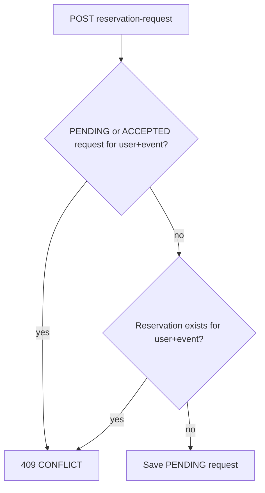

# One reservation request per customer per event

## Current state

- Customers create requests via [`POST /api/v1/reservation-request`](coffeeshop/src/main/java/com/coffeeshop/coffeeshop/controller/ReservationRequestController.java) from [`ReservationsComponent`](coffeeshop-frontend/src/app/features/reservations/reservations.component.ts).
- [`ReservationRequestServiceImpl.createRequest`](coffeeshop/src/main/java/com/coffeeshop/coffeeshop/service/impl/ReservationRequestServiceImpl.java) always inserts a new `PENDING` row with **no duplicate check**.
- Confirmed bookings live in [`Reservation`](coffeeshop/src/main/java/com/coffeeshop/coffeeshop/model/Reservation.java); owners can also bypass requests via [`ReservationServiceImpl.create`](coffeeshop/src/main/java/com/coffeeshop/coffeeshop/service/impl/ReservationServiceImpl.java).
- The frontend has **no** guard (unlike reviews’ `canLeaveReview` in [`shop-details.component.ts`](coffeeshop-frontend/src/app/features/shop-details/shop-details.component.ts)).

## Business rules (confirmed)

| Situation | New request allowed? |
|-----------|----------------------|
| No prior request for this event | Yes |
| Prior request `PENDING` | No |
| Prior request `ACCEPTED` (or confirmed `Reservation` exists) | No |
| Prior request `DENIED` only | Yes (retry) |

Applies to the **target user** (`userId` in the create payload): customers use their own id; owners creating “for guest” use the guest’s id.



## Backend (Java)

Follow the existing review pattern in [`ReviewServiceImpl`](coffeeshop/src/main/java/com/coffeeshop/coffeeshop/service/impl/ReviewServiceImpl.java): repository `exists` / `find` + `ResponseStatusException(HttpStatus.CONFLICT, message)`.

### 1. Repository queries

**[`ReservationRequestRepository`](coffeeshop/src/main/java/com/coffeeshop/coffeeshop/repository/ReservationRequestRepository.java)**

```java
boolean existsByUser_IdAndEvent_EventIdAndStatusIn(
    UUID userId, String eventId, Collection<ReservationStatus> statuses);
```

Use statuses `PENDING` and `ACCEPTED` only (allows retry after `DENIED`).

**[`ReservationRepository`](coffeeshop/src/main/java/com/coffeeshop/coffeeshop/repository/ReservationRepository.java)**

```java
boolean existsByUser_IdAndEvent_EventId(UUID userId, String eventId);
```

### 2. Shared validation helper

Add a private method on `ReservationRequestServiceImpl` (or a small package-private helper) used by create/accept paths:

```java
void assertNoActiveEventBooking(UUID userId, String eventId) {
  if (reservationRequestRepository.existsByUser_IdAndEvent_EventIdAndStatusIn(
          userId, eventId, List.of(PENDING, ACCEPTED))
      || reservationRepository.existsByUser_IdAndEvent_EventId(userId, eventId)) {
    throw new ResponseStatusException(
        HttpStatus.CONFLICT,
        "This user already has a reservation request or reservation for this event");
  }
}
```

Call it in **`createRequest`** after loading user/event and before `save`.

Call it in **`accept`** before creating the `Reservation` (guards race if duplicate `PENDING` rows already exist in DB).

Call the same check in **`ReservationServiceImpl.create`** when `event` is set (owner direct booking for a guest).

### 3. Optional DB safety net (recommended, low cost)

On [`Reservation`](coffeeshop/src/main/java/com/coffeeshop/coffeeshop/model/Reservation.java), add:

```java
@Table(uniqueConstraints = @UniqueConstraint(columnNames = {"user_id", "event_id"}))
```

With `ddl-auto: create-drop` in local/docker ([`application-local.yaml`](coffeeshop/src/main/resources/application-local.yaml)), Hibernate will recreate the constraint on startup. This backs the “one confirmed reservation per user per event” rule; it does **not** replace request-level checks because `DENIED` retries need a non-unique `(user_id, event_id)` on `reservation_request`.

Do **not** add a blanket unique on `reservation_request (user_id, event_id)` — that would block post-`DENIED` retries.

### 4. Integration tests

Extend [`ReservationRequestIntegrationTest`](coffeeshop/src/test/java/com/coffeeshop/coffeeshop/ReservationRequestIntegrationTest.java) (mirror [`ReviewIntegrationTest.customerSecondReviewForSameShop_returnsConflict`](coffeeshop/src/test/java/com/coffeeshop/coffeeshop/ReviewIntegrationTest.java)):

- Second `POST` for same `userId` + `eventId` while first is `PENDING` → **409**
- After `deny`, second `POST` → **201**
- After `accept`, second `POST` → **409**
- Two `PENDING` rows (if seeded manually or via race): second `accept` → **409**

Add one case in [`ReservationEventCreateIntegrationTest`](coffeeshop/src/test/java/com/coffeeshop/coffeeshop/ReservationEventCreateIntegrationTest.java): direct `POST /api/v1/reservation` for user+event when reservation already exists → **409**.

## Frontend (Angular)

Primary file: [`reservations.component.ts`](coffeeshop-frontend/src/app/features/reservations/reservations.component.ts).

### 1. Computed helpers (customer + owner guest flows)

```typescript
private blockingStatuses = new Set(['PENDING', 'ACCEPTED']);

readonly eventIdsBlockedForCurrentUser = computed(() => {
  const userId = /* profile.id or selected guestUserId when owner */;
  const fromRequests = allRequests()
    .filter(r => r.user?.id === userId && blockingStatuses.has(r.status))
    .map(r => r.eventId);
  const fromReservations = myReservations() /* or guest filter */
    .map(r => r.eventId)
    .filter(Boolean);
  return new Set([...fromRequests, ...fromReservations]);
});
```

- **`eventsForShop()` filter**: exclude `eventIdsBlockedForCurrentUser` from the event `<select>` options (or disable options with a label suffix like “— already requested”).
- **`canSubmitRequest`**: false when selected `eventId` is in the blocked set.
- **Customer header button**: hide or disable “+ Request Reservation” when every event for the selected shop is blocked (optional polish; filtering the dropdown is the minimum).

### 2. Submit guard + error UX

In `onSubmitRequest()`:

- Early return if selected event is blocked (defense in depth).
- Add `error` handler on `subscribe`: on **409**, `alert('You already have a reservation request or reservation for this event.')` (same style as reviews in shop-details).

Apply the same pattern to owner **direct** create in `onSubmitDirectReservation()` using the selected guest’s blocked events.

### 3. Out of scope (unless you want it later)

- No new “Reserve” CTA on Events / shop event lists (flow stays on `/reservations`).
- No change to shop-details reservations tab (accept/deny only).

## Files to touch

| Layer | Files |
|-------|--------|
| Backend | `ReservationRequestRepository.java`, `ReservationRepository.java`, `ReservationRequestServiceImpl.java`, `ReservationServiceImpl.java`, optionally `Reservation.java` |
| Tests | `ReservationRequestIntegrationTest.java`, `ReservationEventCreateIntegrationTest.java` |
| Frontend | `reservations.component.ts` |

## Verification

1. Run backend integration tests for reservation modules.
2. Manual: customer requests event A → second request for A blocked; owner denies → customer can request A again; after accept → request and new reservation both blocked.
3. Manual: owner “request for guest” respects guest’s existing request/reservation for that event.
